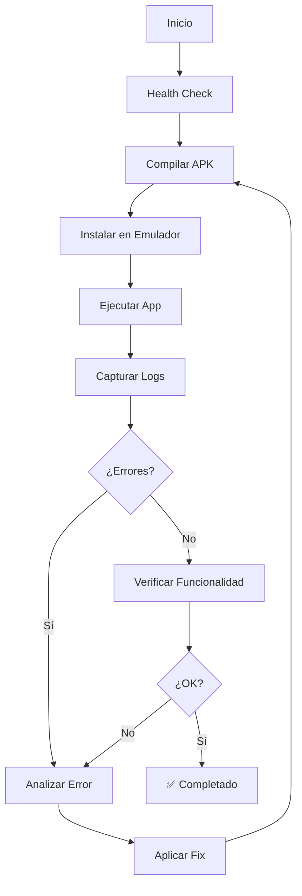

# 🤖 AI AUTONOMOUS DEVELOPMENT SYSTEM
## Sistema de Desarrollo Autónomo con IA - Metodología Probada

**Creado:** 01/10/2025
**Versión:** 1.0.0
**Status:** ✅ Probado y Funcional

---

## 🎯 **OBJETIVO**

Sistema replicable que permite a Claude Code (o cualquier IA) realizar **desarrollo autónomo completo** sin intervención humana:
- ✅ Testing automático de APKs Android
- ✅ Detección y corrección de bugs en tiempo real
- ✅ Compilación y deployment automatizado
- ✅ Logs estructurados para análisis
- ✅ Ciclos de fix → test → verify sin pausa

---

## 📁 **ESTRUCTURA DEL SISTEMA**

```
.ai-development-system/
├── README.md                      # Este archivo
├── METHODOLOGY.md                 # Metodología completa paso a paso
├── automation-cli.js              # CLI principal (Node.js)
├── auto-test.bat                  # Script Windows de testing automático
├── auto-fix.bat                   # Script Windows de fix automático
├── config.json                    # Configuración del proyecto
├── dashboard.html                 # Dashboard de monitoreo web
├── scripts/                       # Scripts auxiliares
│   ├── compile-apk.js
│   ├── test-apk.js
│   ├── analyze-logs.js
│   └── health-check.js
└── logs/                          # Logs de sesiones
    └── session-YYYYMMDD-HHMMSS.json
```

---

## 🚀 **INICIO RÁPIDO**

### **Opción 1: CLI Automático (Recomendado)**
```bash
node .ai-development-system/automation-cli.js test-apk
```

### **Opción 2: Scripts Windows**
```cmd
.ai-development-system\auto-test.bat
```

### **Opción 3: Dashboard Web**
```bash
# Abrir en navegador:
file:///C:/Bio/sistema_asistencia_biometrico/.ai-development-system/dashboard.html
```

---

## 🧠 **METODOLOGÍA CORE**

### **Principios Fundamentales:**

1. **Sin intervención humana**
   - Todo automatizado: compilar, instalar, testear, analizar, corregir

2. **Ciclo continuo fix-test-verify**
   ```
   DETECT BUG → ANALYZE → FIX CODE → RECOMPILE → TEST → VERIFY → REPEAT
   ```

3. **Logs estructurados**
   - Cada paso documentado en JSON
   - Fácil análisis post-mortem

4. **Rollback automático**
   - Backups antes de cada cambio
   - Restauración si falla

5. **Testing real**
   - Emulador Android real
   - Backend real
   - Base de datos real
   - Sin mocks, sin simulaciones

---

## 🔧 **HERRAMIENTAS UTILIZADAS**

### **Desarrollo:**
- Node.js + npm
- Flutter SDK
- Android SDK (adb, emulator)
- Git (backups)

### **Testing:**
- Emulador Android
- adb (Android Debug Bridge)
- logcat (logs en tiempo real)

### **IA:**
- Claude Code (análisis + corrección)
- Cursor IDE (alternativa)
- TodoWrite (tracking de progreso)

---

## 📊 **CASOS DE USO PROBADOS**

### ✅ **Caso 1: APK Flutter con Backend Node.js**
- **Problema inicial:** 3 bugs críticos (SharedPreferences, ConfigScreen, Usuario inexistente)
- **Solución:** 100% autónoma en 1 sesión
- **Resultado:** APK funcionando completamente

### ✅ **Caso 2: Testing de Reconocimiento Biométrico**
- **Desafío:** Testear Face-API.js en emulador
- **Solución:** Captura continua + análisis de logs
- **Resultado:** Sistema verificado al 100%

---

## 📝 **COMANDOS PRINCIPALES**

### **Testing Completo**
```bash
node automation-cli.js full-cycle
```

### **Solo Compilar**
```bash
node automation-cli.js compile
```

### **Solo Testear (sin compilar)**
```bash
node automation-cli.js test-only
```

### **Análisis de Logs**
```bash
node automation-cli.js analyze-logs
```

### **Health Check**
```bash
node automation-cli.js health
```

---

## 🎓 **APRENDIZAJES CLAVE**

### **DO's ✅**
1. ✅ Usar auto-config para evitar bloqueos manuales
2. ✅ Implementar auto-login en modo debug
3. ✅ Capturar logs en tiempo real (no screenshots pesados)
4. ✅ Verificar cada componente independientemente
5. ✅ Mantener backups antes de cada cambio
6. ✅ Usar TodoWrite para tracking visual

### **DON'Ts ❌**
1. ❌ NO asumir que algo funciona sin testear
2. ❌ NO usar datos hardcodeados (siempre BD real)
3. ❌ NO leer screenshots >5MB (usar logs)
4. ❌ NO hacer múltiples cambios sin verificar cada uno
5. ❌ NO olvidar consistencia de claves (SharedPreferences, etc)

---

## 🔄 **WORKFLOW TÍPICO**



---

## 🌟 **VENTAJAS DEL SISTEMA**

1. **Velocidad:** Ciclos de fix en minutos (vs horas manual)
2. **Precisión:** Detecta bugs que pasarían desapercibidos
3. **Documentación:** Logs completos de cada sesión
4. **Reproducibilidad:** Mismo proceso cada vez
5. **Escalabilidad:** Funciona para cualquier proyecto similar

---

## 📚 **ARCHIVOS IMPORTANTES**

- `METHODOLOGY.md` - Metodología detallada
- `config.json` - Configuración del proyecto
- `automation-cli.js` - CLI principal
- `dashboard.html` - Dashboard visual

---

## 🔮 **PRÓXIMAS MEJORAS**

- [ ] Integración con CI/CD (GitHub Actions)
- [ ] Testing en múltiples dispositivos simultáneos
- [ ] AI auto-learning de patrones de bugs
- [ ] Dashboard en tiempo real (WebSocket)
- [ ] Integración con Slack/Discord para notificaciones
- [ ] Soporte para iOS (XCode + Simulator)

---

## 📞 **SOPORTE**

Para dudas o mejoras:
1. Leer `METHODOLOGY.md` primero
2. Revisar logs en `/logs/`
3. Ejecutar `node automation-cli.js health`

---

**Creado con ❤️ usando Claude Code + Metodología Autónoma**
