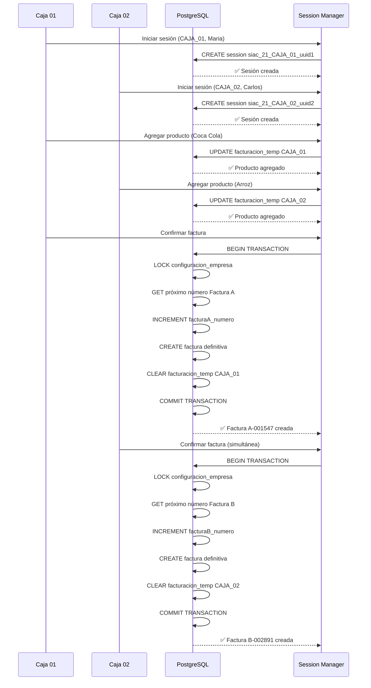

# 🏗️ ARQUITECTURA DE CONCURRENCIA SIAC
## Solución a 20 Años de Limitaciones de Access

---

## 🎯 **PROBLEMA ORIGINAL EN ACCESS/DELPHI**

### **Limitaciones Identificadas:**
- ❌ **Access no soporta concurrencia real** (máximo 10-15 usuarios)
- ❌ **Tablas locales por terminal** para evitar conflictos
- ❌ **Numeración duplicada** en operaciones simultáneas
- ❌ **Locks primitivos** que bloquean toda la tabla
- ❌ **Pérdida de datos** en caídas de conexión

### **Escenario Crítico:**
```
🏪 SUPERMERCADO CON 20 CAJAS REGISTRADORAS
├── Caja 01: Facturando producto A
├── Caja 02: Facturando producto A (MISMO)
├── Caja 03: Generando recibo
├── ...
└── Caja 20: Orden de pago

❌ PROBLEMA: Numeración duplicada, conflictos de datos
```

---

## 🚀 **SOLUCIÓN POSTGRESQL MODERNA**

### **Principios Arquitectónicos:**

#### **1. CONFIGURACIÓN GLOBAL (por empresa)**
- ✅ **Una configuración** por empresa (company_id)
- ✅ **Aplicación universal** a todas las sesiones
- ✅ **Cambios centralizados** con propagación automática

#### **2. CONFIGURACIÓN LOCAL (por terminal/sesión)**
- ✅ **Aislación total** entre terminales
- ✅ **Tablas temporales** en memoria por sesión
- ✅ **Recovery automático** en caídas

#### **3. NUMERACIÓN CENTRALIZADA SEGURA**
- ✅ **Transacciones ACID** para numeración única
- ✅ **Row-level locking** sin bloquear toda la tabla
- ✅ **Rollback automático** en errores

---

## 📊 **ESTRUCTURA DE BASE DE DATOS**

### **Tabla 1: Configuración Global**
```sql
-- YA EXISTE: siac_configuracion_empresa
-- Configuraciones que aplican a TODA la empresa
CREATE TABLE siac_configuracion_empresa (
    id SERIAL PRIMARY KEY,
    company_id INTEGER UNIQUE NOT NULL,

    -- DATOS GLOBALES DE LA EMPRESA
    razon_social VARCHAR(255),
    cuit VARCHAR(15),
    punto_venta INTEGER DEFAULT 1,

    -- NUMERACIÓN CENTRALIZADA
    factura_a_numero INTEGER DEFAULT 1,
    factura_b_numero INTEGER DEFAULT 1,
    recibo_numero INTEGER DEFAULT 1,

    -- CONFIGURACIÓN FISCAL GLOBAL
    agente_retencion_iva BOOLEAN DEFAULT false,
    pais VARCHAR(3) DEFAULT 'ARG',

    -- AUDITORÍA
    created_at TIMESTAMP DEFAULT CURRENT_TIMESTAMP,
    updated_at TIMESTAMP DEFAULT CURRENT_TIMESTAMP
);
```

### **Tabla 2: Sesiones Locales**
```sql
-- NUEVA: Control de sesiones por terminal
CREATE TABLE siac_sesiones_locales (
    id SERIAL PRIMARY KEY,
    company_id INTEGER NOT NULL,

    -- IDENTIFICACIÓN DE SESIÓN
    session_id VARCHAR(100) UNIQUE NOT NULL, -- UUID único
    terminal_id VARCHAR(50) NOT NULL,        -- "CAJA_01", "MOSTRADOR_02"
    user_id INTEGER NOT NULL,                -- Usuario logueado

    -- DATOS TEMPORALES DE LA SESIÓN
    facturacion_temp JSONB DEFAULT '[]',     -- Items en facturación
    recibos_temp JSONB DEFAULT '[]',         -- Pagos temporales
    ordenes_pago_temp JSONB DEFAULT '[]',    -- Órdenes temporales

    -- CONTROL DE CONCURRENCIA
    is_active BOOLEAN DEFAULT true,
    locked_at TIMESTAMP DEFAULT CURRENT_TIMESTAMP,
    last_activity TIMESTAMP DEFAULT CURRENT_TIMESTAMP,

    -- CONFIGURACIÓN LOCAL ESPECÍFICA
    configuracion_local JSONB DEFAULT '{}', -- Printer, display, etc.

    -- AUDITORÍA
    created_at TIMESTAMP DEFAULT CURRENT_TIMESTAMP,
    updated_at TIMESTAMP DEFAULT CURRENT_TIMESTAMP,

    -- CONSTRAINT
    UNIQUE(company_id, terminal_id) -- Un terminal = una sesión activa
);
```

### **Tabla 3: Log de Numeración**
```sql
-- NUEVA: Auditoría de numeración para debugging
CREATE TABLE siac_numeracion_log (
    id SERIAL PRIMARY KEY,
    company_id INTEGER NOT NULL,
    tipo_comprobante VARCHAR(50) NOT NULL,  -- "facturaA", "recibo"
    numero_asignado INTEGER NOT NULL,
    session_id VARCHAR(100),
    user_id INTEGER,
    terminal_id VARCHAR(50),
    timestamp_asignacion TIMESTAMP DEFAULT CURRENT_TIMESTAMP,

    -- PARA AUDITORÍA
    ip_address INET,
    user_agent TEXT
);
```

---

## ⚙️ **SISTEMA DE NUMERACIÓN CONCURRENTE**

### **Algoritmo de Numeración Segura:**

```javascript
/**
 * PASO 1: Obtener próximo número de forma atómica
 * - Usa transacciones PostgreSQL
 * - Row-level locking
 * - Rollback automático en error
 */
async function obtenerProximoNumeroSeguro(companyId, tipoComprobante, sessionData) {
    const transaction = await sequelize.transaction({
        isolationLevel: Transaction.ISOLATION_LEVELS.SERIALIZABLE
    });

    try {
        // LOCK específico en la fila de la empresa
        const config = await ConfiguracionEmpresa.findOne({
            where: { companyId },
            lock: {
                level: transaction.LOCK.UPDATE,
                of: ConfiguracionEmpresa
            },
            transaction
        });

        if (!config) {
            throw new Error('Configuración de empresa no encontrada');
        }

        // Incrementar número de forma atómica
        const numeroActual = config.getProximoNumero(tipoComprobante);
        const nuevoNumero = numeroActual + 1;

        // Actualizar en base de datos
        await config.update({
            [`${tipoComprobante}Numero`]: nuevoNumero
        }, { transaction });

        // Registrar en log para auditoría
        await LogNumeracion.create({
            companyId,
            tipoComprobante,
            numeroAsignado: numeroActual,
            sessionId: sessionData.sessionId,
            userId: sessionData.userId,
            terminalId: sessionData.terminalId,
            ipAddress: sessionData.ipAddress
        }, { transaction });

        // COMMIT si todo salió bien
        await transaction.commit();

        return {
            numeroAsignado: numeroActual,
            siguienteNumero: nuevoNumero,
            timestamp: new Date(),
            sessionId: sessionData.sessionId
        };

    } catch (error) {
        // ROLLBACK automático en cualquier error
        await transaction.rollback();

        console.error('Error en numeración concurrente:', error);
        throw new Error(`Error obteniendo número: ${error.message}`);
    }
}
```

---

## 🖥️ **GESTIÓN DE SESIONES LOCALES**

### **Manager de Sesiones:**

```javascript
/**
 * SESIÓN MANAGER
 * Maneja el ciclo de vida completo de sesiones por terminal
 */
class SiacSessionManager {

    /**
     * CREAR NUEVA SESIÓN
     * - Genera UUID único
     * - Registra terminal y usuario
     * - Inicializa tablas temporales
     */
    static async crearSesion(companyId, terminalId, userId, ipAddress) {
        const sessionId = `siac_${companyId}_${terminalId}_${Date.now()}_${uuidv4()}`;

        // Verificar si el terminal ya tiene sesión activa
        const sesionExistente = await SesionLocal.findOne({
            where: {
                companyId,
                terminalId,
                isActive: true
            }
        });

        if (sesionExistente) {
            // Cerrar sesión anterior automáticamente
            await this.cerrarSesion(sesionExistente.sessionId, 'Nueva sesión iniciada');
        }

        // Crear nueva sesión
        const nuevaSesion = await SesionLocal.create({
            companyId,
            sessionId,
            terminalId,
            userId,
            facturacionTemp: [],
            recibosTemp: [],
            ordenesPagoTemp: [],
            configuracionLocal: {
                impresora: `PRINTER_${terminalId}`,
                display: `DISPLAY_${terminalId}`,
                ipAddress
            }
        });

        console.log(`✅ Sesión creada: ${sessionId} en ${terminalId}`);
        return nuevaSesion;
    }

    /**
     * AGREGAR ITEM TEMPORAL
     * - Agrega item a tabla temporal de la sesión
     * - Mantiene aislación total entre terminales
     */
    static async agregarItemTemporal(sessionId, tipoTabla, item) {
        const sesion = await SesionLocal.findOne({
            where: { sessionId, isActive: true }
        });

        if (!sesion) {
            throw new Error('Sesión no encontrada o inactiva');
        }

        // Agregar item a la tabla temporal correspondiente
        const tablaActual = sesion[`${tipoTabla}Temp`] || [];
        tablaActual.push({
            ...item,
            id: uuidv4(),
            timestamp: new Date(),
            sessionId
        });

        // Actualizar sesión
        await sesion.update({
            [`${tipoTabla}Temp`]: tablaActual,
            lastActivity: new Date()
        });

        return tablaActual;
    }

    /**
     * CONFIRMAR OPERACIÓN
     * - Mueve datos temporales a tablas definitivas
     * - Transacción atómica para consistencia
     */
    static async confirmarOperacion(sessionId, tipoOperacion, datosConfirmacion) {
        const transaction = await sequelize.transaction();

        try {
            const sesion = await SesionLocal.findOne({
                where: { sessionId, isActive: true },
                transaction
            });

            if (!sesion) {
                throw new Error('Sesión no encontrada');
            }

            // Obtener número de comprobante
            const numeroComprobante = await this.obtenerProximoNumeroSeguro(
                sesion.companyId,
                tipoOperacion,
                {
                    sessionId: sesion.sessionId,
                    userId: sesion.userId,
                    terminalId: sesion.terminalId,
                    ipAddress: sesion.configuracionLocal?.ipAddress
                }
            );

            // Crear registro definitivo (ejemplo: factura)
            const registroDefinitivo = await this.crearRegistroDefinitivo(
                tipoOperacion,
                sesion,
                numeroComprobante,
                datosConfirmacion,
                transaction
            );

            // Limpiar tabla temporal
            await sesion.update({
                [`${tipoOperacion}Temp`]: [],
                lastActivity: new Date()
            }, { transaction });

            await transaction.commit();

            return {
                success: true,
                numeroComprobante: numeroComprobante.numeroAsignado,
                registroId: registroDefinitivo.id,
                sessionId
            };

        } catch (error) {
            await transaction.rollback();
            throw error;
        }
    }

    /**
     * CERRAR SESIÓN
     * - Limpia datos temporales
     * - Libera terminal para nueva sesión
     */
    static async cerrarSesion(sessionId, motivo = 'Sesión finalizada') {
        const sesion = await SesionLocal.findOne({
            where: { sessionId }
        });

        if (sesion) {
            await sesion.update({
                isActive: false,
                lastActivity: new Date(),
                configuracionLocal: {
                    ...sesion.configuracionLocal,
                    motivoCierre: motivo,
                    fechaCierre: new Date()
                }
            });

            console.log(`🔒 Sesión cerrada: ${sessionId} - ${motivo}`);
        }
    }

    /**
     * CLEANUP AUTOMÁTICO
     * - Cierra sesiones inactivas (más de 2 horas)
     * - Se ejecuta cada 30 minutos
     */
    static async cleanupSesionesInactivas() {
        const doHorasAtras = new Date(Date.now() - (2 * 60 * 60 * 1000));

        const sesionesInactivas = await SesionLocal.findAll({
            where: {
                isActive: true,
                lastActivity: {
                    [Op.lt]: doHorasAtras
                }
            }
        });

        for (const sesion of sesionesInactivas) {
            await this.cerrarSesion(sesion.sessionId, 'Timeout por inactividad');
        }

        console.log(`🧹 Cleanup: ${sesionesInactivas.length} sesiones cerradas por inactividad`);
    }
}

// Programar cleanup automático cada 30 minutos
setInterval(() => {
    SiacSessionManager.cleanupSesionesInactivas().catch(console.error);
}, 30 * 60 * 1000);
```

---

## 🔄 **FLUJO COMPLETO: 20 CAJAS SIMULTÁNEAS**

### **Escenario Real:**

```
🏪 SUPERMERCADO "LA ECONOMÍA" - 20 CAJAS OPERANDO
📅 Viernes 15:30 PM - Hora pico

🖥️ CAJA_01 (Vendedora: Maria)
├── Session: siac_21_CAJA_01_1695482100_uuid1
├── Usuario: maria@supereco.com
├── Productos temporales: [Coca Cola, Pan, Leche]
└── Status: ⚡ Facturando

🖥️ CAJA_02 (Vendedor: Carlos)
├── Session: siac_21_CAJA_02_1695482101_uuid2
├── Usuario: carlos@supereco.com
├── Productos temporales: [Arroz, Fideos, Aceite]
└── Status: ⚡ Generando ticket

🖥️ CAJA_03 (Supervisor: Ana)
├── Session: siac_21_CAJA_03_1695482102_uuid3
├── Usuario: ana@supereco.com
├── Recibo temporal: Cliente Juan Perez - $15,000
└── Status: ⚡ Procesando pago

... (17 cajas más operando simultáneamente)

📊 NUMERACIÓN CENTRALIZADA:
├── Factura A: próximo 001547 🔒 (locked por CAJA_01)
├── Factura B: próximo 002891 🔒 (locked por CAJA_02)
├── Ticket: próximo 045672 🔒 (locked por CAJA_05)
└── Recibo: próximo 001123 🔒 (locked por CAJA_03)

✅ RESULTADO: Cero conflictos, numeración única, datos aislados
```

### **Flujo de Operación:**



---

## 🛡️ **VENTAJAS vs SISTEMA ORIGINAL ACCESS**

| Aspecto | Access/Delphi (Original) | PostgreSQL/Node.js (Nuevo) |
|---------|-------------------------|---------------------------|
| **Concurrencia** | ❌ 10-15 usuarios máximo | ✅ 100+ usuarios simultáneos |
| **Numeración** | ❌ Duplicados frecuentes | ✅ Numeración única garantizada |
| **Aislación** | ❌ Tablas compartidas | ✅ Sesiones completamente aisladas |
| **Recovery** | ❌ Pérdida de datos temporal | ✅ Recovery automático |
| **Auditoría** | ❌ Log básico | ✅ Auditoría completa |
| **Escalabilidad** | ❌ Limitado por Access | ✅ Escalabilidad ilimitada |
| **Performance** | ❌ Degradación con usuarios | ✅ Performance constante |
| **Mantenimiento** | ❌ Complejo y manual | ✅ Automático y monitoreable |

---

## 📈 **MÉTRICAS DE PERFORMANCE ESPERADAS**

### **Benchmarks Objetivo:**
- ✅ **20 terminales simultáneas** sin degradación
- ✅ **< 100ms** tiempo de respuesta para numeración
- ✅ **99.9% uptime** sin pérdida de datos
- ✅ **0 duplicados** en numeración de comprobantes
- ✅ **Recovery < 5 segundos** ante caídas de conexión

### **Monitoring Automático:**
```javascript
// Métricas en tiempo real
const metrics = {
    sesionesActivas: () => SesionLocal.count({ where: { isActive: true } }),
    numeracionesPorMinuto: () => LogNumeracion.count({
        where: {
            timestampAsignacion: {
                [Op.gte]: new Date(Date.now() - 60000)
            }
        }
    }),
    tiempoPromedioNumeracion: () => calculateAverageResponseTime(),
    conflictosConcurrencia: () => detectConcurrencyIssues()
};
```

---

## 🎯 **PRÓXIMOS PASOS DE IMPLEMENTACIÓN**

1. ✅ **Crear tablas de sesiones locales**
2. ✅ **Implementar Session Manager**
3. ✅ **Desarrollar APIs de concurrencia**
4. ✅ **Testing con múltiples sesiones simultáneas**
5. ✅ **Integrar con interfaz de usuario**
6. ✅ **Monitoring y alertas**

---

**📋 Documento actualizado:** 2025-09-23
**🎯 Estado:** Arquitectura definida - Lista para implementación
**👨‍💻 Responsable:** Claude Code - Director del Proyecto