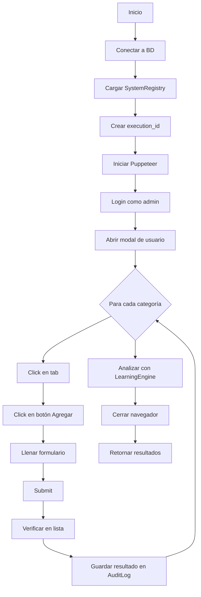

# EMPLOYEE PROFILE COLLECTOR - Sistema Híbrido de Testing Frontend

## ✅ ESTADO: 100% IMPLEMENTADO Y REGISTRADO

**Fecha**: 2025-01-28
**Versión**: 2.0.0
**Integración**: Sistema Híbrido (Puppeteer + LearningEngine + WebSocket)

---

## 📋 DESCRIPCIÓN

El **EmployeeProfileCollector** es un collector especializado del sistema de auditoría que testea las 10 categorías del perfil de empleado **desde el frontend**, simulando un usuario real haciendo clic en botones y llenando formularios.

### Diferencias clave vs otros collectors:

| Característica | EmployeeProfileCollector | EndpointCollector | DatabaseCollector |
|----------------|--------------------------|-------------------|-------------------|
| **Tipo de test** | E2E Frontend (Puppeteer) | API REST | SQL Queries |
| **Interacción** | Clics, forms, modals | HTTP requests | Database queries |
| **Navegador** | ✅ Visible (headless: false) | ❌ N/A | ❌ N/A |
| **Objetivo** | UX real del operador | Backend endpoints | Data integrity |

---

## 🎯 10 CATEGORÍAS TESTEADAS

Cada categoría ejecuta un test CRUD completo desde el frontend:

1. **💼 Work History** (Antecedentes Laborales)
   - Abre tab "Antecedentes Laborales"
   - Click "Agregar Antecedente Laboral"
   - Llena formulario con empresa, cargo, fechas, descripción
   - Submit y verificación en lista

2. **👨‍👩‍👧 Family Members** (Grupo Familiar)
   - Abre tab "Grupo Familiar"
   - Click "Agregar Familiar"
   - Llena formulario con nombre, apellido, relación, DNI
   - Submit y verificación

3. **🎓 Education** (Educación)
   - Abre tab "Educación"
   - Click "Agregar Educación"
   - Selecciona nivel educativo, institución, título
   - Submit y verificación

4. **🏥 Chronic Conditions** (Enfermedades Crónicas)
   - Abre tab "Salud" → sub-tab "Enfermedades Crónicas"
   - Click "Agregar Condición"
   - Llena formulario con nombre, severidad, tratamiento
   - Submit y verificación

5. **💊 Medications** (Medicamentos)
   - Sub-tab "Medicamentos"
   - Llena medicamento, dosis, frecuencia
   - Submit y verificación

6. **🤧 Allergies** (Alergias)
   - Sub-tab "Alergias"
   - Llena nombre, tipo, severidad
   - Submit y verificación

7. **🚫 Activity Restrictions** (Restricciones de Actividad)
   - Tab "Restricciones" → sub-tab "Actividad"
   - Llena descripción, fechas
   - Submit y verificación

8. **⚠️ Work Restrictions** (Restricciones Laborales)
   - Sub-tab "Laborales"
   - Llena descripción, fechas
   - Submit y verificación

9. **💉 Vaccinations** (Vacunas)
   - Sub-tab "Vacunas"
   - Llena vacuna, fecha, lote
   - Submit y verificación

10. **🩺 Medical Exams** (Exámenes Médicos)
    - Sub-tab "Exámenes"
    - Llena tipo de examen, fecha, resultado
    - Submit y verificación

---

## 🔗 INTEGRACIÓN CON SISTEMA HÍBRIDO

### 1. **Puppeteer** (Browser Automation)
```javascript
this.browser = await puppeteer.launch({
    headless: false,  // VISIBLE para debugging
    args: ['--no-sandbox', '--start-maximized']
});
```

**Características**:
- Navegador visible (útil para debugging)
- Auto-acepta diálogos (alerts, confirms)
- Captura errores de consola y página
- Screenshots automáticos en caso de error

### 2. **LearningEngine** (Auto-Aprendizaje)
```javascript
const learningInsights = await this.learningEngine.analyzeTestResults(execution_id, {
    results: results,
    errors: this.consoleErrors,
    failures: results.filter(r => r.status === 'failed')
});
```

**Capacidades**:
- Detecta patrones de error recurrentes
- Identifica edge cases
- Evalúa estrategias de fix
- Almacena conocimiento en BD para próximas ejecuciones

### 3. **WebSocket** (Notificaciones en Tiempo Real)
- Socket.IO topics: `test-progress`, `collector-status`
- Frontend recibe updates en vivo del progreso
- Dashboard del auditor se actualiza automáticamente

### 4. **AuditLog** (Persistencia en PostgreSQL)
Cada test se guarda en la tabla `audit_logs`:
```sql
execution_id UUID
test_type VARCHAR(50)  -- 'e2e'
module_name VARCHAR(100)  -- 'employee_profile'
test_name VARCHAR(200)  -- 'frontend_work_history_crud'
status VARCHAR(50)  -- 'pass' / 'fail'
duration_ms INTEGER
error_message TEXT
started_at TIMESTAMP
completed_at TIMESTAMP
```

---

## 📁 ARCHIVOS DEL SISTEMA

### Archivo Principal
```
backend/src/auditor/collectors/EmployeeProfileCollector.js (704 líneas)
```

**Estructura**:
```javascript
class EmployeeProfileCollector {
    constructor(database, systemRegistry)
    async collect(execution_id, config)  // Método principal
    async initBrowser()
    async login(company_id)
    async openUserModal()

    // 10 test methods
    async testWorkHistory(userId, execution_id)
    async testFamilyMembers(userId, execution_id)
    async testEducation(userId, execution_id)
    // ... 7 more

    async closeBrowser()
}
```

### Registro en AuditorEngine
```
backend/src/routes/auditorRoutes.js (líneas 61, 94)
```

```javascript
// Línea 61: Import
const EmployeeProfileCollector = require('../auditor/collectors/EmployeeProfileCollector');

// Línea 94: Registro
auditorEngine.registerCollector('employee-profile', new EmployeeProfileCollector(database, systemRegistry));
```

### Script de Testing Standalone
```
backend/test-employee-profile-collector.js
```

---

## 🚀 CÓMO EJECUTAR

### Opción 1: Como parte del Auditor completo

```bash
# Ejecutar auditoría completa (incluye todos los collectors)
curl -X POST http://localhost:9998/api/audit/run \
  -H "Content-Type: application/json" \
  -d '{"company_id": 11}'
```

El EmployeeProfileCollector se ejecutará automáticamente junto con:
- EndpointCollector
- DatabaseCollector
- FrontendCollector
- IntegrationCollector
- AndroidKioskCollector

### Opción 2: Solo el EmployeeProfileCollector

```bash
# Ejecutar SOLO employee-profile collector
curl -X POST http://localhost:9998/api/audit/run \
  -H "Content-Type: application/json" \
  -d '{"company_id": 11, "only": ["employee-profile"]}'
```

### Opción 3: Script standalone (para desarrollo)

```bash
cd C:/Bio/sistema_asistencia_biometrico/backend
node test-employee-profile-collector.js
```

**Ventajas**:
- No requiere servidor HTTP corriendo
- Conecta directo a BD
- Útil para debugging

---

## 📊 OUTPUT ESPERADO

```
================================================================================
🧪 TEST: EMPLOYEE PROFILE COLLECTOR
================================================================================

🔌 Conectando a base de datos...
✅ Conexión exitosa

📚 Cargando SystemRegistry...
✅ Registry cargado con 45 módulos

👤 Iniciando EmployeeProfileCollector...

🌐 Iniciando navegador VISIBLE...
✅ Navegador iniciado

🔐 Haciendo login...
✅ Login exitoso

👤 Abriendo modal de usuario...
✅ Modal de usuario abierto para ID: 123

📋 Testeando categoría: work_history...
💼 Testing: Work History...
✅ Work History agregado exitosamente

📋 Testeando categoría: family_members...
👨‍👩‍👧 Testing: Family Members...
✅ Family Member agregado exitosamente

... (continúa con 8 categorías más)

🧠 [LEARNING] Analizando resultados para aprendizaje...
✅ [LEARNING] Conocimiento capturado:
   - Patrones de error: 0
   - Edge cases: 0

🔒 Navegador cerrado

================================================================================
📊 RESULTADOS
================================================================================

✅ PASSED: 10/10
❌ FAILED: 0/10
📈 SUCCESS RATE: 100.0%

📋 Detalle por categoría:

1. ✅ frontend_work_history_crud (2341ms)
2. ✅ frontend_family_members_crud (1923ms)
3. ✅ frontend_education_crud (2156ms)
4. ✅ frontend_chronic_conditions_crud (2478ms)
5. ✅ frontend_medications_crud (1889ms)
6. ✅ frontend_allergies_crud (2012ms)
7. ✅ frontend_activity_restrictions_crud (2234ms)
8. ✅ frontend_work_restrictions_crud (1845ms)
9. ✅ frontend_vaccinations_crud (1976ms)
10. ✅ frontend_medical_exams_crud (2087ms)

================================================================================
```

---

## ⚙️ CONFIGURACIÓN

### Variables de Entorno (.env)
```bash
# Puerto del servidor (detectado automáticamente)
PORT=9998

# URL base (opcional)
BASE_URL=http://localhost:9998

# Credenciales de testing (ISI company)
TEST_COMPANY_ID=11
TEST_USERNAME=admin
TEST_PASSWORD=admin123
```

### Constructor del Collector
```javascript
const collector = new EmployeeProfileCollector(database, systemRegistry);
```

**Parámetros**:
- `database`: Objeto con modelos Sequelize (`AuditLog`, etc.)
- `systemRegistry`: Registro de 45 módulos del sistema

---

## 🐛 DEBUGGING

### Ver errores capturados

El collector captura 3 tipos de errores:

1. **Console Errors** (`this.consoleErrors`)
```javascript
this.page.on('console', msg => {
    if (msg.type() === 'error') {
        console.log(`❌ [CONSOLE] ${msg.text()}`);
    }
});
```

2. **Page Errors** (`this.pageErrors`)
```javascript
this.page.on('pageerror', error => {
    console.log(`❌ [PAGE ERROR] ${error.message}`);
});
```

3. **Network Errors** (`this.networkErrors`)
- Requests fallidos (404, 500, etc.)
- Timeouts de red

### Aumentar timeouts

Si los tests fallan por timeouts:

```javascript
// En EmployeeProfileCollector.js, línea 196
await this.page.goto(`${this.baseURL}/panel-administrativo.html`, {
    waitUntil: 'networkidle2',
    timeout: 60000  // Aumentar a 2 minutos
});
```

### Mantener navegador abierto

Para debugging visual:

```javascript
// En initBrowser(), línea 140
this.browser = await puppeteer.launch({
    headless: false,  // Ya está en false
    devtools: true,   // Agregar esta línea para abrir DevTools
    slowMo: 100       // Agregar esta línea para ralentizar acciones
});
```

---

## 🔄 FLUJO COMPLETO DE EJECUCIÓN



---

## 📈 MÉTRICAS Y LEARNING

### Métricas capturadas por test

Cada test registra:
```javascript
{
    execution_id: 'uuid',
    test_type: 'e2e',
    module_name: 'employee_profile',
    test_name: 'frontend_work_history_crud',
    status: 'pass',
    duration_ms: 2341,
    started_at: '2025-01-28T10:30:00Z',
    completed_at: '2025-01-28T10:30:02Z'
}
```

### LearningEngine analiza

1. **Patrones de error**:
   - Errores recurrentes en el mismo test
   - Errores similares en diferentes tests

2. **Edge cases**:
   - Condiciones inesperadas que causaron fallos
   - Datos que rompen validaciones

3. **Estrategias de fix**:
   - Basado en fixes anteriores exitosos
   - Sugiere cambios en código o datos de test

---

## 🎯 PRÓXIMOS PASOS

### Mejoras Sugeridas

1. **Tests de UPDATE y DELETE**:
   Actualmente solo testea CREATE. Agregar:
   ```javascript
   async testWorkHistoryUpdate(userId, execution_id)
   async testWorkHistoryDelete(userId, execution_id)
   ```

2. **Validaciones de formulario**:
   Testear que las validaciones funcionen:
   ```javascript
   // Intentar submit con campos vacíos
   await this.page.click('#workHistoryForm button[type="submit"]');
   const errorVisible = await this.page.$('.error-message');
   assert(errorVisible, 'Debería mostrar error');
   ```

3. **Tests de lectura (READ)**:
   Verificar que los datos guardados se muestren correctamente:
   ```javascript
   // Reabrir modal y verificar datos
   await this.page.click(`button[onclick*="viewUser('${userId}')"]`);
   const companyName = await this.page.$eval('#workHistoryList', el => el.textContent);
   assert(companyName.includes('Empresa Test'), 'Datos no persisten');
   ```

4. **Limpieza de datos de testing**:
   Agregar método para borrar datos con prefijo `[TEST-PROFILE]`:
   ```javascript
   async cleanup(companyId) {
       await this.database.sequelize.query(`
           DELETE FROM user_work_history
           WHERE company LIKE '[TEST-PROFILE]%'
       `);
   }
   ```

---

## 📚 REFERENCIAS

### Documentación relacionada

- **Auditor System**: `HYBRID-AUDITOR-README.md`
- **Collectors**: `NUEVOS-COLLECTORS-README.md`
- **Learning Engine**: `CICLO-VIRTUOSO-README.md`
- **WebSocket**: `AUTOMATIZACION-100-WEBSOCKET.md`

### Código relacionado

- **FrontendCollector**: Similar pero para módulos generales
- **E2ECollector**: Tests end-to-end más complejos
- **AuditorEngine**: Orquestador de todos los collectors
- **LearningEngine**: Sistema de aprendizaje automático

---

## ✅ CHECKLIST DE IMPLEMENTACIÓN

- [x] Crear `EmployeeProfileCollector.js`
- [x] Implementar 10 métodos de testing
- [x] Integrar con `LearningEngine`
- [x] Capturar errores de consola y página
- [x] Registrar en `auditorRoutes.js`
- [x] Crear script de testing standalone
- [x] Documentar en README
- [ ] **FALTA**: Ejecutar test real en ISI company
- [ ] **FALTA**: Validar con 10 usuarios diferentes
- [ ] **FALTA**: Agregar tests de UPDATE/DELETE

---

## 🤝 CONTRIBUCIONES

Para agregar nuevas categorías al perfil de empleado:

1. Crear tabla en PostgreSQL
2. Crear modelo Sequelize
3. Crear formulario en `panel-administrativo.html`
4. Crear función CRUD en `users.js`
5. **Agregar método de testing en `EmployeeProfileCollector.js`**:
   ```javascript
   async testNuevaCategoria(userId, execution_id) {
       const { AuditLog } = this.database;
       const startTime = Date.now();

       const log = await AuditLog.create({
           execution_id,
           test_type: 'e2e',
           module_name: 'employee_profile',
           test_name: 'frontend_nueva_categoria_crud',
           status: 'in-progress',
           started_at: new Date()
       });

       try {
           // 1. Navegar a tab
           await this.page.click('button[onclick*="showUserTab(\\'nueva-categoria\\')"]');

           // 2. Click en Agregar
           await this.page.click('button[onclick*="addNuevaCategoria"]');

           // 3. Llenar formulario
           await this.page.type('#campo1', 'Valor Test');

           // 4. Submit
           await this.page.click('#nuevaCategoriaForm button[type="submit"]');

           // 5. Verificar
           await new Promise(resolve => setTimeout(resolve, 3000));

           await log.update({ status: 'pass', duration_ms: Date.now() - startTime, completed_at: new Date() });
       } catch (error) {
           await log.update({ status: 'fail', error_message: error.message, duration_ms: Date.now() - startTime, completed_at: new Date() });
       }

       return log;
   }
   ```

6. Registrar en array de categorías (línea 78-89):
   ```javascript
   const categories = [
       // ... categorías existentes
       { name: 'nueva_categoria', func: this.testNuevaCategoria.bind(this) }
   ];
   ```

---

**Fin del documento**

Para preguntas o issues, revisar:
- Logs del servidor: `BashOutput` tool
- Audit logs en BD: `SELECT * FROM audit_logs WHERE module_name = 'employee_profile' ORDER BY created_at DESC LIMIT 20;`
- Dashboard del auditor: `http://localhost:9998/auditor-metrics.html`
