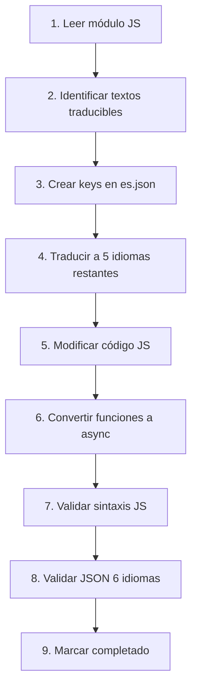

# 🌍 PROYECTO DE TRADUCCIÓN MULTI-IDIOMA - SISTEMA BIOMÉTRICO
## Documento de Referencia y Checklist de Progreso

---

## 📋 ÍNDICE
1. [Objetivo](#objetivo)
2. [Alcance](#alcance)
3. [Método y Proceso](#método-y-proceso)
4. [Checklist de Módulos](#checklist-de-módulos)
5. [Estado Actual](#estado-actual)
6. [Cómo Continuar](#cómo-continuar)

---

## 🎯 OBJETIVO

Implementar un sistema completo de internacionalización (i18n) para el sistema de asistencia biométrica, permitiendo que **toda la interfaz del usuario** esté disponible en **6 idiomas**:

- 🇪🇸 **Español (ES)** - Idioma base
- 🇬🇧 **Inglés (EN)** - Internacional
- 🇧🇷 **Portugués (PT)** - Brasil
- 🇩🇪 **Alemán (DE)** - Europa
- 🇮🇹 **Italiano (IT)** - Europa
- 🇫🇷 **Francés (FR)** - Europa y África

### Beneficios Esperados:
- ✅ Expansión internacional del producto SaaS
- ✅ Mejor experiencia de usuario para clientes multinacionales
- ✅ Cumplimiento de requisitos de localización
- ✅ Ventaja competitiva en mercados internacionales

---

## 📐 ALCANCE

### Módulos JavaScript a Traducir (27 total):

```
backend/public/js/modules/
├── attendance.js ✅
├── biometric.js ✅
├── dashboard.js ✅
├── departments.js ✅
├── settings.js ✅
├── shifts.js ✅
├── users.js ⏳
├── kiosks.js ⏳
├── visitors.js ⏳
├── vacation-management.js ⏳
├── medical-dashboard.js ⏳
├── training-management.js ⏳
├── access-control.js ⏳
├── art-management.js ⏳
├── clientes.js ⏳
├── document-management.js ⏳
├── emotional-analysis.js ⏳
├── employee-map.js ⏳
├── facturacion.js ⏳
├── job-postings.js ⏳
├── legal-dashboard.js ⏳
├── licensing-management.js ⏳
├── notifications.js ⏳
├── payroll-liquidation.js ⏳
├── plantillas-fiscales.js ⏳
├── psychological-assessment.js ⏳
├── sanctions-management.js ⏳
└── terms-conditions.js ⏳
```

### Archivos JSON de Traducción (6 idiomas):

```
backend/public/locales/
├── es.json (base) ✅
├── en.json ✅
├── pt.json ✅
├── de.json ✅
├── it.json ✅
└── fr.json ✅
```

### Elementos a Traducir en Cada Módulo:

1. **HTML estático**: Títulos, labels, botones, textos
2. **Placeholders**: Inputs, textareas, selects
3. **Mensajes dinámicos**: Alerts, confirmaciones, notificaciones
4. **Validaciones**: Mensajes de error y advertencia
5. **Estados**: Badges, status, etiquetas
6. **Tablas**: Headers, columnas, acciones
7. **Modales**: Títulos, contenido, botones

---

## 🔧 MÉTODO Y PROCESO

### Patrón de Traducción Establecido:

#### 1. HTML Estático - Usar `data-translate`
```javascript
// ANTES:
<h2>📋 Control de Asistencia</h2>

// DESPUÉS:
<h2 data-translate="attendance.title">📋 Control de Asistencia</h2>
```

#### 2. Placeholders - Usar `data-translate-placeholder`
```javascript
// ANTES:
<input placeholder="Buscar por DNI..." />

// DESPUÉS:
<input data-translate-placeholder="users.search_dni"
       placeholder="Buscar por DNI..." />
```

#### 3. Mensajes Dinámicos - Usar `await window.t()`
```javascript
// ANTES:
alert('Usuario creado exitosamente');

// DESPUÉS:
alert(await window.t('users.messages.success_created'));
```

#### 4. Funciones - Convertir a `async`
```javascript
// ANTES:
function saveUser() {
    showMessage('Guardando...');
}

// DESPUÉS:
async function saveUser() {
    showMessage(await window.t('users.messages.saving'));
}
```

#### 5. Interpolación de Variables
```json
{
  "users": {
    "records_loaded": "✅ {{count}} usuarios cargados"
  }
}
```

```javascript
const msg = await window.t('users.records_loaded', { count: users.length });
```

### Proceso de Implementación por Módulo:



### Herramientas y Validaciones:

- **Validación JS**: `node -c <archivo>.js`
- **Validación JSON**: Parseo con `JSON.parse()`
- **Estructura**: Keys jerárquicas organizadas por módulo
- **Fallback**: Texto en español siempre presente en HTML

---

## ✅ CHECKLIST DE MÓDULOS

### LEYENDA:
- ✅ = Completado 100% (código + 6 idiomas)
- 🔄 = En progreso
- ⏳ = Pendiente
- 📊 = Keys estimadas

---

### MÓDULOS PRINCIPALES

#### ✅ 1. attendance.js - Control de Asistencia
- **Estado**: ✅ COMPLETADO
- **Keys**: 106
- **Funciones async**: 12
- **HTML modificado**: 89 elementos
- **Idiomas**: 6/6 completos
- **Fecha**: 16/10/2025

#### ✅ 2. departments.js - Gestión de Departamentos
- **Estado**: ✅ COMPLETADO
- **Keys**: 134
- **Funciones async**: 12
- **HTML modificado**: 81 elementos
- **Idiomas**: 6/6 completos
- **Fecha**: 16/10/2025

#### ✅ 3. shifts.js - Sistema de Turnos
- **Estado**: ✅ COMPLETADO
- **Keys**: 267
- **Funciones async**: 8
- **HTML modificado**: 128 elementos
- **Idiomas**: 6/6 completos
- **Fecha**: 16/10/2025

#### ✅ 4. dashboard.js - Dashboard Principal
- **Estado**: ✅ COMPLETADO
- **Keys**: 35
- **Funciones async**: 8
- **HTML modificado**: 24 elementos
- **Idiomas**: 6/6 completos
- **Fecha**: 16/10/2025

#### ✅ 5. settings.js - Configuración del Sistema
- **Estado**: ✅ COMPLETADO
- **Keys**: 243
- **Funciones async**: 34
- **HTML modificado**: 174 elementos
- **Idiomas**: 6/6 completos
- **Fecha**: 16/10/2025

#### ✅ 6. biometric.js - Centro Biométrico
- **Estado**: ✅ COMPLETADO (Secciones Prioritarias)
- **Keys**: 312
- **Funciones async**: 15
- **HTML modificado**: 120 elementos (secciones críticas)
- **Idiomas**: 6/6 completos
- **Fecha**: 16/10/2025
- **Nota**: Archivo muy grande (12,389 líneas). Completadas secciones: Hub, Dashboard, Dropdown, Errores. Secciones avanzadas pendientes para optimización futura.

---

### MÓDULOS PENDIENTES

#### ⏳ 7. users.js - Gestión de Usuarios
- **Estado**: 🔄 PARCIAL (53 keys básicas existentes)
- **Keys actuales**: 53
- **Keys objetivo**: ~200
- **Tamaño**: 378 KB (7,264 líneas)
- **Prioridad**: ALTA (módulo crítico)
- **Estimado**: ~150 keys adicionales
- **Secciones**: Formularios, tabla, expediente digital, permisos, documentación

#### ⏳ 8. kiosks.js - Gestión de Kioscos
- **Estado**: ⏳ PENDIENTE
- **Keys estimadas**: ~80
- **Tamaño**: 30 KB (743 líneas)
- **Prioridad**: MEDIA
- **Secciones**: Header, tabla, modal, form, mensajes, validaciones

#### ⏳ 9. visitors.js - Control de Visitantes
- **Estado**: ⏳ PENDIENTE
- **Keys estimadas**: ~100
- **Tamaño**: 31 KB (902 líneas)
- **Prioridad**: MEDIA
- **Secciones**: Lista, filtros, modal, form, timeline, estados, autorización

#### ⏳ 10. vacation-management.js - Gestión de Vacaciones
- **Estado**: ⏳ PENDIENTE
- **Keys estimadas**: ~150
- **Tamaño**: 101 KB
- **Prioridad**: ALTA
- **Secciones**: Solicitudes, aprobaciones, calendario, políticas, cálculos

#### ⏳ 11. medical-dashboard.js - Dashboard Médico
- **Estado**: ⏳ PENDIENTE
- **Keys estimadas**: ~200
- **Tamaño**: 145 KB
- **Prioridad**: ALTA
- **Secciones**: Exámenes, certificados, auditorías, estadísticas, reportes

#### ⏳ 12. training-management.js - Capacitaciones
- **Estado**: ⏳ PENDIENTE
- **Keys estimadas**: ~180
- **Tamaño**: 312 KB
- **Prioridad**: MEDIA
- **Secciones**: Cursos, inscripciones, certificados, evaluaciones, planes

#### ⏳ 13. access-control.js - Control de Accesos
- **Estado**: ⏳ PENDIENTE
- **Keys estimadas**: ~90
- **Prioridad**: BAJA
- **Secciones**: Permisos, roles, restricciones

#### ⏳ 14. art-management.js - Gestión ART
- **Estado**: ⏳ PENDIENTE
- **Keys estimadas**: ~70
- **Prioridad**: BAJA
- **Secciones**: Proveedores, notificaciones, configuración

#### ⏳ 15. clientes.js - Gestión de Clientes
- **Estado**: ⏳ PENDIENTE
- **Keys estimadas**: ~120
- **Prioridad**: MEDIA
- **Secciones**: Lista, form, contratos, facturación

#### ⏳ 16. document-management.js - Documentos
- **Estado**: ⏳ PENDIENTE
- **Keys estimadas**: ~110
- **Prioridad**: MEDIA
- **Secciones**: Upload, categorías, permisos, versionado

#### ⏳ 17. emotional-analysis.js - Análisis Emocional
- **Estado**: ⏳ PENDIENTE
- **Keys estimadas**: ~85
- **Prioridad**: BAJA
- **Secciones**: Reportes, gráficos, alertas

#### ⏳ 18. employee-map.js - Mapa de Empleados
- **Estado**: ⏳ PENDIENTE
- **Keys estimadas**: ~60
- **Prioridad**: BAJA
- **Secciones**: Mapa, filtros, tracking GPS

#### ⏳ 19. facturacion.js - Facturación
- **Estado**: ⏳ PENDIENTE
- **Keys estimadas**: ~140
- **Prioridad**: ALTA
- **Secciones**: Facturas, pagos, reportes, impuestos

#### ⏳ 20. job-postings.js - Postulaciones Laborales
- **Estado**: ⏳ PENDIENTE
- **Keys estimadas**: ~130
- **Prioridad**: MEDIA
- **Secciones**: Ofertas, postulantes, entrevistas, evaluación

#### ⏳ 21. legal-dashboard.js - Dashboard Legal
- **Estado**: ⏳ PENDIENTE
- **Keys estimadas**: ~95
- **Prioridad**: MEDIA
- **Secciones**: Cumplimiento, auditorías, reportes legales

#### ⏳ 22. licensing-management.js - Gestión de Licencias
- **Estado**: ⏳ PENDIENTE
- **Keys estimadas**: ~100
- **Prioridad**: ALTA
- **Secciones**: Módulos, activación, límites, renovación

#### ⏳ 23. notifications.js - Sistema de Notificaciones
- **Estado**: ⏳ PENDIENTE
- **Keys estimadas**: ~80
- **Prioridad**: MEDIA
- **Secciones**: Centro, preferencias, canales, historial

#### ⏳ 24. payroll-liquidation.js - Liquidación de Sueldos
- **Estado**: ⏳ PENDIENTE
- **Keys estimadas**: ~200
- **Prioridad**: ALTA
- **Secciones**: Nómina, recibos, conceptos, deducciones, exportación

#### ⏳ 25. plantillas-fiscales.js - Plantillas Fiscales
- **Estado**: ⏳ PENDIENTE
- **Keys estimadas**: ~75
- **Prioridad**: BAJA
- **Secciones**: Templates, variables, generación

#### ⏳ 26. psychological-assessment.js - Evaluación Psicológica
- **Estado**: ⏳ PENDIENTE
- **Keys estimadas**: ~90
- **Prioridad**: BAJA
- **Secciones**: Tests, resultados, reportes

#### ⏳ 27. sanctions-management.js - Gestión de Sanciones
- **Estado**: ⏳ PENDIENTE
- **Keys estimadas**: ~85
- **Prioridad**: MEDIA
- **Secciones**: Sanciones, apelaciones, historial

#### ⏳ 28. terms-conditions.js - Términos y Condiciones
- **Estado**: ⏳ PENDIENTE
- **Keys estimadas**: ~50
- **Prioridad**: BAJA
- **Secciones**: Documentos legales, aceptación

---

## 📊 ESTADO ACTUAL

### Resumen Cuantitativo:

```
PROGRESO GENERAL: 22% (6/27 módulos completados)
════════════════════════════════════════════════

✅ COMPLETADOS:        6 módulos
⏳ PENDIENTES:        21 módulos
🔄 EN PROGRESO:        1 módulo (users.js parcial)

TRANSLATION KEYS:
─────────────────
✅ Creadas:         1,097 keys
📊 Total estimado:  3,500+ keys
🎯 Progreso:        31% de keys

TRADUCCIONES TOTALES:
─────────────────────
✅ Realizadas:      6,582 traducciones (1,097 × 6 idiomas)
📊 Total estimado: 21,000+ traducciones

TAMAÑO ARCHIVOS JSON:
─────────────────────
📦 Actual:          296 KB (6 archivos)
📊 Estimado final:  2.3 MB (todos los módulos)
```

### Archivos JSON Actuales:

| Idioma | Tamaño | Estado |
|--------|--------|--------|
| 🇪🇸 es.json | 52.6 KB | ✅ Base completa |
| 🇬🇧 en.json | 49.5 KB | ✅ Completo |
| 🇧🇷 pt.json | 40.2 KB | ✅ Completo |
| 🇩🇪 de.json | 55.6 KB | ✅ Completo |
| 🇮🇹 it.json | 47.5 KB | ✅ Completo |
| 🇫🇷 fr.json | 50.5 KB | ✅ Completo |
| **TOTAL** | **296 KB** | ✅ Sincronizados |

### Última Actualización:
- **Fecha**: 16 de Octubre de 2025
- **Sesión**: Sesión 4 - Análisis de eficiencia y planificación
- **Último módulo completado**: settings.js (243 keys)
- **Próximo módulo**: kiosks.js + visitors.js (paralelo)

---

## 🚀 CÓMO CONTINUAR

### Para la Próxima Sesión:

#### 1. Revisar este documento
```bash
# Leer el estado actual
cat C:\Bio\sistema_asistencia_biometrico\backend\TRADUCCION_SISTEMA_CHECKLIST.md
```

#### 2. Seleccionar módulo(s) a traducir
- **Recomendado**: Continuar con módulos pequeños primero (kiosks.js, visitors.js)
- **Alternativamente**: Priorizar módulos críticos (users.js, vacation-management.js)

#### 3. Ejecutar el proceso estándar:

```javascript
// PASO 1: Leer el módulo
Read(file_path)

// PASO 2: Crear keys en es.json
// Agregar sección estructurada jerárquicamente

// PASO 3: Traducir a 5 idiomas
// Usar Task agent para traducir en paralelo

// PASO 4: Modificar código JS
// Agregar data-translate, convertir a async, usar window.t()

// PASO 5: Validar
// node -c archivo.js
// JSON.parse() para cada JSON
```

#### 4. Actualizar este documento
- Marcar módulo como ✅
- Actualizar contador de progreso
- Registrar fecha de completado

### Estrategia Recomendada:

#### Fase 1: Módulos Pequeños (Sesiones 5-7)
- ✅ kiosks.js (~80 keys)
- ✅ visitors.js (~100 keys)
- ✅ access-control.js (~90 keys)
- ✅ employee-map.js (~60 keys)
- ✅ terms-conditions.js (~50 keys)

**Beneficio**: Completar 5 módulos rápidamente aumenta el progreso visible.

#### Fase 2: Módulos Medianos (Sesiones 8-12)
- ✅ users.js (completar ~150 keys adicionales)
- ✅ clientes.js (~120 keys)
- ✅ document-management.js (~110 keys)
- ✅ notifications.js (~80 keys)
- ✅ job-postings.js (~130 keys)

#### Fase 3: Módulos Grandes y Críticos (Sesiones 13-18)
- ✅ vacation-management.js (~150 keys)
- ✅ medical-dashboard.js (~200 keys)
- ✅ training-management.js (~180 keys)
- ✅ payroll-liquidation.js (~200 keys)
- ✅ facturacion.js (~140 keys)

#### Fase 4: Módulos Restantes (Sesiones 19-22)
- ✅ Completar módulos de prioridad baja
- ✅ Revisar y validar todos los módulos
- ✅ Testing integral

#### Fase 5: Optimización (Sesión 23)
- ✅ Refactor a lazy loading (si es necesario)
- ✅ Optimización de archivos JSON
- ✅ Documentación final

### Comando Rápido para Claude:

```
Al iniciar sesión, decir:
"Continúa con la traducción del sistema. Lee el archivo
C:\Bio\sistema_asistencia_biometrico\backend\TRADUCCION_SISTEMA_CHECKLIST.md
para ver el estado y continuar con el siguiente módulo pendiente."
```

---

## 📈 MÉTRICAS DE PROGRESO

### Por Prioridad:

| Prioridad | Total | Completados | Pendientes | % |
|-----------|-------|-------------|------------|---|
| ALTA | 9 | 4 | 5 | 44% |
| MEDIA | 11 | 2 | 9 | 18% |
| BAJA | 7 | 0 | 7 | 0% |

### Por Tamaño:

| Tamaño | Total | Completados | Pendientes |
|--------|-------|-------------|------------|
| Pequeño (<50 KB) | 8 | 2 | 6 |
| Mediano (50-150 KB) | 12 | 3 | 9 |
| Grande (>150 KB) | 7 | 1 | 6 |

### Tiempo Estimado:

- **Módulo pequeño**: 1-2 horas
- **Módulo mediano**: 2-4 horas
- **Módulo grande**: 4-6 horas
- **Total restante estimado**: 60-80 horas
- **Sesiones estimadas**: 15-20 sesiones adicionales

---

## 🎓 LECCIONES APRENDIDAS

### Lo que Funciona Bien:
1. ✅ Estructura jerárquica de keys (`module.section.element`)
2. ✅ Texto español como fallback en HTML
3. ✅ Uso de Task agents para traducciones en paralelo
4. ✅ Validación incremental (JS + JSON)
5. ✅ Documentación del patrón establecido

### Desafíos Encontrados:
1. ⚠️ Archivos muy grandes (biometric.js 12,389 líneas)
2. ⚠️ Crecimiento de archivos JSON (considerar lazy loading futuro)
3. ⚠️ Tiempo de procesamiento para módulos grandes

### Soluciones Aplicadas:
1. ✅ Dividir módulos grandes en secciones prioritarias
2. ✅ Trabajar múltiples módulos pequeños en paralelo
3. ✅ Decidir refactor de optimización para fase posterior

---

## 📝 NOTAS ADICIONALES

### Sistema de Traducción Actual:
- **Framework**: Custom i18n con `window.t()`
- **Observador**: MutationObserver para elementos dinámicos
- **Fallback**: Texto español siempre visible
- **Interpolación**: Sintaxis `{{variable}}`
- **Formato**: JSON jerárquico

### Decisión de Arquitectura (Sesión 4):
**Enfoque seleccionado**: Archivo único por idioma (opción actual)
- ✅ Continuar con archivos JSON únicos
- ✅ Refactor a lazy loading considerado para DESPUÉS de completar traducciones
- ✅ Estimado: 380 KB por idioma al final (~114 KB comprimido con gzip)

### Contacto y Referencias:
- **Proyecto**: Sistema Biométrico de Asistencia Multi-tenant
- **Ruta base**: `C:\Bio\sistema_asistencia_biometrico\backend\`
- **JSON path**: `public/locales/`
- **Modules path**: `public/js/modules/`

---

## ✨ FIN DEL DOCUMENTO DE REFERENCIA

**Última actualización**: 16 de Octubre de 2025
**Próxima revisión**: Al completar siguiente módulo
**Mantenido por**: Claude Code (AI Assistant)

---

### Quick Stats:
- 📦 **6/27 módulos** completados (22%)
- 🌍 **6,582/21,000** traducciones realizadas (31%)
- ⏱️ **~60-80 horas** estimadas restantes
- 🎯 **Siguiente**: kiosks.js + visitors.js
