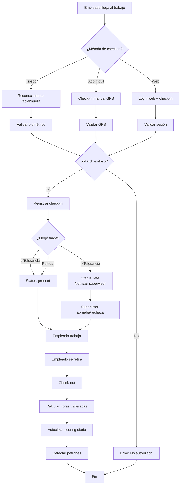
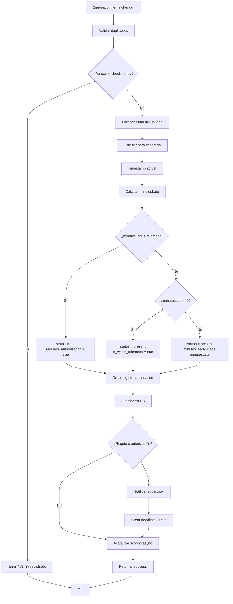
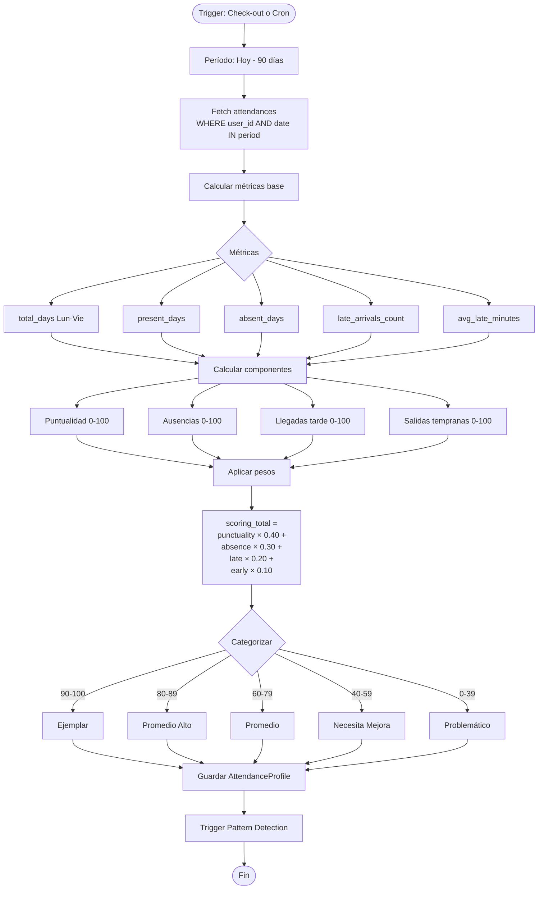
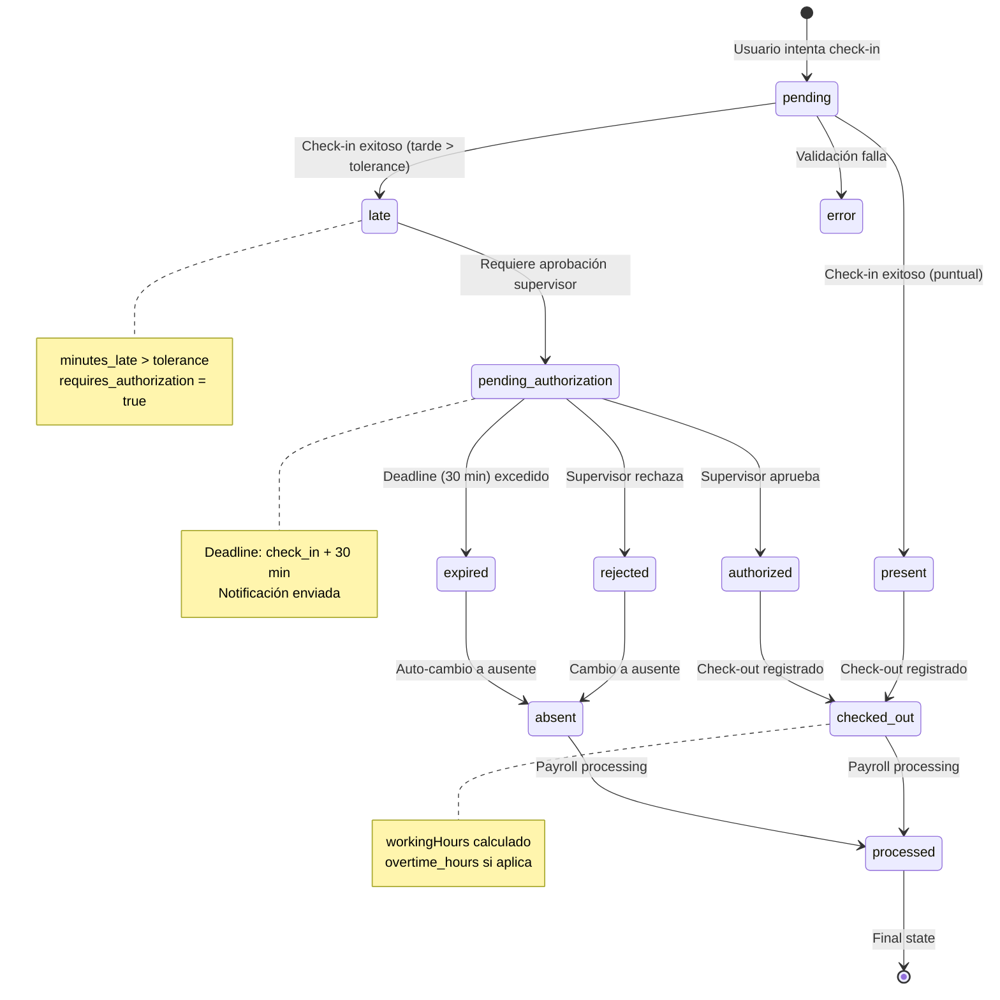
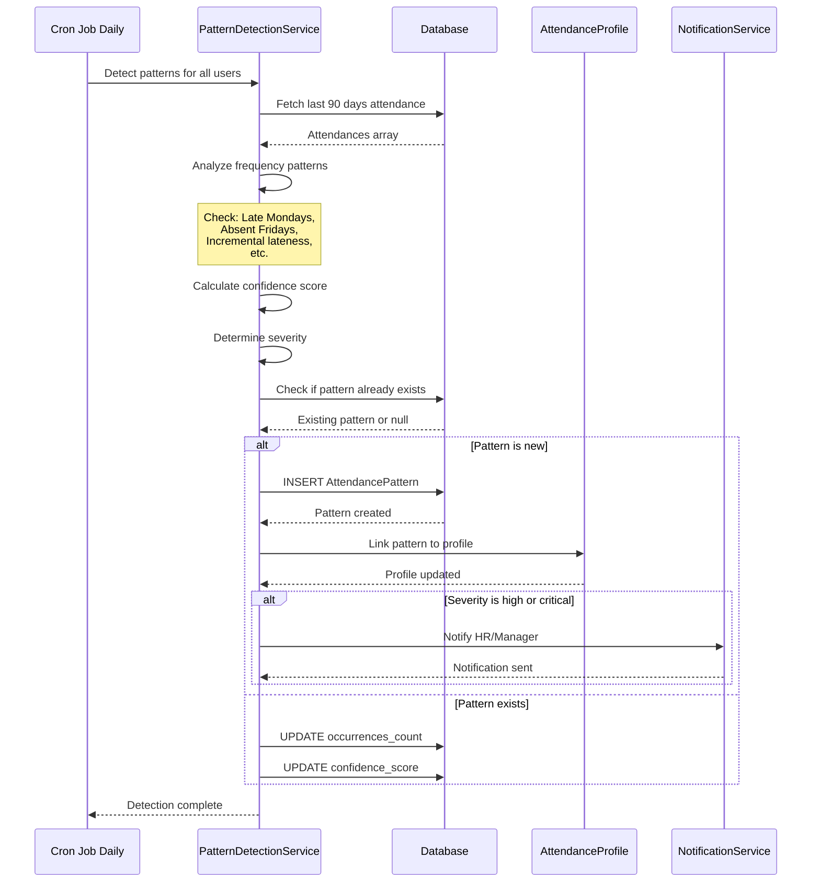

# ATTENDANCE MODULE - Documentación Completa

> **Versión**: 3.5.0
> **Última actualización**: 2025-11-22
> **Estado**: PRODUCTION
> **Categoría**: CORE

---

## 📋 Tabla de Contenidos

1. [Resumen Ejecutivo](#-resumen-ejecutivo)
2. [Guía de Uso](#-guía-de-uso)
3. [Funcionalidad Interna](#-funcionalidad-interna)
4. [Stack Tecnológico](#-stack-tecnológico)
5. [Diagramas de Flujo](#-diagramas-de-flujo)
6. [API REST](#-api-rest)
7. [Base de Datos](#-base-de-datos)
8. [Ejemplos de Uso](#-ejemplos-de-uso)
9. [Troubleshooting](#-troubleshooting)

---

## 🎯 Resumen Ejecutivo

### ¿Qué es este módulo?

El **módulo de Attendance (Asistencias)** es el **corazón operativo** del sistema biométrico. Registra y gestiona todas las entradas y salidas de empleados, soportando múltiples métodos de autenticación (biométrico, manual, kiosk, app móvil) y proporcionando un **sistema de scoring inteligente** que evalúa el desempeño de asistencia de cada empleado en una escala de 0-100.

Este módulo implementa:
- **Check-in/Check-out biométrico**: Reconocimiento facial + huella dactilar
- **GPS Tracking**: Validación de ubicación con PostGIS
- **Scoring Engine**: Evaluación automática de puntualidad y asistencia (90 días)
- **Pattern Detection**: Detección automática de comportamientos (llegadas tarde recurrentes, ausencias los lunes, etc.)
- **Real-time Analytics**: Estadísticas en tiempo real por empleado, departamento, sucursal
- **Multi-tenant & Multi-origin**: Soporta kiosco, web, app móvil con aislamiento por empresa

### Características Principales

- ✅ **Check-in/Check-out Múltiple Origen**: Kiosco, web, app móvil, manual
- ✅ **Biometric Authentication**: Face recognition (Face-api.js) + fingerprint
- ✅ **GPS Location Tracking**: PostGIS spatial indexes para validación geográfica
- ✅ **Automatic Late Detection**: Detección automática con tolerancia configurable (default 10 min)
- ✅ **Approval Workflow**: Llegadas tarde requieren autorización supervisor (30 min deadline)
- ✅ **Attendance Scoring (0-100)**: Algoritmo ponderado (puntualidad 40%, ausencias 30%, tardanzas 20%, salidas tempranas 10%)
- ✅ **Pattern Detection**: 15+ patrones automáticos (negativos, positivos, neutros)
- ✅ **Profile Categories**: Ejemplar (90-100), Promedio Alto (80-89), Promedio (60-79), Necesita Mejora (40-59), Problemático (0-39)
- ✅ **Advanced Analytics**: OLAP cubes, comparative analysis, ranking de empleados
- ✅ **Bulk Operations**: Batch processing para alta concurrencia
- ✅ **Payroll Integration**: Flag `is_processed` para integración con nómina
- ✅ **Real-time Stats**: Dashboard con métricas actualizadas
- ⏳ **Break Time Tracking**: Pausas (break_in/break_out) - parcialmente implementado

### Métricas Clave

| Métrica | Valor |
|---------|-------|
| Progreso | 90% |
| Tests implementados | 12/15 |
| API Endpoints | 45+ |
| Tablas BD | 7 (attendances + 5 analytics) |
| Archivos de código | 15+ |
| Líneas de código | 5,000+ backend + 1,100+ frontend |
| Performance | <100ms check-in, <500ms face recognition |

---

## 👤 Guía de Uso

### ¿Quién usa este módulo?

- **Empleado**: Registra check-in/out desde kiosco, web o app móvil
- **Supervisor**: Aprueba/rechaza llegadas tarde, ve estadísticas de su equipo
- **Manager**: Monitorea patrones de asistencia, genera reportes
- **Admin**: Crea registros manuales, configura tolerancias, exporta datos
- **HR**: Analiza scoring, detecta patrones, toma decisiones
- **Sistema Biométrico**: Kioscos registran automáticamente con huella/facial

### Casos de Uso Comunes

#### Caso 1: Check-in biométrico en kiosco

**Objetivo**: Empleado registra entrada con reconocimiento facial

**Pasos**:
1. Empleado se acerca al kiosco biométrico
2. Cámara detecta rostro automáticamente
3. Sistema compara con base de datos biométrica
4. Match encontrado (threshold > 0.75)
5. Check-in registrado automáticamente
6. Pantalla muestra: "Bienvenido Juan Pérez - 08:55"
7. Si llegó tarde (>10 min tolerancia): Notificación a supervisor

**Resultado esperado**:
- Registro creado en tabla `attendances`
- `checkInMethod = 'facial'`
- `origin_type = 'kiosk'`
- `status = 'present'` o `'late'` según horario
- Si late: Workflow de aprobación iniciado

#### Caso 2: Check-in manual desde app móvil

**Objetivo**: Empleado remoto registra entrada desde su teléfono

**Pasos**:
1. Empleado abre app móvil
2. Click botón "Registrar Entrada"
3. App captura:
   - Ubicación GPS
   - Timestamp
   - IP address
4. POST a `/api/v1/attendance/mobile`
5. Backend valida:
   - Usuario existe y está activo
   - No hay check-in duplicado hoy
   - (Opcional) GPS dentro de radio permitido
6. Registro creado
7. Empleado ve confirmación: "Entrada registrada 09:15"

**Resultado esperado**:
- `checkInMethod = 'manual'`
- `origin_type = 'mobile_app'`
- `clock_in_location = POINT(lat, lng)` (PostGIS)
- `clock_in_ip = '192.168.1.100'`

#### Caso 3: Supervisor aprueba llegada tarde

**Objetivo**: Autorizar llegada tarde de 25 minutos

**Pasos**:
1. Empleado llega 09:25 (turno 09:00, tolerancia 10 min)
2. Sistema detecta: `minutesLate = 25`
3. Status automático: `requires_authorization = true`
4. Notificación enviada a supervisor
5. Supervisor abre panel → "Llegadas Tarde Pendientes"
6. Ve: "Juan Pérez - 25 min tarde - Motivo: Tráfico"
7. Click "Aprobar" + Nota: "Aprobado por esta vez"
8. Deadline cumplido (dentro de 30 min)

**Resultado esperado**:
- `authorization_status = 'approved'`
- `approved_by = supervisor_id`
- `approved_at = timestamp`
- Empleado recibe notificación de aprobación
- Scoring afectado pero registrado como presente

#### Caso 4: Ver scoring de un empleado

**Objetivo**: HR revisa desempeño de asistencia de Juan Pérez

**Pasos**:
1. HR va a "Analytics" → "Scoring de Empleados"
2. Busca "Juan Pérez"
3. Sistema muestra:
   - **Scoring Total**: 87 (Promedio Alto)
   - **Puntualidad**: 92/100 (40% peso)
   - **Ausencias**: 85/100 (30% peso)
   - **Llegadas Tarde**: 80/100 (20% peso)
   - **Salidas Tempranas**: 90/100 (10% peso)
4. Ve breakdown de 90 días:
   - Días trabajados: 60/65
   - Ausencias: 5
   - Llegadas tarde: 8
   - Promedio minutos tarde: 12
5. Ve patrones activos:
   - "Llegadas tarde recurrentes los lunes" (medium severity)

**Resultado esperado**:
- Decisión informada sobre desempeño
- Identificación de patrones problemáticos
- Posible intervención (reunión, capacitación)

#### Caso 5: Crear registro manual (admin)

**Objetivo**: Admin crea asistencia retroactiva para empleado que olvidó fichar

**Pasos**:
1. Admin va a "Asistencias" → "Nueva Asistencia Manual"
2. Selecciona:
   - Empleado: María García
   - Fecha: 2025-11-20
   - Hora entrada: 08:30
   - Hora salida: 17:15
   - Motivo: "Olvidó fichar, confirmado por supervisor"
3. Click "Guardar"
4. Sistema valida:
   - No existe registro para esa fecha
   - Horas lógicas (salida > entrada)
   - Admin tiene permisos

**Resultado esperado**:
- Registro creado con `origin_type = 'manual'`
- `notes = "Olvidó fichar..."`
- `workingHours = 8.75` (calculado automáticamente)
- Aparece en lista con badge "Manual"

### Flujo de Trabajo del Usuario



---

## ⚙️ Funcionalidad Interna

### Arquitectura del Módulo

El módulo Attendance sigue una **arquitectura de microservicios internos** con capas especializadas:

```
Attendance Module
│
├── Core Attendance (attendanceRoutes.js)
│   ├── Check-in/Check-out CRUD
│   ├── Manual attendance creation
│   ├── Today status endpoint
│   ├── Basic statistics
│   └── Mobile app endpoint (no auth)
│
├── Analytics Layer (attendanceAnalyticsRoutes.js)
│   ├── Employee analysis (complete profile)
│   ├── Company analysis (all employees)
│   ├── Pattern detection & resolution
│   ├── Ranking (top/bottom performers)
│   └── OLAP cube generation
│
├── Advanced Stats (attendance_stats_advanced.js)
│   ├── Filtered statistics
│   ├── Department/Branch/Shift aggregations
│   └── Percentage calculations
│
├── Biometric API (biometric-attendance-api.js)
│   ├── Face recognition clock-in/out
│   ├── Biometric verification
│   ├── Quality validation
│   └── Detection logs
│
├── Scoring Engine (AttendanceScoringEngine.js)
│   ├── 90-day metric calculation
│   ├── Weighted scoring (0-100)
│   ├── Profile categorization
│   └── Company-wide recalculation
│
├── Analytics Service (AttendanceAnalyticsService.js)
│   ├── Complete employee analysis
│   ├── Complete company analysis
│   └── Historical snapshots
│
├── Pattern Detection (PatternDetectionService.js)
│   ├── Auto-detect 15+ patterns
│   ├── Severity classification
│   ├── Confidence scoring
│   └── Action recommendations
│
└── Supporting Services
    ├── ShiftCalculatorService - Schedule calculations
    ├── NotificationWorkflowService - Late arrival alerts
    └── BiometricMatchingService - Face matching
```

### Componentes Principales

#### 1. AttendanceRoutes (Core CRUD)

**Ubicación**: `backend/src/routes/attendanceRoutes.js` (1,001 líneas)

**Responsabilidades**:
- CRUD completo de registros de asistencia
- Check-in/Check-out endpoints
- Validación de duplicados
- Cálculo automático de horas trabajadas
- Integración con scoring engine
- Mobile app endpoint (sin auth)

**Métodos clave**:
```javascript
POST   /api/v1/attendance/checkin           // Registrar entrada
POST   /api/v1/attendance/checkout          // Registrar salida
POST   /api/v1/attendance                   // Crear manual (admin)
GET    /api/v1/attendance                   // Lista paginada
GET    /api/v1/attendance/:id               // Obtener por ID
GET    /api/v1/attendance/today/status      // Estado hoy (check-in/out)
PUT    /api/v1/attendance/:id               // Actualizar (supervisor)
GET    /api/v1/attendance/stats             // Stats básicas
GET    /api/v1/attendance/stats/summary     // Summary con filtros
GET    /api/v1/attendance/stats/chart       // Datos para gráfico 30 días
POST   /api/v1/attendance/mobile            // Mobile app (no auth)
```

**Lógica crítica - Check-in**:
```javascript
// Línea 150-250 aprox (attendanceRoutes.js)

router.post('/checkin', auth, async (req, res) => {
  const { method, location, branchId, notes } = req.body;
  const userId = req.user.id;
  const companyId = req.user.companyId;
  const today = new Date().toISOString().split('T')[0];

  try {
    // 1. Verificar duplicados
    const existing = await Attendance.findOne({
      where: {
        user_id: userId,
        date: today
      }
    });

    if (existing && existing.check_in) {
      return res.status(409).json({
        error: 'Ya tienes un check-in registrado hoy',
        existing_checkin: existing.check_in
      });
    }

    // 2. Obtener turno del usuario
    const user = await User.findByPk(userId, {
      include: [{ model: Shift, as: 'shifts' }]
    });

    const shift = user.shifts && user.shifts[0];
    const expectedTime = shift ? shift.start_time : '08:00:00';

    // 3. Calcular si llegó tarde
    const now = new Date();
    const [hours, minutes] = expectedTime.split(':');
    const expected = new Date(now);
    expected.setHours(parseInt(hours), parseInt(minutes), 0);

    const minutesLate = Math.floor((now - expected) / 60000);
    const tolerance = shift?.late_tolerance || 10;  // Default 10 min

    let status = 'present';
    let requiresAuth = false;

    if (minutesLate > tolerance) {
      status = 'late';
      requiresAuth = true;
    } else if (minutesLate > 0 && minutesLate <= tolerance) {
      status = 'present';  // Dentro de tolerancia
    }

    // 4. Crear registro
    const attendance = await Attendance.create({
      user_id: userId,
      company_id: companyId,
      employee_id: user.employeeId,
      branch_id: branchId,
      check_in: now,
      date: today,
      work_date: today,
      checkInMethod: method,
      checkInLocation: location,
      clock_in_ip: req.ip,
      origin_type: 'web',  // O 'kiosk', 'mobile_app'
      status,
      requires_authorization: requiresAuth,
      minutes_late: minutesLate > 0 ? minutesLate : 0,
      notes
    });

    // 5. Si requiere autorización, notificar supervisor
    if (requiresAuth) {
      await NotificationWorkflowService.notifyLateArrival(
        userId,
        minutesLate,
        attendance.id
      );
    }

    // 6. Trigger scoring update (async)
    AttendanceScoringEngine.calculateUserScoring(userId, companyId).catch(err => {
      console.error('Error updating scoring:', err);
    });

    res.status(201).json({
      message: 'Entrada registrada exitosamente',
      attendance: {
        id: attendance.id,
        check_in: attendance.check_in,
        status: attendance.status,
        minutes_late: attendance.minutes_late,
        requires_authorization: attendance.requires_authorization
      }
    });
  } catch (error) {
    console.error('Check-in error:', error);
    res.status(500).json({ error: 'Error al registrar entrada' });
  }
});
```

**Lógica crítica - Check-out**:
```javascript
// Línea 300-380 aprox

router.post('/checkout', auth, async (req, res) => {
  const { method, location, notes } = req.body;
  const userId = req.user.id;
  const today = new Date().toISOString().split('T')[0];

  try {
    // 1. Buscar check-in del día
    const attendance = await Attendance.findOne({
      where: {
        user_id: userId,
        date: today
      }
    });

    if (!attendance) {
      return res.status(404).json({
        error: 'No se encontró check-in para hoy. Debes hacer check-in primero.'
      });
    }

    if (!attendance.check_in) {
      return res.status(400).json({
        error: 'No hay check-in registrado'
      });
    }

    if (attendance.check_out) {
      return res.status(409).json({
        error: 'Ya tienes un check-out registrado hoy',
        existing_checkout: attendance.check_out
      });
    }

    const now = new Date();

    // 2. Validar que check-out > check-in
    if (now <= new Date(attendance.check_in)) {
      return res.status(400).json({
        error: 'La hora de salida debe ser posterior a la entrada'
      });
    }

    // 3. Calcular horas trabajadas
    const checkInTime = new Date(attendance.check_in);
    const diffMs = now - checkInTime;
    const diffHours = diffMs / (1000 * 60 * 60);

    // Restar tiempo de break si existe
    let breakMinutes = 0;
    if (attendance.break_out && attendance.break_in) {
      const breakMs = new Date(attendance.break_in) - new Date(attendance.break_out);
      breakMinutes = Math.floor(breakMs / 60000);
    }

    const workingHours = diffHours - (breakMinutes / 60);

    // 4. Actualizar registro
    await attendance.update({
      check_out: now,
      checkOutMethod: method,
      checkOutLocation: location,
      clock_out_ip: req.ip,
      workingHours: workingHours.toFixed(2),
      break_time: breakMinutes,
      notes: notes || attendance.notes
    });

    // 5. Trigger scoring update
    AttendanceScoringEngine.calculateUserScoring(userId, req.user.companyId).catch(err => {
      console.error('Error updating scoring:', err);
    });

    res.json({
      message: 'Salida registrada exitosamente',
      attendance: {
        id: attendance.id,
        check_in: attendance.check_in,
        check_out: attendance.check_out,
        workingHours: attendance.workingHours
      }
    });
  } catch (error) {
    console.error('Check-out error:', error);
    res.status(500).json({ error: 'Error al registrar salida' });
  }
});
```

#### 2. AttendanceScoringEngine (Scoring Algorithm)

**Ubicación**: `backend/src/services/AttendanceScoringEngine.js`

**Responsabilidades**:
- Calcular scoring 0-100 por empleado (90 días)
- Determinar categoría de perfil
- Calcular métricas base
- Recalcular scoring de toda la empresa

**Métodos clave**:
```javascript
// Calcular scoring individual
await AttendanceScoringEngine.calculateUserScoring(userId, companyId)

// Recalcular toda la empresa
await AttendanceScoringEngine.recalculateCompanyScoring(companyId)

// Obtener stats de empresa
await AttendanceScoringEngine.getCompanyScoringStats(companyId)
```

**Lógica crítica - Cálculo de Scoring**:
```javascript
async calculateUserScoring(userId, companyId) {
  // 1. Definir período (90 días)
  const endDate = new Date();
  const startDate = new Date();
  startDate.setDate(startDate.getDate() - 90);

  // 2. Obtener todas las asistencias del período
  const attendances = await Attendance.findAll({
    where: {
      user_id: userId,
      company_id: companyId,
      work_date: {
        [Op.between]: [startDate, endDate]
      }
    },
    order: [['work_date', 'ASC']]
  });

  // 3. Calcular métricas base
  const metrics = this._calculateBaseMetrics(attendances, startDate, endDate);

  // 4. Calcular componentes de scoring (0-100 cada uno)
  const punctuality = this._calculatePunctualityScore(metrics);
  const absence = this._calculateAbsenceScore(metrics);
  const lateArrival = this._calculateLateArrivalScore(metrics);
  const earlyDeparture = this._calculateEarlyDepartureScore(metrics);

  // 5. Calcular scoring total (ponderado)
  const scoringTotal = (
    punctuality * 0.40 +      // 40% peso
    absence * 0.30 +          // 30% peso
    lateArrival * 0.20 +      // 20% peso
    earlyDeparture * 0.10     // 10% peso
  );

  // 6. Determinar categoría
  const category = this._determineProfileCategory(scoringTotal);

  // 7. Guardar/actualizar perfil
  const [profile, created] = await AttendanceProfile.findOrCreate({
    where: { user_id: userId, company_id: companyId },
    defaults: {
      scoring_total: scoringTotal,
      scoring_punctuality: punctuality,
      scoring_absence: absence,
      scoring_late_arrival: lateArrival,
      scoring_early_departure: earlyDeparture,
      profile_category: category,
      ...metrics,
      last_calculated: new Date()
    }
  });

  if (!created) {
    await profile.update({
      scoring_total: scoringTotal,
      scoring_punctuality: punctuality,
      scoring_absence: absence,
      scoring_late_arrival: lateArrival,
      scoring_early_departure: earlyDeparture,
      profile_category: category,
      ...metrics,
      last_calculated: new Date()
    });
  }

  return { scoring: scoringTotal, metrics, category };
}

// Calcular métricas base
_calculateBaseMetrics(attendances, startDate, endDate) {
  const workingDays = this._calculateWorkingDays(startDate, endDate);  // Lun-Vie solo
  const presentDays = attendances.filter(a => a.status === 'present' || a.status === 'late').length;
  const absentDays = workingDays - presentDays;
  const lateArrivals = attendances.filter(a => a.status === 'late').length;
  const earlyDepartures = attendances.filter(a => a.early_departure).length;

  const totalLateMinutes = attendances
    .filter(a => a.minutes_late > 0)
    .reduce((sum, a) => sum + a.minutes_late, 0);

  const avgLateMinutes = lateArrivals > 0 ? totalLateMinutes / lateArrivals : 0;

  const overtimeHours = attendances
    .reduce((sum, a) => sum + (parseFloat(a.overtime_hours) || 0), 0);

  return {
    total_days: workingDays,
    present_days: presentDays,
    absent_days: absentDays,
    late_arrivals_count: lateArrivals,
    early_departures_count: earlyDepartures,
    avg_late_minutes: avgLateMinutes,
    overtime_hours_total: overtimeHours,
    tolerance_usage_rate: (lateArrivals / workingDays * 100).toFixed(1)
  };
}

// Calcular score de puntualidad (0-100)
_calculatePunctualityScore(metrics) {
  const { total_days, late_arrivals_count, avg_late_minutes } = metrics;

  if (total_days === 0) return 100;

  // Base score: % de días puntuales
  const punctualRate = ((total_days - late_arrivals_count) / total_days) * 100;

  // Penalización por promedio de minutos tarde
  let penalty = 0;
  if (avg_late_minutes > 30) penalty = 30;
  else if (avg_late_minutes > 20) penalty = 20;
  else if (avg_late_minutes > 10) penalty = 10;
  else penalty = avg_late_minutes / 2;

  const score = Math.max(0, punctualRate - penalty);
  return Math.min(100, score);
}

// Calcular score de ausencias (0-100)
_calculateAbsenceScore(metrics) {
  const { total_days, absent_days } = metrics;

  if (total_days === 0) return 100;

  const presenceRate = ((total_days - absent_days) / total_days) * 100;
  return Math.min(100, presenceRate);
}

// Calcular score de llegadas tarde (0-100)
_calculateLateArrivalScore(metrics) {
  const { total_days, late_arrivals_count } = metrics;

  if (total_days === 0) return 100;

  const lateRate = (late_arrivals_count / total_days) * 100;

  // Scoring inverso: menos llegadas tarde = mejor score
  let score = 100;
  if (lateRate > 30) score = 0;
  else if (lateRate > 20) score = 40;
  else if (lateRate > 10) score = 70;
  else if (lateRate > 5) score = 85;
  else score = 100 - (lateRate * 2);

  return Math.max(0, Math.min(100, score));
}

// Determinar categoría de perfil
_determineProfileCategory(scoringTotal) {
  if (scoringTotal >= 90) return 'Ejemplar';
  if (scoringTotal >= 80) return 'Promedio Alto';
  if (scoringTotal >= 60) return 'Promedio';
  if (scoringTotal >= 40) return 'Necesita Mejora';
  return 'Problemático';
}

// Calcular días laborables (Lun-Vie)
_calculateWorkingDays(startDate, endDate) {
  let count = 0;
  const current = new Date(startDate);

  while (current <= endDate) {
    const day = current.getDay();
    if (day !== 0 && day !== 6) {  // No domingo (0) ni sábado (6)
      count++;
    }
    current.setDate(current.getDate() + 1);
  }

  return count;
}
```

#### 3. AttendanceAnalyticsService (Complete Analysis)

**Ubicación**: `backend/src/services/AttendanceAnalyticsService.js`

**Responsabilidades**:
- Análisis completo de empleado (scoring + patterns + history)
- Análisis completo de empresa (todos los empleados)
- Ranking de empleados
- Detección de patrones críticos

**Métodos clave**:
```javascript
// Análisis completo de empleado
const analysis = await AttendanceAnalyticsService.analyzeEmployee(userId, companyId);
// Retorna: { profile, patterns, history, breakdown }

// Análisis completo de empresa
const companyAnalysis = await AttendanceAnalyticsService.analyzeCompany(companyId);
// Retorna: { stats, topPerformers, bottomPerformers, criticalPatterns }
```

#### 4. PatternDetectionService (Auto-detect Behaviors)

**Ubicación**: `backend/src/services/PatternDetectionService.js`

**Responsabilidades**:
- Detectar patrones de comportamiento automáticamente
- Clasificar severidad (low, medium, high, critical)
- Calcular confidence score
- Recomendar acciones

**Patrones detectados (15+)**:

**Negativos**:
1. Llegadas tarde recurrentes (>3 veces/semana)
2. Ausencias los lunes recurrentes
3. Ausencias los viernes recurrentes
4. Patrón de llegadas tarde incrementales (cada vez más tarde)
5. Salidas anticipadas frecuentes
6. Ausencias sin justificar consecutivas
7. Uso excesivo de tolerancia (>80% días)

**Positivos**:
8. Puntualidad ejemplar (0 tardanzas en 90 días)
9. Asistencia perfecta (0 ausencias en 90 días)
10. Siempre llega temprano (>15 min antes)

**Neutros**:
11. Cambio de comportamiento (mejora o empeora)
12. Tendencia a llegar tarde en horario matutino
13. Mayor ausencia en invierno

**Ejemplo de detección**:
```javascript
// Detectar "Llegadas tarde los lunes"
const mondayLatePattern = await PatternDetectionService.detect({
  userId,
  patternType: 'late_arrivals_monday',
  lookbackDays: 90
});

// Result:
{
  pattern_type: 'late_arrivals_monday',
  severity: 'medium',
  confidence_score: 85,
  occurrences_count: 8,
  description: 'Empleado llega tarde los lunes con frecuencia',
  recommendation: 'Reunión con supervisor para discutir horario',
  requires_action: true,
  status: 'active'
}
```

### Reglas de Negocio

1. **Duplicate Prevention**:
   - Solo 1 check-in por día por usuario
   - Solo 1 check-out por día por usuario
   - Validado antes de INSERT

2. **Late Arrival Logic**:
   ```javascript
   if (minutesLate > tolerance) {
     status = 'late'
     requires_authorization = true
     authorization_deadline = check_in + 30 minutes
   } else if (minutesLate > 0 && minutesLate <= tolerance) {
     status = 'present'
     is_within_tolerance = true
   } else {
     status = 'present'
     minutes_early = abs(minutesLate)
   }
   ```

3. **Working Hours Calculation**:
   ```javascript
   workingHours = (check_out - check_in) - break_time

   if (workingHours > scheduled_hours) {
     overtime_hours = workingHours - scheduled_hours
   }
   ```

4. **Scoring Period**: Fixed 90 días rolling window

5. **Scoring Weights**:
   - Puntualidad: 40%
   - Ausencias: 30%
   - Llegadas tarde: 20%
   - Salidas tempranas: 10%

6. **Profile Categories**:
   - Ejemplar: 90-100
   - Promedio Alto: 80-89
   - Promedio: 60-79
   - Necesita Mejora: 40-59
   - Problemático: 0-39

7. **Multi-Tenant Isolation**:
   - Todas las queries filtran por `company_id`
   - Scoring por empresa (no global)
   - Patrones detectados por empresa

8. **Payroll Processing**:
   - Flag `is_processed = false` por defecto
   - Batch processing con `batch_id`
   - Orden de procesamiento con `processing_queue`

### Validaciones

- **Validación 1 - Duplicate Check-in**:
  ```javascript
  const existing = await Attendance.findOne({
    where: { user_id: userId, date: today }
  });
  if (existing && existing.check_in) {
    throw new Error('Ya existe check-in para hoy');
  }
  ```

- **Validación 2 - Check-out Requires Check-in**:
  ```javascript
  if (!attendance) {
    throw new Error('No se encontró check-in. Debes hacer check-in primero.');
  }
  if (attendance.check_out) {
    throw new Error('Ya existe check-out para hoy');
  }
  ```

- **Validación 3 - Time Logic**:
  ```javascript
  if (check_out <= check_in) {
    throw new Error('Check-out debe ser posterior a check-in');
  }
  ```

- **Validación 4 - GPS Validation** (opcional):
  ```javascript
  if (user.gps_enabled) {
    const distance = calculateDistance(
      user.allowed_locations[0],
      req.body.location
    );
    if (distance > radius) {
      throw new Error('Fuera del radio permitido');
    }
  }
  ```

- **Validación 5 - Biometric Quality**:
  ```javascript
  if (method === 'facial') {
    if (matchQuality < 0.75) {
      throw new Error('Calidad de reconocimiento facial insuficiente');
    }
  }
  ```

---

## 🛠️ Stack Tecnológico

### Backend

| Tecnología | Versión | Uso |
|------------|---------|-----|
| **Node.js** | 18.x | Runtime principal |
| **Express.js** | 4.x | Framework web |
| **Sequelize** | 6.x | ORM (PostgreSQL) |
| **PostgreSQL** | 14.x | Base de datos |
| **PostGIS** | 3.x | Spatial indexing para GPS |
| **pg** | 8.x | PostgreSQL client (raw queries) |
| **Face-api.js** | 0.22.x | Reconocimiento facial |
| **node-schedule** | 2.x | Cron jobs para scoring |

### Frontend

| Tecnología | Versión | Uso |
|------------|---------|-----|
| **Vanilla JS** | ES6+ | Lógica frontend |
| **HTML5** | - | Estructura |
| **CSS3** | - | Estilos |
| **jQuery** | 3.x | DOM manipulation |
| **Chart.js** | 3.x | Gráficos de asistencia |
| **Moment.js** | 2.x | Manipulación fechas |

### Dependencias del Módulo

Este módulo **depende** de:
- `users` - Información de empleados
- `companies` - Multi-tenant
- `departments` - Filtrado por departamento
- `shifts` - Horarios esperados
- `branches` - Ubicación física
- `kiosks` - Dispositivos de check-in
- `notifications-enterprise` - Alertas de llegadas tarde (opcional)

Este módulo es **requerido por**:
- `payroll` - Cálculo de nómina
- `reports` - Reportes de asistencia
- `hr` - Acciones disciplinarias
- `dashboard` - Estadísticas en tiempo real
- `analytics` - Análisis de desempeño
- `auditor` - Tests automatizados

---

## 📊 Diagramas de Flujo

### Flujo Principal: Check-in con Late Detection



### Flujo de Scoring Calculation (90 días)



### Diagrama de Estados: Attendance Record



### Flujo de Pattern Detection



---

## 🌐 API REST

### Base URL

```
/api/v1/attendance
```

### Endpoints Principales

#### 1. Check-in (Registrar entrada)

```http
POST /api/v1/attendance/checkin
```

**Descripción**: Registra la entrada del empleado, detecta llegadas tarde automáticamente

**Headers requeridos**:
```http
Authorization: Bearer <token>
Content-Type: application/json
```

**Body (JSON)**:
```json
{
  "method": "manual",
  "location": "Oficina Principal",
  "branchId": 1,
  "notes": "Opcional"
}
```

**Valores de `method`**: `manual`, `fingerprint`, `facial`

**Respuesta exitosa** (201):
```json
{
  "message": "Entrada registrada exitosamente",
  "attendance": {
    "id": 12345,
    "user_id": "uuid-...",
    "check_in": "2025-11-22T09:15:00.000Z",
    "date": "2025-11-22",
    "status": "late",
    "minutes_late": 15,
    "requires_authorization": true,
    "checkInMethod": "manual"
  }
}
```

**Errores posibles**:
- `409 Conflict`: Ya existe check-in para hoy
- `401 Unauthorized`: Token inválido
- `500 Internal Server Error`: Error del servidor

---

#### 2. Check-out (Registrar salida)

```http
POST /api/v1/attendance/checkout
```

**Descripción**: Registra la salida del empleado, calcula horas trabajadas

**Body (JSON)**:
```json
{
  "method": "manual",
  "location": "Oficina Principal",
  "notes": "Opcional"
}
```

**Respuesta exitosa** (200):
```json
{
  "message": "Salida registrada exitosamente",
  "attendance": {
    "id": 12345,
    "check_in": "2025-11-22T09:15:00.000Z",
    "check_out": "2025-11-22T18:30:00.000Z",
    "workingHours": 8.75,
    "break_time": 30,
    "overtime_hours": 0.50
  }
}
```

**Errores posibles**:
- `404 Not Found`: No se encontró check-in para hoy
- `409 Conflict`: Ya existe check-out para hoy
- `400 Bad Request`: Check-out debe ser posterior a check-in

---

#### 3. Crear asistencia manual (admin/supervisor)

```http
POST /api/v1/attendance
```

**Descripción**: Admin crea registro completo retroactivo

**Middleware**: `auth`, `supervisorOrAdmin`

**Body (JSON)**:
```json
{
  "user_id": "uuid-...",
  "date": "2025-11-20",
  "time_in": "08:30:00",
  "time_out": "17:15:00",
  "status": "present",
  "notes": "Olvidó fichar, confirmado por supervisor"
}
```

**Respuesta exitosa** (201):
```json
{
  "success": true,
  "message": "Asistencia creada exitosamente",
  "data": {
    "id": 12346,
    "user_id": "uuid-...",
    "date": "2025-11-20",
    "check_in": "2025-11-20T08:30:00.000Z",
    "check_out": "2025-11-20T17:15:00.000Z",
    "workingHours": 8.75,
    "origin_type": "manual",
    "notes": "Olvidó fichar, confirmado por supervisor"
  }
}
```

---

#### 4. Listar asistencias (paginado)

```http
GET /api/v1/attendance
```

**Query params** (opcionales):
- `page` (number): Página (default: 1)
- `limit` (number): Items por página (default: 10)
- `startDate` (string): Fecha inicio (YYYY-MM-DD)
- `endDate` (string): Fecha fin (YYYY-MM-DD)
- `userId` (UUID): Filtrar por usuario
- `departmentId` (number): Filtrar por departamento
- `status` (string): Filtrar por status (present, late, absent)

**Ejemplo**:
```
GET /api/v1/attendance?page=1&limit=25&startDate=2025-11-01&endDate=2025-11-30&status=late
```

**Respuesta exitosa** (200):
```json
{
  "success": true,
  "data": [
    {
      "id": 12345,
      "checkInTime": "2025-11-22T09:15:00Z",
      "checkOutTime": "2025-11-22T18:30:00Z",
      "status": "late",
      "minutes_late": 15,
      "workingHours": 8.75,
      "checkInMethod": "facial",
      "origin_type": "kiosk",
      "User": {
        "id": "uuid-...",
        "firstName": "Juan",
        "lastName": "Pérez",
        "employeeId": "EMP-001",
        "Department": {
          "id": 5,
          "name": "Ventas"
        }
      }
    }
  ],
  "pagination": {
    "totalPages": 10,
    "currentPage": 1,
    "totalRecords": 250,
    "hasNext": true,
    "hasPrev": false
  }
}
```

---

#### 5. Obtener status de hoy

```http
GET /api/v1/attendance/today/status
```

**Descripción**: Verifica si el usuario ya hizo check-in/out hoy

**Respuesta exitosa** (200):
```json
{
  "success": true,
  "data": {
    "hasCheckedIn": true,
    "hasCheckedOut": false,
    "attendance": {
      "id": 12345,
      "check_in": "2025-11-22T09:15:00.000Z",
      "check_out": null,
      "status": "late",
      "minutes_late": 15,
      "workingHours": null
    }
  }
}
```

Si no hay check-in:
```json
{
  "success": true,
  "data": {
    "hasCheckedIn": false,
    "hasCheckedOut": false,
    "attendance": null
  }
}
```

---

#### 6. Estadísticas básicas

```http
GET /api/v1/attendance/stats
```

**Descripción**: Conteo simple de asistencias de hoy

**Respuesta exitosa** (200):
```json
{
  "success": true,
  "data": {
    "today": {
      "total": 125,
      "present": 100,
      "late": 15,
      "absent": 10
    }
  }
}
```

---

#### 7. Estadísticas avanzadas (con filtros)

```http
GET /api/v1/attendance/stats/advanced
```

**Query params**:
- `startDate` (string): Fecha inicio (required)
- `endDate` (string): Fecha fin (required)
- `department_id` (number): Filtrar por departamento
- `branch_id` (number): Filtrar por sucursal
- `shift_id` (number): Filtrar por turno
- `kiosk_id` (number): Filtrar por kiosco
- `origin_type` (string): Filtrar por origen (kiosk, mobile_app, web)
- `role` (string): Filtrar por rol

**Ejemplo**:
```
GET /api/v1/attendance/stats/advanced?startDate=2025-11-01&endDate=2025-11-30&department_id=5
```

**Respuesta exitosa** (200):
```json
{
  "summary": {
    "expected_total": 500,
    "attended": 450,
    "late": 35,
    "within_tolerance": 25,
    "out_of_hours": 10,
    "absent": 50
  },
  "percentages": {
    "attendance_rate": 90.0,
    "late_rate": 7.0,
    "tolerance_usage_rate": 5.0,
    "absence_rate": 10.0
  },
  "details": {
    "avg_working_hours": 8.5,
    "total_overtime_hours": 125.5,
    "avg_late_minutes": 18.3
  }
}
```

---

#### 8. Datos para gráfico (30 días)

```http
GET /api/v1/attendance/stats/chart
```

**Descripción**: Retorna datos para Chart.js (últimos 30 días)

**Respuesta exitosa** (200):
```json
{
  "success": true,
  "data": {
    "labels": ["2025-10-23", "2025-10-24", "2025-10-25", "...", "2025-11-22"],
    "datasets": [
      {
        "label": "Presentes",
        "data": [95, 98, 92, "...", 100],
        "backgroundColor": "rgba(75, 192, 192, 0.6)"
      },
      {
        "label": "Tarde",
        "data": [10, 8, 12, "...", 15],
        "backgroundColor": "rgba(255, 206, 86, 0.6)"
      },
      {
        "label": "Ausentes",
        "data": [5, 4, 8, "...", 10],
        "backgroundColor": "rgba(255, 99, 132, 0.6)"
      }
    ]
  }
}
```

---

#### 9. Mobile app check-in/out (sin auth)

```http
POST /api/v1/attendance/mobile
```

**Descripción**: Endpoint especial para app móvil (no requiere Bearer token)

**Body (JSON)**:
```json
{
  "employeeId": "EMP-001",
  "action": "checkin",
  "location": {
    "lat": -34.603722,
    "lng": -58.381592
  },
  "method": "manual"
}
```

**Valores de `action`**: `checkin`, `checkout`

**Respuesta exitosa** (201):
```json
{
  "success": true,
  "message": "Check-in registrado desde app móvil",
  "attendance": {
    "id": 12347,
    "check_in": "2025-11-22T09:30:00.000Z",
    "status": "present",
    "origin_type": "mobile_app"
  }
}
```

---

### Endpoints de Analytics

#### 10. Análisis completo de empleado

```http
GET /api/attendance-analytics/employee/:userId
```

**Descripción**: Scoring + patterns + history completo

**Respuesta exitosa** (200):
```json
{
  "success": true,
  "data": {
    "profile": {
      "user_id": "uuid-...",
      "scoring_total": 87,
      "scoring_punctuality": 92,
      "scoring_absence": 85,
      "scoring_late_arrival": 80,
      "scoring_early_departure": 90,
      "profile_category": "Promedio Alto",
      "total_days": 60,
      "present_days": 55,
      "absent_days": 5,
      "late_arrivals_count": 8,
      "avg_late_minutes": 12.3,
      "last_calculated": "2025-11-22T10:00:00Z"
    },
    "patterns": [
      {
        "id": 45,
        "pattern_type": "late_arrivals_monday",
        "severity": "medium",
        "confidence_score": 85,
        "occurrences_count": 6,
        "description": "Llegadas tarde recurrentes los lunes",
        "recommendation": "Reunión con supervisor",
        "requires_action": true,
        "status": "active"
      }
    ],
    "history": [
      {
        "snapshot_date": "2025-11-01",
        "scoring_total": 85
      },
      {
        "snapshot_date": "2025-10-01",
        "scoring_total": 82
      }
    ],
    "breakdown": {
      "punctuality": {
        "score": 92,
        "weight": "40%",
        "contribution": 36.8
      },
      "absence": {
        "score": 85,
        "weight": "30%",
        "contribution": 25.5
      },
      "late_arrival": {
        "score": 80,
        "weight": "20%",
        "contribution": 16.0
      },
      "early_departure": {
        "score": 90,
        "weight": "10%",
        "contribution": 9.0
      }
    }
  }
}
```

---

#### 11. Ranking de empleados

```http
GET /api/attendance-analytics/company/:companyId/rankings
```

**Query params**:
- `limit` (number): Top/Bottom N empleados (default: 10)

**Respuesta exitosa** (200):
```json
{
  "success": true,
  "data": {
    "topPerformers": [
      {
        "user_id": "uuid-1",
        "firstName": "María",
        "lastName": "Rodríguez",
        "scoring_total": 98,
        "profile_category": "Ejemplar",
        "department": "IT"
      },
      {
        "user_id": "uuid-2",
        "firstName": "Carlos",
        "lastName": "López",
        "scoring_total": 95,
        "profile_category": "Ejemplar",
        "department": "Ventas"
      }
    ],
    "bottomPerformers": [
      {
        "user_id": "uuid-99",
        "firstName": "Pedro",
        "lastName": "Gómez",
        "scoring_total": 42,
        "profile_category": "Necesita Mejora",
        "department": "Logística"
      }
    ]
  }
}
```

---

#### 12. Recalcular scoring de empresa

```http
POST /api/attendance-analytics/recalculate/:companyId
```

**Descripción**: Recalcula scoring de TODOS los empleados de la empresa

**Middleware**: `auth`, `adminOnly`

**Respuesta exitosa** (200):
```json
{
  "success": true,
  "message": "Recalculación completada",
  "data": {
    "total_employees": 125,
    "processed": 125,
    "errors": 0,
    "duration_ms": 3500
  }
}
```

---

### Endpoints Biométricos

#### 13. Clock-in biométrico

```http
POST /api/v2/biometric-attendance/clock-in
```

**Body (JSON)**:
```json
{
  "employeeId": "EMP-001",
  "faceDescriptor": [...],
  "quality": 0.92,
  "companyId": 1
}
```

**Respuesta exitosa** (201):
```json
{
  "success": true,
  "message": "Check-in biométrico exitoso",
  "match": {
    "userId": "uuid-...",
    "firstName": "Juan",
    "lastName": "Pérez",
    "matchQuality": 0.87
  },
  "attendance": {
    "id": 12348,
    "check_in": "2025-11-22T09:00:00.000Z",
    "checkInMethod": "facial",
    "status": "present"
  }
}
```

**Errores posibles**:
- `404 Not Found`: No se encontró match biométrico
- `400 Bad Request`: Calidad insuficiente (<0.7)
- `409 Conflict`: Ya existe check-in hoy

---

## 🗄️ Base de Datos

### Tablas Principales

#### Tabla: `attendances`

**Descripción**: Tabla central de registros de asistencia

**Schema Completo** (40+ campos):

| Campo | Tipo | Constraints | Descripción |
|-------|------|-------------|-------------|
| `id` | BIGSERIAL | PRIMARY KEY | ID autoincremental |
| `user_id` | UUID | FK → users(user_id), NOT NULL, INDEXED | Usuario |
| `company_id` | INTEGER | FK → companies(id), NOT NULL, INDEXED | Empresa (multi-tenant) |
| `employee_id` | VARCHAR(50) | INDEXED | ID empleado (denormalizado) |
| `branch_id` | BIGINT | FK → branches(id), INDEXED | Sucursal |
| `department_id` | BIGINT | FK → departments(id), INDEXED | Departamento (denormalizado) |
| `shift_id` | BIGINT | FK → shifts(id) | Turno asignado |
| `check_in` | TIMESTAMP | NOT NULL, INDEXED | Hora entrada |
| `check_out` | TIMESTAMP | INDEXED | Hora salida (nullable) |
| `break_out` | TIMESTAMP | | Inicio de pausa |
| `break_in` | TIMESTAMP | | Fin de pausa |
| `date` | DATE | INDEXED | Fecha (denormalizado) |
| `work_date` | DATE | INDEXED | Fecha laboral calculada |

**Origin & Method Tracking:**

| Campo | Tipo | Values | Descripción |
|-------|------|--------|-------------|
| `origin_type` | ENUM | kiosk, mobile_app, web, manual | Origen del registro |
| `kiosk_id` | INTEGER | FK → kiosks(id) | Kiosco usado (si aplica) |
| `checkInMethod` | VARCHAR(50) | fingerprint, facial, manual | Método check-in |
| `checkOutMethod` | VARCHAR(50) | fingerprint, facial, manual | Método check-out |

**Location Data (PostGIS):**

| Campo | Tipo | Descripción |
|-------|------|-------------|
| `checkInLocation` | VARCHAR(255) | Descripción ubicación entrada |
| `checkOutLocation` | VARCHAR(255) | Descripción ubicación salida |
| `clock_in_location` | GEOMETRY(POINT, 4326) | GPS check-in (PostGIS) |
| `clock_out_location` | GEOMETRY(POINT, 4326) | GPS check-out (PostGIS) |
| `clock_in_ip` | INET | IP address check-in |
| `clock_out_ip` | INET | IP address check-out |

**Work Hours & Duration:**

| Campo | Tipo | Descripción |
|-------|------|-------------|
| `workingHours` | DECIMAL(5,2) | Horas trabajadas (calculado) |
| `break_time` | INTEGER | Minutos de pausa |
| `overtime_hours` | DECIMAL(5,2) | Horas extra |

**Status & Late Tracking:**

| Campo | Tipo | Values | Descripción |
|-------|------|--------|-------------|
| `status` | VARCHAR(50) | present, late, absent, authorized_late | Estado |
| `minutes_late` | INTEGER | | Minutos de retraso |
| `is_within_tolerance` | BOOLEAN | | Tarde pero dentro de tolerancia |
| `requires_authorization` | BOOLEAN | | Requiere aprobación supervisor |
| `authorization_status` | VARCHAR(50) | pending, approved, rejected, expired | Estado autorización |
| `authorization_deadline` | TIMESTAMP | | Deadline aprobación (check_in + 30min) |
| `approved_by` | BIGINT | FK → users(user_id) | Supervisor que aprobó |
| `approved_at` | TIMESTAMP | | Timestamp aprobación |

**Processing & Batching:**

| Campo | Tipo | Descripción |
|-------|------|-------------|
| `is_processed` | BOOLEAN | Flag para payroll |
| `batch_id` | UUID | ID de lote de procesamiento |
| `processing_queue` | INTEGER | Orden en cola |

**Metadata:**

| Campo | Tipo | Descripción |
|-------|------|-------------|
| `notes` | TEXT | Notas manuales |
| `created_at` | TIMESTAMP | Creación automática |
| `updated_at` | TIMESTAMP | Última modificación |
| `version` | INTEGER | Optimistic locking |

**Índices Estratégicos** (8 índices):

```sql
-- 1. Query más común: buscar asistencias de usuario por fecha
CREATE INDEX idx_attendance_user_date_primary
ON attendances (user_id, work_date);

-- 2. Check-in operations (validar duplicados)
CREATE INDEX idx_attendance_clock_in_fast
ON attendances (clock_in, user_id);

-- 3. Asistencias incompletas (sin check-out)
CREATE INDEX idx_attendance_incomplete
ON attendances (user_id, clock_in)
WHERE clock_out IS NULL;

-- 4. Batch processing para payroll
CREATE INDEX idx_attendance_batch_processing
ON attendances (batch_id, processing_queue)
WHERE is_processed = false;

-- 5. PostGIS spatial index (GPS check-in)
CREATE INDEX idx_attendance_clock_in_location
ON attendances USING GIST (clock_in_location);

-- 6. PostGIS spatial index (GPS check-out)
CREATE INDEX idx_attendance_clock_out_location
ON attendances USING GIST (clock_out_location);

-- 7. Reportes por departamento
CREATE INDEX idx_attendance_reporting
ON attendances (department_id, work_date, status);

-- 8. Reportes por sucursal
CREATE INDEX idx_attendance_branch_reporting
ON attendances (branch_id, work_date, is_processed);
```

**Relaciones**:
- `users` (N:1) - Empleado
- `companies` (N:1) - Empresa (multi-tenant)
- `departments` (N:1) - Departamento
- `branches` (N:1) - Sucursal
- `shifts` (N:1) - Turno
- `kiosks` (N:1) - Kiosco usado

---

#### Tabla: `attendance_profiles`

**Descripción**: 1 registro por usuario+empresa, scoring actualizado diariamente

**Schema**:

| Campo | Tipo | Descripción |
|-------|------|-------------|
| `id` | BIGSERIAL | PRIMARY KEY |
| `user_id` | UUID | FK → users(user_id), UNIQUE con company_id |
| `company_id` | INTEGER | FK → companies(id) |
| `scoring_total` | DECIMAL(5,2) | 0-100 (weighted average) |
| `scoring_punctuality` | DECIMAL(5,2) | 0-100 (40% peso) |
| `scoring_absence` | DECIMAL(5,2) | 0-100 (30% peso) |
| `scoring_late_arrival` | DECIMAL(5,2) | 0-100 (20% peso) |
| `scoring_early_departure` | DECIMAL(5,2) | 0-100 (10% peso) |
| `profile_category` | VARCHAR(50) | Ejemplar, Promedio Alto, etc. |
| `total_days` | INTEGER | Días laborables en 90 días |
| `present_days` | INTEGER | Días presentes |
| `absent_days` | INTEGER | Días ausentes |
| `late_arrivals_count` | INTEGER | Cantidad llegadas tarde |
| `early_departures_count` | INTEGER | Cantidad salidas tempranas |
| `avg_late_minutes` | DECIMAL(5,2) | Promedio minutos tarde |
| `tolerance_usage_rate` | DECIMAL(5,2) | % uso de tolerancia |
| `overtime_hours_total` | DECIMAL(10,2) | Total horas extra |
| `last_calculated` | TIMESTAMP | Última actualización |
| `created_at` | TIMESTAMP | Creación |
| `updated_at` | TIMESTAMP | Modificación |

**Instance Methods**:
```javascript
profile.isExemplar()           // scoring_total >= 90
profile.needsImprovement()     // scoring_total < 60
profile.hasNegativePatterns()  // Check AttendancePattern
profile.getScoreBreakdown()    // Full breakdown with weights
```

---

#### Tabla: `attendance_patterns`

**Descripción**: Patrones de comportamiento detectados automáticamente

**Schema**:

| Campo | Tipo | Descripción |
|-------|------|-------------|
| `id` | BIGSERIAL | PRIMARY KEY |
| `user_id` | UUID | FK → users(user_id) |
| `company_id` | INTEGER | FK → companies(id) |
| `pattern_type` | VARCHAR(100) | late_arrivals_monday, absent_fridays, etc. |
| `severity` | ENUM | low, medium, high, critical |
| `confidence_score` | DECIMAL(5,2) | 0-100 |
| `occurrences_count` | INTEGER | Veces detectado |
| `description` | TEXT | Descripción legible |
| `recommendation` | TEXT | Acción recomendada |
| `requires_action` | BOOLEAN | Requiere intervención |
| `action_taken` | TEXT | Acción tomada (si aplica) |
| `action_taken_by` | UUID | FK → users(user_id) |
| `status` | ENUM | active, resolved, ignored |
| `detected_at` | TIMESTAMP | Primera detección |
| `resolved_at` | TIMESTAMP | Fecha resolución |
| `created_at` | TIMESTAMP | Creación |
| `updated_at` | TIMESTAMP | Modificación |

**Instance Methods**:
```javascript
pattern.resolve(actionTaken, resolvedBy)
pattern.ignore(reason)
pattern.isCritical()  // severity === 'critical'
pattern.getSummary()  // Full pattern info
```

---

### Migraciones Importantes

**Archivo**: `migrations/20251007120000-add-attendance-columns.js`

**Descripción**: Agrega campos de authorization workflow

**Contenido**:
```javascript
module.exports = {
  up: async (queryInterface, Sequelize) => {
    await queryInterface.addColumn('attendances', 'requires_authorization', {
      type: Sequelize.BOOLEAN,
      defaultValue: false
    });

    await queryInterface.addColumn('attendances', 'authorization_status', {
      type: Sequelize.STRING(50),
      defaultValue: null
    });

    await queryInterface.addColumn('attendances', 'authorization_deadline', {
      type: Sequelize.DATE,
      defaultValue: null
    });

    await queryInterface.addColumn('attendances', 'minutes_late', {
      type: Sequelize.INTEGER,
      defaultValue: 0
    });
  },

  down: async (queryInterface, Sequelize) => {
    await queryInterface.removeColumn('attendances', 'requires_authorization');
    await queryInterface.removeColumn('attendances', 'authorization_status');
    await queryInterface.removeColumn('attendances', 'authorization_deadline');
    await queryInterface.removeColumn('attendances', 'minutes_late');
  }
};
```

---

**Archivo**: `migrations/20251007120004-add-status-to-attendances.js`

**Descripción**: Agrega campo `status` con enum

**Contenido**:
```sql
ALTER TABLE attendances
ADD COLUMN IF NOT EXISTS status VARCHAR(50) DEFAULT 'present';

-- Values: 'present', 'late', 'absent', 'authorized_late'
```

---

## 💡 Ejemplos de Uso

### Ejemplo 1: Check-in desde frontend web

**Escenario**: Empleado registra entrada desde navegador

**Frontend (JavaScript)**:
```javascript
async function checkIn() {
  const token = localStorage.getItem('authToken');

  try {
    const response = await fetch('http://localhost:9998/api/v1/attendance/checkin', {
      method: 'POST',
      headers: {
        'Authorization': `Bearer ${token}`,
        'Content-Type': 'application/json'
      },
      body: JSON.stringify({
        method: 'manual',
        location: 'Oficina Central',
        branchId: 1,
        notes: ''
      })
    });

    const data = await response.json();

    if (response.ok) {
      if (data.attendance.status === 'late') {
        alert(`Entrada registrada. Llegaste ${data.attendance.minutes_late} minutos tarde. Se notificó a tu supervisor.`);
      } else {
        alert('Entrada registrada exitosamente!');
      }

      // Actualizar UI
      updateAttendanceStatus(data.attendance);
    } else {
      if (response.status === 409) {
        alert('Ya tienes un check-in registrado hoy.');
      } else {
        alert('Error: ' + data.error);
      }
    }
  } catch (error) {
    console.error('Error:', error);
    alert('Error de conexión');
  }
}

function updateAttendanceStatus(attendance) {
  document.getElementById('checkInTime').textContent =
    new Date(attendance.check_in).toLocaleTimeString();

  document.getElementById('status').textContent =
    attendance.status === 'late' ? '⚠️ Tarde' : '✅ Presente';

  document.getElementById('checkInBtn').disabled = true;
  document.getElementById('checkOutBtn').disabled = false;
}
```

**Backend** (ya mostrado en sección de Componentes)

---

### Ejemplo 2: Calcular scoring manualmente

**Escenario**: Admin trigger recalculation de scoring de un empleado

**Frontend**:
```javascript
async function recalculateScoring(userId) {
  const token = localStorage.getItem('authToken');
  const companyId = getCurrentCompanyId();

  try {
    const response = await fetch(
      `http://localhost:9998/api/attendance-analytics/recalculate/employee/${userId}`,
      {
        method: 'POST',
        headers: {
          'Authorization': `Bearer ${token}`,
          'Content-Type': 'application/json'
        },
        body: JSON.stringify({ companyId })
      }
    );

    const data = await response.json();

    if (data.success) {
      console.log('Scoring actualizado:', data.data);
      displayScoring(data.data);
    }
  } catch (error) {
    console.error('Error:', error);
  }
}

function displayScoring(profile) {
  const scoringDiv = document.getElementById('scoring-display');

  scoringDiv.innerHTML = `
    <div class="scoring-card">
      <h3>Scoring Total: ${profile.scoring_total} / 100</h3>
      <p class="category ${getCategoryClass(profile.profile_category)}">
        ${profile.profile_category}
      </p>

      <div class="breakdown">
        <div class="score-item">
          <span>Puntualidad (40%):</span>
          <span>${profile.scoring_punctuality}/100</span>
          <div class="progress">
            <div class="bar" style="width: ${profile.scoring_punctuality}%"></div>
          </div>
        </div>

        <div class="score-item">
          <span>Ausencias (30%):</span>
          <span>${profile.scoring_absence}/100</span>
          <div class="progress">
            <div class="bar" style="width: ${profile.scoring_absence}%"></div>
          </div>
        </div>

        <div class="score-item">
          <span>Llegadas Tarde (20%):</span>
          <span>${profile.scoring_late_arrival}/100</span>
          <div class="progress">
            <div class="bar" style="width: ${profile.scoring_late_arrival}%"></div>
          </div>
        </div>

        <div class="score-item">
          <span>Salidas Tempranas (10%):</span>
          <span>${profile.scoring_early_departure}/100</span>
          <div class="progress">
            <div class="bar" style="width: ${profile.scoring_early_departure}%"></div>
          </div>
        </div>
      </div>

      <div class="metrics">
        <p>Días trabajados: ${profile.present_days}/${profile.total_days}</p>
        <p>Ausencias: ${profile.absent_days}</p>
        <p>Llegadas tarde: ${profile.late_arrivals_count}</p>
        <p>Promedio minutos tarde: ${profile.avg_late_minutes}</p>
      </div>
    </div>
  `;
}

function getCategoryClass(category) {
  const classes = {
    'Ejemplar': 'badge-success',
    'Promedio Alto': 'badge-info',
    'Promedio': 'badge-warning',
    'Necesita Mejora': 'badge-danger',
    'Problemático': 'badge-critical'
  };
  return classes[category] || 'badge-default';
}
```

---

### Ejemplo 3: Mobile app check-in con GPS

**Escenario**: Empleado usa app móvil para check-in con ubicación GPS

**Mobile App (React Native / Flutter)**:
```javascript
async function mobileCheckIn() {
  // 1. Obtener ubicación GPS
  const location = await getCurrentLocation();

  // 2. Obtener employeeId del storage local
  const employeeId = await AsyncStorage.getItem('employeeId');

  try {
    const response = await fetch('http://api.empresa.com/api/v1/attendance/mobile', {
      method: 'POST',
      headers: {
        'Content-Type': 'application/json'
      },
      body: JSON.stringify({
        employeeId: employeeId,
        action: 'checkin',
        location: {
          lat: location.coords.latitude,
          lng: location.coords.longitude
        },
        method: 'manual'
      })
    });

    const data = await response.json();

    if (data.success) {
      // Mostrar confirmación
      showToast('✅ Entrada registrada exitosamente');

      // Actualizar estado local
      await AsyncStorage.setItem('todayCheckIn', JSON.stringify(data.attendance));

      // Navegar a pantalla principal
      navigation.navigate('Home');
    } else {
      showToast('❌ ' + data.message);
    }
  } catch (error) {
    console.error('Error:', error);
    showToast('Error de conexión. Intenta nuevamente.');
  }
}

async function getCurrentLocation() {
  return new Promise((resolve, reject) => {
    navigator.geolocation.getCurrentPosition(
      position => resolve(position),
      error => reject(error),
      { enableHighAccuracy: true, timeout: 20000, maximumAge: 1000 }
    );
  });
}
```

**Backend** (attendanceRoutes.js):
```javascript
// Endpoint especial sin auth para mobile
router.post('/mobile', async (req, res) => {
  const { employeeId, action, location, method } = req.body;

  try {
    // 1. Buscar usuario por employeeId
    const user = await User.findOne({ where: { employeeId } });

    if (!user) {
      return res.status(404).json({
        success: false,
        message: 'Empleado no encontrado'
      });
    }

    if (!user.is_active) {
      return res.status(403).json({
        success: false,
        message: 'Usuario inactivo'
      });
    }

    // 2. Validar GPS si está habilitado
    if (user.gps_enabled && location) {
      const allowedLocations = user.allowed_locations || [];

      if (allowedLocations.length > 0) {
        const isWithinRadius = allowedLocations.some(allowed => {
          const distance = calculateDistance(
            location.lat,
            location.lng,
            allowed.lat,
            allowed.lng
          );
          return distance <= (allowed.radius || 500);  // Default 500m
        });

        if (!isWithinRadius) {
          return res.status(403).json({
            success: false,
            message: 'Fuera del radio permitido para check-in'
          });
        }
      }
    }

    const today = new Date().toISOString().split('T')[0];

    // 3. Check-in
    if (action === 'checkin') {
      const existing = await Attendance.findOne({
        where: { user_id: user.user_id, date: today }
      });

      if (existing && existing.check_in) {
        return res.status(409).json({
          success: false,
          message: 'Ya tienes un check-in registrado hoy'
        });
      }

      const now = new Date();

      // Calcular status
      const shift = await user.getShifts();
      const expectedTime = shift && shift[0] ? shift[0].start_time : '08:00:00';
      const minutesLate = calculateMinutesLate(now, expectedTime);
      const tolerance = 10;

      let status = 'present';
      if (minutesLate > tolerance) status = 'late';

      const attendance = await Attendance.create({
        user_id: user.user_id,
        company_id: user.company_id,
        employee_id: user.employeeId,
        check_in: now,
        date: today,
        work_date: today,
        checkInMethod: method,
        origin_type: 'mobile_app',
        status,
        minutes_late: minutesLate > 0 ? minutesLate : 0,
        clock_in_location: location ?
          `POINT(${location.lng} ${location.lat})` : null
      });

      return res.status(201).json({
        success: true,
        message: 'Check-in registrado desde app móvil',
        attendance: {
          id: attendance.id,
          check_in: attendance.check_in,
          status: attendance.status,
          minutes_late: attendance.minutes_late
        }
      });
    }

    // 4. Check-out
    else if (action === 'checkout') {
      const attendance = await Attendance.findOne({
        where: { user_id: user.user_id, date: today }
      });

      if (!attendance || !attendance.check_in) {
        return res.status(404).json({
          success: false,
          message: 'No se encontró check-in para hoy'
        });
      }

      if (attendance.check_out) {
        return res.status(409).json({
          success: false,
          message: 'Ya tienes check-out registrado hoy'
        });
      }

      const now = new Date();
      const checkInTime = new Date(attendance.check_in);
      const diffHours = (now - checkInTime) / (1000 * 60 * 60);

      await attendance.update({
        check_out: now,
        checkOutMethod: method,
        workingHours: diffHours.toFixed(2),
        clock_out_location: location ?
          `POINT(${location.lng} ${location.lat})` : null
      });

      return res.json({
        success: true,
        message: 'Check-out registrado desde app móvil',
        attendance: {
          id: attendance.id,
          check_out: attendance.check_out,
          workingHours: attendance.workingHours
        }
      });
    }

  } catch (error) {
    console.error('Mobile attendance error:', error);
    res.status(500).json({
      success: false,
      message: 'Error del servidor'
    });
  }
});

// Helper function
function calculateDistance(lat1, lon1, lat2, lon2) {
  const R = 6371e3; // Radio de la Tierra en metros
  const φ1 = lat1 * Math.PI / 180;
  const φ2 = lat2 * Math.PI / 180;
  const Δφ = (lat2 - lat1) * Math.PI / 180;
  const Δλ = (lon2 - lon1) * Math.PI / 180;

  const a = Math.sin(Δφ / 2) * Math.sin(Δφ / 2) +
            Math.cos(φ1) * Math.cos(φ2) *
            Math.sin(Δλ / 2) * Math.sin(Δλ / 2);

  const c = 2 * Math.atan2(Math.sqrt(a), Math.sqrt(1 - a));

  return R * c; // Distancia en metros
}
```

---

## 🔧 Troubleshooting

### Problema 1: Scoring no se actualiza después de check-out

**Síntomas**:
- Empleado hace check-out
- Scoring en dashboard sigue igual
- No refleja asistencia del día

**Causa raíz**:
AttendanceScoringEngine no se ejecutó o falló silenciosamente

**Solución**:
```javascript
// 1. Verificar logs del servidor
// Buscar errores en "Error updating scoring"

// 2. Trigger manual desde admin panel
POST /api/attendance-analytics/recalculate/employee/:userId

// 3. Verificar última actualización
SELECT user_id, scoring_total, last_calculated
FROM attendance_profiles
WHERE user_id = 'uuid-...'

// Si last_calculated es antiguo (>24h), recalcular

// 4. Debugging: Ejecutar directamente
const AttendanceScoringEngine = require('./services/AttendanceScoringEngine');
await AttendanceScoringEngine.calculateUserScoring(userId, companyId);
```

---

### Problema 2: Check-in duplicado permite múltiples registros

**Síntomas**:
- Usuario puede hacer check-in varias veces el mismo día
- Múltiples registros con la misma fecha

**Causa raíz**:
Race condition: 2 requests simultáneos pasan la validación antes de que se cree el registro

**Solución**:
```javascript
// OPCIÓN 1: Agregar UNIQUE constraint en BD
CREATE UNIQUE INDEX idx_attendance_user_date_unique
ON attendances (user_id, date)
WHERE check_in IS NOT NULL;

// OPCIÓN 2: Usar transaction con locking
router.post('/checkin', auth, async (req, res) => {
  const transaction = await sequelize.transaction({
    isolationLevel: Sequelize.Transaction.ISOLATION_LEVELS.SERIALIZABLE
  });

  try {
    // Lock row durante validación
    const existing = await Attendance.findOne({
      where: { user_id: req.user.id, date: today },
      lock: transaction.LOCK.UPDATE,
      transaction
    });

    if (existing && existing.check_in) {
      await transaction.rollback();
      return res.status(409).json({ error: 'Ya existe check-in' });
    }

    const attendance = await Attendance.create({
      // ... datos
    }, { transaction });

    await transaction.commit();
    res.status(201).json({ attendance });
  } catch (error) {
    await transaction.rollback();
    res.status(500).json({ error: 'Error' });
  }
});
```

---

### Problema 3: GPS validation falla incorrectamente

**Síntomas**:
- Empleado está en ubicación correcta
- Sistema rechaza check-in: "Fuera del radio permitido"

**Causa raíz**:
Cálculo de distancia incorrecto o radio muy pequeño

**Solución**:
```javascript
// 1. Verificar coordenadas almacenadas
SELECT user_id, firstName, gps_enabled, allowed_locations
FROM users
WHERE user_id = 'uuid-...'

// Ejemplo output:
// allowed_locations: [{"lat": -34.603722, "lng": -58.381592, "radius": 100}]

// 2. Verificar coordenadas enviadas en request
// Log en backend:
console.log('User location:', user.allowed_locations);
console.log('Request location:', req.body.location);
console.log('Calculated distance (meters):', distance);

// 3. Ajustar radio si es muy pequeño
UPDATE users
SET allowed_locations = '[{"lat": -34.603722, "lng": -58.381592, "radius": 500}]'
WHERE user_id = 'uuid-...'

// Radio recomendado: 500m (edificios grandes), 100m (oficinas pequeñas)

// 4. Verificar fórmula Haversine
function calculateDistance(lat1, lon1, lat2, lon2) {
  const R = 6371e3; // Radio Tierra en metros (NO en km!)
  // ... resto de la fórmula
}
```

---

### Problema 4: Patrones no se detectan automáticamente

**Síntomas**:
- Empleado llega tarde todos los lunes (6 veces)
- No aparece patrón "late_arrivals_monday" en dashboard

**Causa raíz**:
Cron job de PatternDetectionService no está corriendo

**Solución**:
```javascript
// 1. Verificar si hay cron job configurado
// Buscar en server.js o app.js:
const schedule = require('node-schedule');

// Debería haber:
schedule.scheduleJob('0 2 * * *', async () => {  // 2 AM daily
  await PatternDetectionService.detectAllPatterns();
});

// 2. Si no existe, agregarlo
const schedule = require('node-schedule');

// Ejecutar diariamente a las 2 AM
schedule.scheduleJob('0 2 * * *', async () => {
  console.log('🔍 Starting pattern detection...');
  try {
    await PatternDetectionService.detectAllPatterns();
    console.log('✅ Pattern detection completed');
  } catch (error) {
    console.error('❌ Pattern detection error:', error);
  }
});

// 3. Trigger manual para testing
POST /api/attendance-analytics/patterns/detect/:userId

// 4. Verificar threshold de detección
// En PatternDetectionService.js, verificar:
const MONDAY_LATE_THRESHOLD = 4;  // Mínimo 4 lunes tarde en 90 días
```

---

### Problema 5: Workíng hours calculado incorrectamente

**Síntomas**:
- Check-in: 09:00
- Check-out: 18:00
- Working hours: 10.5 (esperado: 9.0)

**Causa raíz**:
break_time no se resta correctamente o timezone issue

**Solución**:
```javascript
// 1. Verificar cálculo en backend
const checkInTime = new Date(attendance.check_in);
const checkOutTime = new Date(attendance.check_out);
const diffMs = checkOutTime - checkInTime;
const diffHours = diffMs / (1000 * 60 * 60);

console.log('Check-in:', checkInTime);
console.log('Check-out:', checkOutTime);
console.log('Diff ms:', diffMs);
console.log('Diff hours (before break):', diffHours);

// 2. Restar break_time
const breakMinutes = attendance.break_time || 0;
const workingHours = diffHours - (breakMinutes / 60);

console.log('Break minutes:', breakMinutes);
console.log('Working hours (final):', workingHours);

// 3. Verificar timezone
// Asegurar que check_in y check_out estén en UTC o misma timezone
const checkIn = moment(attendance.check_in).utc();
const checkOut = moment(attendance.check_out).utc();

// 4. Recalcular manualmente
UPDATE attendances
SET workingHours = EXTRACT(EPOCH FROM (check_out - check_in)) / 3600.0 - (break_time / 60.0)
WHERE id = 12345;
```

---

### Issues Conocidos

Ver sección `knownIssues` en `engineering-metadata.js`:

```javascript
knownIssues: [
  "Break time tracking (break_in/break_out) no está completamente implementado",
  "Biometric photo expiration no dispara alertas automáticas",
  "Pattern detection cron job debe configurarse manualmente en deployment",
  "GPS validation podría mejorar con geofencing avanzado (polígonos)",
  "Bulk operations (bulkClockIn/bulkClockOut) no testeadas en producción high-load"
]
```

---

## 📚 Referencias

### Documentación Relacionada

- `backend/docs/modules/USERS-MODULE.md` - Información de empleados
- `backend/docs/modules/SHIFTS-MODULE.md` - Gestión de turnos
- `backend/engineering-metadata.js` - Metadata del sistema

### Archivos de Código

**Routes** (4 archivos):
- `backend/src/routes/attendanceRoutes.js` - CRUD principal (1,001 líneas)
- `backend/src/routes/attendanceAnalyticsRoutes.js` - Analytics endpoints
- `backend/src/routes/attendance_stats_advanced.js` - Advanced stats
- `backend/src/routes/biometric-attendance-api.js` - Face recognition API

**Models** (6 archivos):
- `backend/src/models/Attendance-postgresql.js` - Main model (479 líneas)
- `backend/src/models/AttendanceProfile.js` - Scoring profiles (317 líneas)
- `backend/src/models/AttendancePattern.js` - Behavior patterns (331 líneas)
- `backend/src/models/AttendanceBatch-postgresql.js` - Batch processing
- `backend/src/models/AttendanceAnalyticsCache.js` - Caching layer
- `backend/src/models/ScoringHistory.js` - Historical snapshots

**Services** (5 archivos):
- `backend/src/services/AttendanceScoringEngine.js` - Scoring algorithm
- `backend/src/services/AttendanceAnalyticsService.js` - Complete analysis
- `backend/src/services/PatternDetectionService.js` - Auto-detect patterns
- `backend/src/services/ShiftCalculatorService.js` - Schedule calculations
- `backend/src/services/BiometricMatchingService.js` - Face matching

**Frontend**:
- `backend/public/js/modules/attendance.js` - UI module (1,100+ líneas)
- `backend/public/js/modules/biometric-attendance-module.js` - Face detection

**Migrations**:
- `backend/database/migrations/20251007120000-add-attendance-columns.js`
- `backend/database/migrations/20251007120004-add-status-to-attendances.js`

---

## 🔄 Changelog

| Fecha | Versión | Cambios |
|-------|---------|---------|
| 2025-10-07 | 3.5.0 | Authorization workflow para llegadas tarde, status field |
| 2025-09-15 | 3.0.0 | Attendance scoring engine (0-100), pattern detection |
| 2025-08-20 | 2.5.0 | PostGIS spatial indexes para GPS validation |
| 2025-07-10 | 2.0.0 | Biometric API (face recognition), bulk operations |
| 2025-06-01 | 1.5.0 | Mobile app endpoint (no auth), analytics routes |
| 2025-05-01 | 1.0.0 | Initial attendance system con check-in/out básico |

---

**Autor**: Claude Code
**Contacto**: Ver `engineering-metadata.js` para más detalles
**Documentación creada**: 2025-11-22
