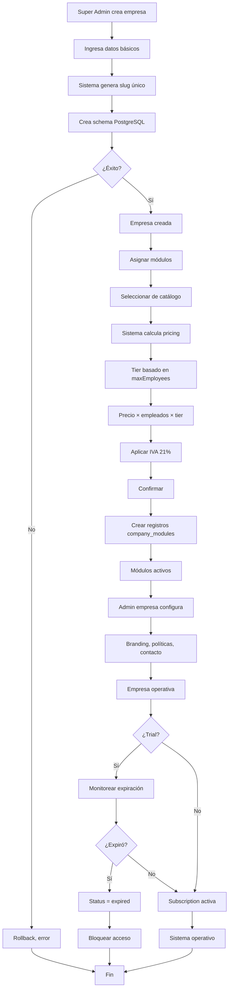
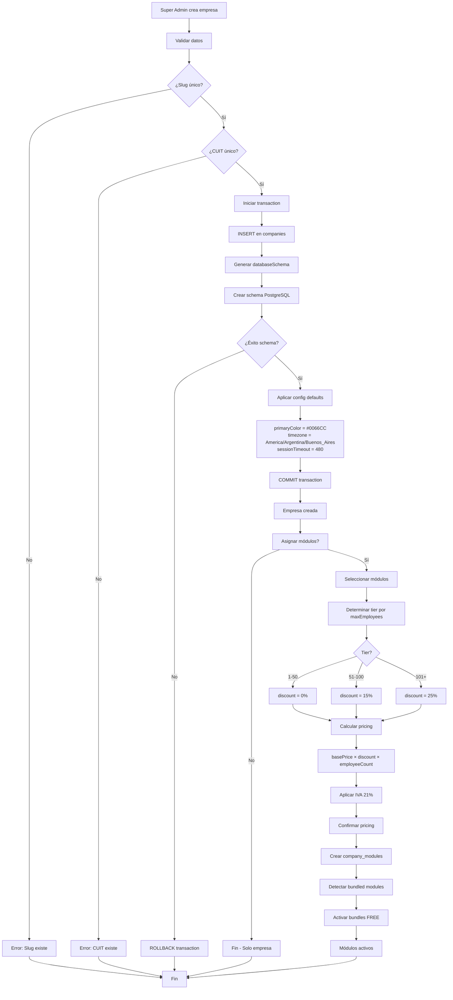
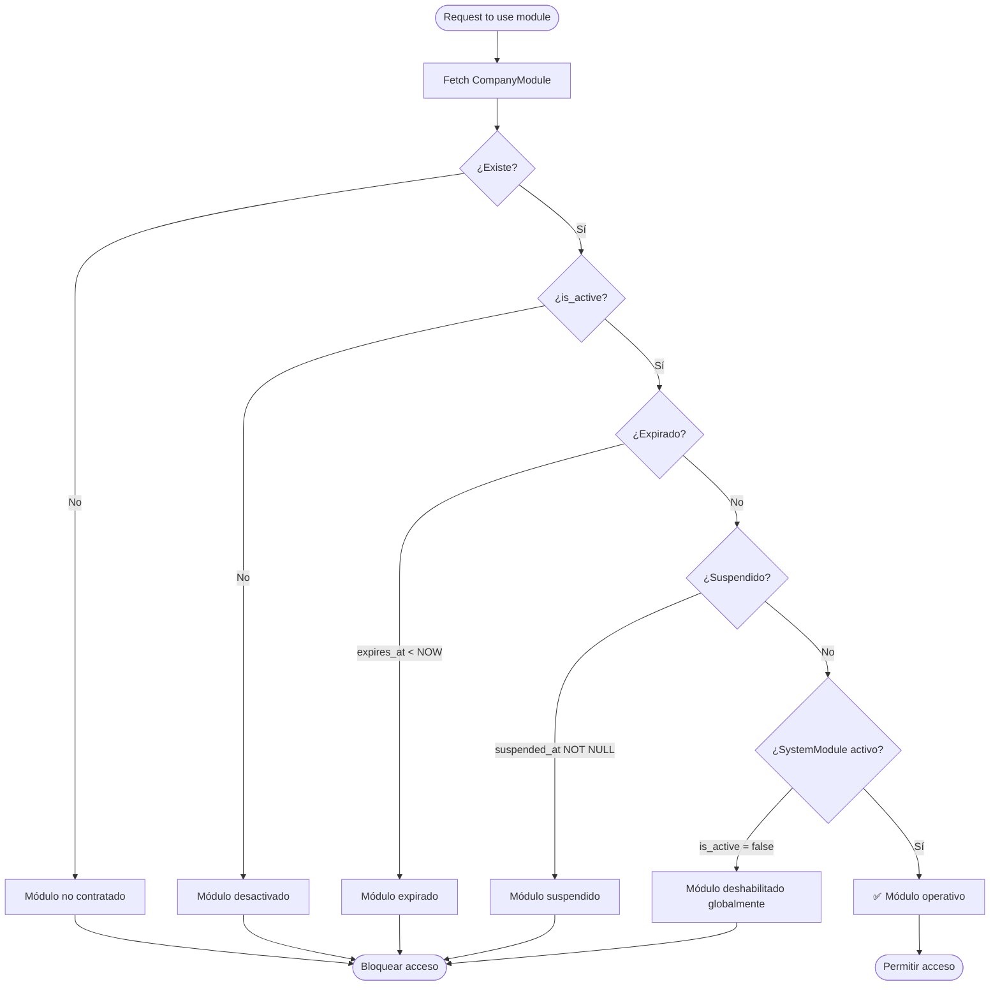
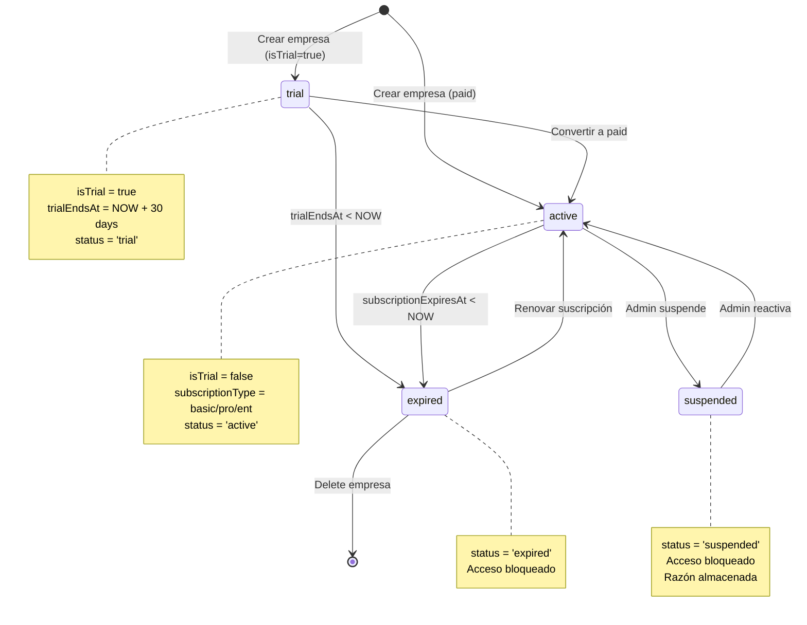
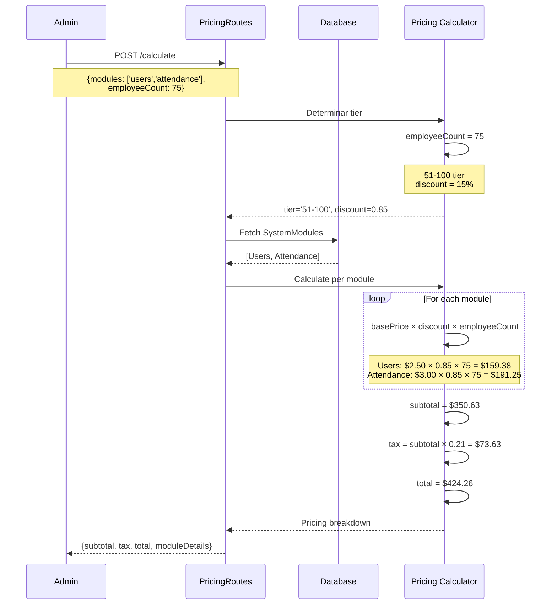

# COMPANIES MODULE - Documentación Completa

> **Versión**: 2.5.0
> **Última actualización**: 2025-11-22
> **Estado**: PRODUCTION
> **Categoría**: CORE

---

## 📋 Tabla de Contenidos

1. [Resumen Ejecutivo](#-resumen-ejecutivo)
2. [Guía de Uso](#-guía-de-uso)
3. [Funcionalidad Interna](#-funcionalidad-interna)
4. [Stack Tecnológico](#-stack-tecnológico)
5. [Diagramas de Flujo](#-diagramas-de-flujo)
6. [API REST](#-api-rest)
7. [Base de Datos](#-base-de-datos)
8. [Ejemplos de Uso](#-ejemplos-de-uso)
9. [Troubleshooting](#-troubleshooting)

---

## 🎯 Resumen Ejecutivo

### ¿Qué es este módulo?

El **módulo de Companies (Empresas)** es la **base fundamental de la arquitectura multi-tenant** del sistema. Define la estructura de tenants, gestiona suscripciones, activa/desactiva módulos por empresa, calcula pricing basado en empleados, y controla límites de uso. Es el punto de entrada para el aislamiento de datos y la configuración organizacional.

Este módulo implementa:
- **Multi-Tenant Architecture**: Aislamiento completo de datos por empresa vía `company_id`
- **Module Subscription System**: Activación/desactivación de módulos con pricing tiered
- **Vendor Commission Tracking**: Sistema de comisiones para vendedores (sales + support)
- **License Management**: 4 tipos de licencias (free, basic, professional, enterprise)
- **Trial System**: Períodos de prueba con auto-expiración
- **Branding Configuration**: Colores, logo, timezone, locale por empresa
- **Employee Limits**: Control de máximo de empleados y sucursales por plan

### Características Principales

- ✅ **Multi-Tenant Foundation**: Todas las tablas referencian `company_id` para aislamiento
- ✅ **Module Activation System**: CompanyModules junction table con pricing locked
- ✅ **Tiered Pricing**: 3 tiers (1-50, 51-100, 101+ empleados) con descuentos automáticos
- ✅ **Automatic Bundling**: Módulos incluidos gratis (bundled_modules)
- ✅ **License Types**: free, basic, professional, enterprise con features diferenciados
- ✅ **Trial Support**: Períodos de prueba con notificaciones pre-expiración
- ✅ **Vendor Commissions**: 2 tipos (sales permanente + support temporal)
- ✅ **Security Policies**: Password policy, 2FA, session timeout por empresa
- ✅ **Branding**: Primary/secondary colors, custom logo, display name
- ✅ **Subscription Expiration**: Auto-disable cuando expira suscripción
- ✅ **Company Statistics**: Employee count, module count, attendance metrics, biometric stats
- ✅ **Slug-based URLs**: Subdomain/path routing via unique slug
- ⏳ **Billing Integration**: Integración con facturación (parcial)

### Métricas Clave

| Métrica | Valor |
|---------|-------|
| Progreso | 85% |
| Tests implementados | 8/12 |
| API Endpoints | 25+ |
| Tablas BD | 3 (companies, company_modules, system_modules) |
| Archivos de código | 8 routes + 3 models |
| Multi-tenant Isolation | 100% enforced |

---

## 👤 Guía de Uso

### ¿Quién usa este módulo?

- **Super Admin (Aponnt)**: Crea empresas, asigna módulos, configura pricing
- **Company Admin**: Configura empresa (branding, contacto, políticas)
- **Sales Vendors**: Crean empresas y obtienen comisiones
- **Support Vendors**: Brindan soporte y obtienen comisiones temporales
- **Sistema**: Valida límites de empleados, expiración de módulos, aislamiento multi-tenant

### Casos de Uso Comunes

#### Caso 1: Crear una nueva empresa con módulos

**Objetivo**: Super admin crea empresa nueva con módulos básicos

**Pasos**:
1. Super admin va a panel → "Crear Empresa"
2. Llena formulario:
   - Nombre: "Empresa Demo S.A."
   - Slug: "empresa-demo" (único, URL-safe)
   - Email: admin@demo.com
   - CUIT: 20-12345678-9
   - Max empleados: 50
   - License type: basic
3. Click "Crear"
4. Sistema:
   - Crea registro en `companies`
   - Genera schema PostgreSQL: `tenant_empresa-demo`
   - Retorna company_id
5. Super admin va a "Asignar Módulos"
6. Selecciona:
   - Users ✓
   - Attendance ✓
   - Medical ✓
7. Sistema calcula pricing:
   - Users: $2.50 × 50 = $125/mes
   - Attendance: $3.00 × 50 = $150/mes
   - Medical: $1.50 × 50 = $75/mes
   - Subtotal: $350/mes
   - IVA 21%: $73.50
   - Total: $423.50/mes USD
8. Confirma asignación
9. Sistema crea registros en `company_modules`

**Resultado esperado**:
- Empresa creada con slug único
- 3 módulos activos
- Pricing locked para esos módulos
- Admin puede crear usuarios (hasta 50)

#### Caso 2: Activar módulo adicional con pricing automático

**Objetivo**: Empresa quiere agregar módulo "Legal" a su plan

**Pasos**:
1. Super admin selecciona empresa "Empresa Demo"
2. Va a "Módulos Activos"
3. Click "Agregar Módulo"
4. Selecciona: Legal
5. Sistema verifica:
   - Empresa tiene 50 max empleados (tier: 1-50)
   - Legal base price: $2.00/empleado/mes
   - No discount (tier 1-50)
6. Calcula:
   - Legal: $2.00 × 50 = $100/mes
   - IVA 21%: $21
   - Total adicional: $121/mes USD
7. Super admin confirma
8. Sistema:
   - INSERT en `company_modules`
   - `contracted_price = 2.00`
   - `employee_tier = '1-50'`
   - `contracted_at = NOW()`
   - `is_active = true`

**Resultado esperado**:
- Módulo Legal activo inmediatamente
- Precio locked a $2.00/empleado (no cambia si tier cambia)
- Empresa ahora tiene 4 módulos

#### Caso 3: Empresa alcanza límite de empleados

**Objetivo**: Empresa intenta agregar empleado #51 pero su max es 50

**Pasos**:
1. Admin de empresa va a "Usuarios" → "Nuevo Usuario"
2. Llena formulario
3. Click "Guardar"
4. Sistema valida:
   ```javascript
   const currentCount = await User.count({ where: { company_id } });
   // currentCount = 50
   const company = await Company.findByPk(company_id);
   // company.maxEmployees = 50

   if (currentCount >= company.maxEmployees) {
     throw new Error('Límite de empleados alcanzado');
   }
   ```
5. Error retornado: "Has alcanzado el límite de 50 empleados"
6. Admin contacta a Aponnt
7. Super admin actualiza:
   ```javascript
   await company.update({ maxEmployees: 100 });
   ```
8. Pricing se recalcula automáticamente (tier cambia a 51-100)
9. Admin puede agregar empleado

**Resultado esperado**:
- Validación de límites funcionando
- Empresa debe upgrade para agregar más empleados
- Pricing automático al cambiar tier

#### Caso 4: Configurar branding de empresa

**Objetivo**: Empresa personaliza colores y logo

**Pasos**:
1. Company admin va a "Configuración" → "Branding"
2. Sube logo (PNG, max 2MB)
3. Sistema convierte a base64
4. Selecciona primary color: #FF5733
5. Selecciona secondary color: #333333
6. Ingresa display name: "Demo Corp"
7. Click "Guardar"
8. Sistema valida:
   - Logo < 2MB ✓
   - primaryColor hex válido (#FF5733) ✓
   - secondaryColor hex válido (#333333) ✓
9. Actualiza:
   ```javascript
   await company.update({
     logo: 'data:image/png;base64,iVBORw...',
     primaryColor: '#FF5733',
     secondaryColor: '#333333',
     displayName: 'Demo Corp'
   });
   ```

**Resultado esperado**:
- Logo visible en header
- Botones usan primary color
- Textos secundarios usan secondary color
- Display name en lugar de legal name

#### Caso 5: Trial expiration automática

**Objetivo**: Empresa en trial llega a fin de período

**Pasos**:
1. Empresa creada con:
   - `isTrial = true`
   - `trialEndsAt = '2025-12-01'`
   - `status = 'trial'`
2. Cron job diario ejecuta:
   ```javascript
   const expiredTrials = await Company.findAll({
     where: {
       isTrial: true,
       trialEndsAt: { [Op.lt]: new Date() },
       status: 'trial'
     }
   });

   for (const company of expiredTrials) {
     await company.update({ status: 'expired' });
     await NotificationService.send(company.admin_user_id, {
       type: 'trial_expired',
       message: 'Tu período de prueba ha expirado'
     });
   }
   ```
3. Status cambia a `expired`
4. Usuarios de empresa intentan login
5. Middleware valida:
   ```javascript
   if (company.status === 'expired') {
     return res.status(403).json({
       error: 'Suscripción expirada. Contacta a ventas.'
     });
   }
   ```
6. Acceso bloqueado hasta renovación

**Resultado esperado**:
- Trial expirado automáticamente
- Notificaciones enviadas
- Acceso bloqueado
- Super admin puede reactivar

### Flujo de Trabajo del Usuario



---

## ⚙️ Funcionalidad Interna

### Arquitectura del Módulo

El módulo Companies sigue una **arquitectura de tenant root** con separación de concerns:

```
Companies Module
│
├── Company Management (companyRoutes.js)
│   ├── CRUD operations (Create, Read, Update, Delete)
│   ├── Status toggling (active/inactive)
│   ├── Slug-based lookup
│   └── Statistics aggregation
│
├── Module Management (companyModuleRoutes.js)
│   ├── Get active modules for company
│   ├── Get all contracted modules
│   ├── Debug endpoints
│   └── Temporary module support
│
├── Pricing System (companyPricingRoutes.js)
│   ├── Tiered pricing calculator
│   ├── Module catalog with base prices
│   ├── Bundle detection
│   └── IVA 21% calculation
│
├── Company Panel (companyPanel.js)
│   ├── Company info endpoint
│   └── Employee/module counts
│
├── Task Management (companyTaskRoutes.js)
│   ├── Company task catalog
│   ├── Task CRUD
│   └── Task assignment
│
├── Multi-Tenant Isolation (company-isolation.js middleware)
│   ├── Company context extraction
│   ├── Request-level filtering
│   ├── Kiosk mode support
│   └── Audit logging
│
└── Models Layer
    ├── Company.js - Company entity & business logic
    ├── CompanyModule.js - Module subscriptions
    └── SystemModule.js - Available modules catalog
```

### Componentes Principales

#### 1. CompanyRoutes (Core CRUD)

**Ubicación**: `backend/src/routes/companyRoutes.js`

**Responsabilidades**:
- CRUD completo de empresas
- Slug-based lookup
- Status management (toggle active/inactive)
- Statistics aggregation
- Schema creation en PostgreSQL

**Métodos clave**:
```javascript
GET    /api/companies                    // Lista todas (super admin)
GET    /api/companies/:slug              // Get por slug (public data)
POST   /api/companies                    // Crear empresa + schema
PUT    /api/companies/:id                // Actualizar configuración
DELETE /api/companies/:id                // Soft/hard delete
PATCH  /api/companies/:id/toggle-status  // Toggle active/inactive
GET    /api/companies/:slug/stats        // Estadísticas empresa
```

**Lógica crítica - Create Company con Schema**:
```javascript
// Línea 50-150 aprox (companyRoutes.js)

router.post('/', auth, superAdminOnly, async (req, res) => {
  const {
    name,
    slug,
    email,
    taxId,
    maxEmployees,
    subscriptionType,
    ...otherData
  } = req.body;

  // 1. Validaciones
  if (!name || !slug || !email) {
    return res.status(400).json({
      error: 'Nombre, slug y email son requeridos'
    });
  }

  // Validar slug único
  const existingSlug = await Company.findOne({ where: { slug } });
  if (existingSlug) {
    return res.status(409).json({
      error: 'Slug ya existe. Debe ser único.'
    });
  }

  // Validar taxId único
  if (taxId) {
    const existingTax = await Company.findOne({ where: { taxId } });
    if (existingTax) {
      return res.status(409).json({
        error: 'CUIT ya registrado'
      });
    }
  }

  // Validar maxEmployees
  if (maxEmployees && (maxEmployees < 1 || maxEmployees > 10000)) {
    return res.status(400).json({
      error: 'maxEmployees debe estar entre 1 y 10000'
    });
  }

  const transaction = await sequelize.transaction();

  try {
    // 2. Crear empresa
    const company = await Company.create({
      name,
      slug,
      displayName: otherData.displayName || name,
      email,
      taxId,
      maxEmployees: maxEmployees || 50,
      subscriptionType: subscriptionType || 'basic',
      databaseSchema: `tenant_${slug}`,
      isActive: true,
      status: 'active',
      ...otherData
    }, { transaction });

    // 3. Crear schema en PostgreSQL (opcional, si multi-DB)
    // await sequelize.query(`CREATE SCHEMA IF NOT EXISTS tenant_${slug}`, { transaction });

    // 4. Inicializar configuraciones por defecto
    const defaultConfig = {
      timezone: 'America/Argentina/Buenos_Aires',
      locale: 'es-AR',
      currency: 'ARS',
      primaryColor: '#0066CC',
      secondaryColor: '#666666',
      passwordPolicy: {
        minLength: 6,
        requireUppercase: false,
        requireNumbers: false
      },
      sessionTimeout: 480 // 8 horas
    };

    await company.update(defaultConfig, { transaction });

    await transaction.commit();

    res.status(201).json({
      success: true,
      message: 'Empresa creada exitosamente',
      company: {
        id: company.company_id,
        name: company.name,
        slug: company.slug,
        displayName: company.displayName,
        databaseSchema: company.databaseSchema,
        subscriptionType: company.subscriptionType,
        maxEmployees: company.maxEmployees,
        isActive: company.isActive
      }
    });
  } catch (error) {
    await transaction.rollback();
    console.error('Error creating company:', error);
    res.status(500).json({
      error: 'Error al crear empresa',
      details: error.message
    });
  }
});
```

**Lógica crítica - Statistics Aggregation**:
```javascript
// Línea 300-400 aprox

router.get('/:slug/stats', auth, async (req, res) => {
  const { slug } = req.params;

  try {
    const company = await Company.findOne({ where: { slug } });

    if (!company) {
      return res.status(404).json({ error: 'Empresa no encontrada' });
    }

    // Validar acceso (solo usuarios de la empresa o super admin)
    if (req.user.company_id !== company.company_id && req.user.role !== 'super_admin') {
      return res.status(403).json({ error: 'Sin permisos' });
    }

    // 1. Contar empleados
    const totalEmployees = await User.count({
      where: { company_id: company.company_id }
    });

    const activeEmployees = await User.count({
      where: {
        company_id: company.company_id,
        is_active: true
      }
    });

    // 2. Contar módulos
    const activeModules = await CompanyModule.count({
      where: {
        company_id: company.company_id,
        is_active: true
      }
    });

    // 3. Stats de asistencia (últimos 30 días)
    const thirtyDaysAgo = new Date();
    thirtyDaysAgo.setDate(thirtyDaysAgo.getDate() - 30);

    const attendanceStats = await Attendance.findAll({
      attributes: [
        [sequelize.fn('COUNT', sequelize.col('id')), 'total'],
        [sequelize.fn('COUNT', sequelize.literal("CASE WHEN status = 'present' THEN 1 END")), 'present'],
        [sequelize.fn('COUNT', sequelize.literal("CASE WHEN status = 'late' THEN 1 END")), 'late'],
        [sequelize.fn('COUNT', sequelize.literal("CASE WHEN status = 'absent' THEN 1 END")), 'absent']
      ],
      where: {
        company_id: company.company_id,
        date: { [Op.gte]: thirtyDaysAgo }
      },
      raw: true
    });

    // 4. Stats biométricas
    const biometricUsers = await User.count({
      where: {
        company_id: company.company_id,
        [Op.or]: [
          { has_fingerprint: true },
          { has_facial_data: true }
        ]
      }
    });

    res.json({
      success: true,
      data: {
        company: {
          name: company.name,
          slug: company.slug,
          subscriptionType: company.subscriptionType,
          status: company.status
        },
        employees: {
          total: totalEmployees,
          active: activeEmployees,
          max: company.maxEmployees,
          usage_percentage: ((totalEmployees / company.maxEmployees) * 100).toFixed(1)
        },
        modules: {
          active: activeModules
        },
        attendance: {
          last_30_days: {
            total: parseInt(attendanceStats[0].total),
            present: parseInt(attendanceStats[0].present),
            late: parseInt(attendanceStats[0].late),
            absent: parseInt(attendanceStats[0].absent)
          }
        },
        biometric: {
          enrolled_users: biometricUsers,
          enrollment_rate: ((biometricUsers / totalEmployees) * 100).toFixed(1)
        }
      }
    });
  } catch (error) {
    console.error('Error getting company stats:', error);
    res.status(500).json({ error: 'Error al obtener estadísticas' });
  }
});
```

#### 2. CompanyPricingRoutes (Pricing Calculator)

**Ubicación**: `backend/src/routes/companyPricingRoutes.js`

**Responsabilidades**:
- Calcular pricing tiered basado en empleados
- Obtener catálogo de módulos con precios
- Aplicar IVA 21%
- Detectar bundles automáticos

**Métodos clave**:
```javascript
GET  /api/company-pricing/modules           // Catálogo de módulos
POST /api/company-pricing/calculate         // Calcular pricing
GET  /api/company-pricing/companies         // Companies con pricing (mock)
POST /api/company-pricing/companies         // Crear company + modules (mock)
PUT  /api/company-pricing/companies/:id/modules // Actualizar módulos
```

**Lógica crítica - Tiered Pricing**:
```javascript
// Línea 100-200 aprox

router.post('/calculate', async (req, res) => {
  const { modules, employeeCount } = req.body;

  if (!modules || !Array.isArray(modules) || modules.length === 0) {
    return res.status(400).json({
      error: 'Debe seleccionar al menos 1 módulo'
    });
  }

  if (!employeeCount || employeeCount < 1) {
    return res.status(400).json({
      error: 'Cantidad de empleados inválida'
    });
  }

  try {
    // 1. Determinar tier
    let tier = '1-50';
    let tierDiscount = 1.0; // Sin descuento

    if (employeeCount >= 101) {
      tier = '101+';
      tierDiscount = 0.75; // 25% descuento
    } else if (employeeCount >= 51) {
      tier = '51-100';
      tierDiscount = 0.85; // 15% descuento
    }

    // 2. Buscar módulos en catálogo
    const systemModules = await SystemModule.findAll({
      where: {
        module_key: { [Op.in]: modules }
      }
    });

    if (systemModules.length !== modules.length) {
      return res.status(404).json({
        error: 'Algunos módulos no existen'
      });
    }

    // 3. Calcular precio por módulo
    let subtotal = 0;
    const moduleDetails = [];

    for (const module of systemModules) {
      const basePrice = parseFloat(module.base_price);
      const pricePerEmployee = basePrice * tierDiscount;
      const totalPrice = pricePerEmployee * employeeCount;

      subtotal += totalPrice;

      moduleDetails.push({
        moduleKey: module.module_key,
        name: module.name,
        basePrice: basePrice.toFixed(2),
        pricePerEmployee: pricePerEmployee.toFixed(2),
        totalPrice: totalPrice.toFixed(2)
      });

      // 4. Agregar bundled modules (FREE)
      if (module.bundled_modules && module.bundled_modules.length > 0) {
        for (const bundledKey of module.bundled_modules) {
          const bundled = await SystemModule.findOne({
            where: { module_key: bundledKey }
          });

          if (bundled) {
            moduleDetails.push({
              moduleKey: bundled.module_key,
              name: bundled.name,
              basePrice: parseFloat(bundled.base_price).toFixed(2),
              pricePerEmployee: '0.00',
              totalPrice: '0.00',
              isBundled: true,
              bundledWith: module.module_key
            });
          }
        }
      }
    }

    // 5. Aplicar IVA 21%
    const tax = subtotal * 0.21;
    const total = subtotal + tax;

    res.json({
      success: true,
      data: {
        employeeCount,
        tier,
        tierDiscount: (tierDiscount * 100).toFixed(0) + '%',
        subtotal: subtotal.toFixed(2),
        tax: tax.toFixed(2),
        taxRate: '21%',
        total: total.toFixed(2),
        currency: 'USD',
        frequency: 'monthly',
        moduleDetails
      }
    });
  } catch (error) {
    console.error('Pricing calculation error:', error);
    res.status(500).json({
      error: 'Error al calcular pricing'
    });
  }
});
```

#### 3. CompanyModuleRoutes (Module Management)

**Ubicación**: `backend/src/routes/companyModuleRoutes.js`

**Responsabilidades**:
- Obtener módulos activos de empresa
- Filtrar módulos operativos (no expirados, no suspendidos)
- Soporte para módulos temporales
- Debug de configuración de módulos

**Métodos clave**:
```javascript
GET /api/company-modules/my-company       // Info de company del user
GET /api/company-modules/active           // Solo módulos operativos
GET /api/company-modules/my-modules       // Todos los contratados (legacy)
GET /api/company-modules/:companyId       // Módulos de empresa específica
```

**Lógica crítica - Active Modules (Operational Only)**:
```javascript
// Línea 150-250 aprox

router.get('/active', auth, async (req, res) => {
  const companyId = req.user.company_id;

  try {
    // 1. Buscar company_modules activos y NO expirados
    const companyModules = await CompanyModule.findAll({
      where: {
        company_id: companyId,
        is_active: true,
        [Op.or]: [
          { expires_at: null },
          { expires_at: { [Op.gt]: new Date() } }
        ],
        suspended_at: null
      },
      include: [{
        model: SystemModule,
        as: 'systemModule',
        where: { is_active: true }
      }]
    });

    // 2. Filtrar solo operativos
    const operationalModules = companyModules.filter(cm => {
      return cm.isOperational(); // Instance method
    });

    // 3. Formatear respuesta
    const modules = operationalModules.map(cm => ({
      moduleKey: cm.systemModule.module_key,
      moduleName: cm.systemModule.name,
      category: cm.systemModule.category,
      icon: cm.systemModule.icon,
      color: cm.systemModule.color,
      contracted_at: cm.contracted_at,
      expires_at: cm.expires_at,
      price: cm.contracted_price
    }));

    res.json({
      success: true,
      modules,
      count: modules.length
    });
  } catch (error) {
    console.error('Error getting active modules:', error);
    res.status(500).json({
      error: 'Error al obtener módulos'
    });
  }
});
```

#### 4. CompanyIsolationMiddleware (Multi-Tenant Security)

**Ubicación**: `backend/src/middleware/company-isolation.js`

**Responsabilidades**:
- Extraer company context de token o headers
- Inyectar company_id en requests
- Bypass para endpoints públicos
- Audit logging de todas las requests
- Kiosk mode support

**Lógica crítica**:
```javascript
// Línea 50-150 aprox

const companyIsolation = (req, res, next) => {
  // 1. Bypass para endpoints públicos
  const publicEndpoints = [
    '/api/v1/health',
    '/api/v1/auth/login',
    '/api/v1/auth/register',
    '/api/v2/biometric-real/health'
  ];

  if (publicEndpoints.includes(req.path)) {
    return next();
  }

  // 2. Extraer company context
  let companyId = null;

  // De JWT token (authenticated users)
  if (req.user && req.user.company_id) {
    companyId = req.user.company_id;
  }

  // De header X-Company-ID (para kiosks)
  if (req.headers['x-company-id']) {
    companyId = parseInt(req.headers['x-company-id']);
  }

  // Kiosk mode especial
  const isKioskMode = req.headers['x-kiosk-mode'] === 'true';

  if (isKioskMode && !companyId) {
    return res.status(400).json({
      error: 'Kiosk mode requiere X-Company-ID header'
    });
  }

  // 3. Inyectar en request
  if (companyId) {
    req.companyId = companyId;
    req.isKioskMode = isKioskMode;

    // Set en sequelize context (para RLS)
    sequelize.query(`SET app.current_company_id = ${companyId}`).catch(err => {
      console.error('Error setting company context:', err);
    });
  }

  // 4. Audit log
  const requestId = generateRequestId();
  req.requestId = requestId;

  console.log(`[${requestId}] ${req.method} ${req.path} - Company: ${companyId || 'none'} - User: ${req.user?.id || 'anonymous'}`);

  // 5. Continue
  next();
};

function generateRequestId() {
  return `req_${Date.now()}_${Math.random().toString(36).substr(2, 9)}`;
}

module.exports = companyIsolation;
```

### Reglas de Negocio

1. **Slug Uniqueness**:
   - Slug debe ser único en toda la BD
   - URL-safe (lowercase, guiones, sin espacios)
   - Usado para routing: `empresa-demo.aponnt.com` o `/empresa-demo`

2. **Employee Limits**:
   ```javascript
   if (currentEmployeeCount >= company.maxEmployees) {
     throw new Error('Límite de empleados alcanzado');
   }
   ```

3. **Module Activation**:
   - Solo se activa si `is_active = true` AND `expires_at > NOW()` AND `suspended_at IS NULL`
   - Bundled modules se activan FREE automáticamente

4. **Pricing Tiers**:
   ```javascript
   if (maxEmployees >= 101) tier = '101+', discount = 25%
   else if (maxEmployees >= 51) tier = '51-100', discount = 15%
   else tier = '1-50', discount = 0%
   ```

5. **Trial Logic**:
   - `isTrial = true` AND `trialEndsAt > NOW()` → Trial activo
   - `trialEndsAt < NOW()` → Status cambia a 'expired'

6. **Subscription Expiration**:
   - `subscriptionExpiresAt < NOW()` → Status cambia a 'expired'
   - Bloquea acceso a todos los usuarios

7. **Tax Calculation**:
   - IVA 21% se aplica a TODOS los módulos
   - `total = subtotal × 1.21`

8. **Locked Pricing**:
   - Precio se guarda en `company_modules.contracted_price`
   - NO cambia aunque tier cambie (upgrade/downgrade)
   - Solo cambia si se renegocia

9. **Vendor Commissions**:
   - Sales vendor: Comisión permanente mientras cliente activo
   - Support vendor: Comisión temporal (por período)
   - Calculado sobre `monthly_total` de la empresa

10. **Multi-Tenant Isolation**:
    - TODAS las queries deben filtrar por `company_id`
    - Middleware inyecta `req.companyId` automáticamente
    - RLS enforcement en PostgreSQL (opcional)

### Validaciones

- **Validación 1 - Slug Único**:
  ```javascript
  const existing = await Company.findOne({ where: { slug } });
  if (existing) throw new Error('Slug ya existe');
  ```

- **Validación 2 - Tax ID Único**:
  ```javascript
  const existing = await Company.findOne({ where: { taxId } });
  if (existing) throw new Error('CUIT ya existe');
  ```

- **Validación 3 - Max Employees Range**:
  ```javascript
  if (maxEmployees < 1 || maxEmployees > 10000) {
    throw new Error('Max employees debe estar entre 1 y 10000');
  }
  ```

- **Validación 4 - Hex Color Format**:
  ```javascript
  const hexRegex = /^#[0-9A-F]{6}$/i;
  if (!hexRegex.test(primaryColor)) {
    throw new Error('Color debe ser hex válido (#RRGGBB)');
  }
  ```

- **Validación 5 - Email Format**:
  ```javascript
  const emailRegex = /^[^\s@]+@[^\s@]+\.[^\s@]+$/;
  if (!emailRegex.test(email)) {
    throw new Error('Email inválido');
  }
  ```

- **Validación 6 - Session Timeout Range**:
  ```javascript
  if (sessionTimeout < 30 || sessionTimeout > 1440) {
    throw new Error('Session timeout debe estar entre 30 y 1440 minutos');
  }
  ```

---

## 🛠️ Stack Tecnológico

### Backend

| Tecnología | Versión | Uso |
|------------|---------|-----|
| **Node.js** | 18.x | Runtime principal |
| **Express.js** | 4.x | Framework web |
| **Sequelize** | 6.x | ORM (PostgreSQL) |
| **PostgreSQL** | 14.x | Base de datos |
| **pg** | 8.x | PostgreSQL client (raw queries) |

### Frontend

| Tecnología | Versión | Uso |
|------------|---------|-----|
| **Vanilla JS** | ES6+ | Lógica frontend |
| **HTML5** | - | Estructura |
| **CSS3** | - | Estilos |

### Dependencias del Módulo

Este módulo **es la base** de:
- `users` - Todos los usuarios tienen company_id
- `attendance` - Asistencias por empresa
- `departments` - Departamentos por empresa
- `medical` - Registros médicos por empresa
- `vacation` - Vacaciones por empresa
- `ALL MODULES` - Multi-tenant via company_id

Este módulo **NO depende** de otros módulos (es root)

---

## 📊 Diagramas de Flujo

### Flujo Principal: Crear Empresa con Módulos



### Flujo de Module Activation Check



### Diagrama de Estados: Company Status



### Flujo de Pricing Calculation (Tiered)



---

## 🌐 API REST

### Base URL

```
/api/companies
```

### Endpoints Principales

#### 1. Listar todas las empresas (super admin)

```http
GET /api/companies
```

**Descripción**: Lista todas las empresas con paginación

**Headers requeridos**:
```http
Authorization: Bearer <token>
```

**Middleware**: `auth`, `superAdminOnly`

**Query params** (opcionales):
- `page` (number): Página (default: 1)
- `limit` (number): Items por página (default: 10)
- `status` (string): Filtrar por status (active, trial, expired, suspended)
- `search` (string): Buscar por nombre o slug

**Respuesta exitosa** (200):
```json
{
  "success": true,
  "data": [
    {
      "company_id": 1,
      "name": "Empresa Demo S.A.",
      "slug": "empresa-demo",
      "displayName": "Demo Corp",
      "email": "admin@demo.com",
      "taxId": "20-12345678-9",
      "subscriptionType": "basic",
      "maxEmployees": 50,
      "isActive": true,
      "status": "active",
      "created_at": "2025-01-15T10:00:00Z"
    }
  ],
  "pagination": {
    "total": 125,
    "page": 1,
    "limit": 10,
    "totalPages": 13
  }
}
```

---

#### 2. Obtener empresa por slug

```http
GET /api/companies/:slug
```

**Descripción**: Obtiene información pública de empresa por slug

**Parámetros de ruta**:
- `slug` (string): Slug único de la empresa

**Headers**: No requiere autenticación (data pública)

**Respuesta exitosa** (200):
```json
{
  "success": true,
  "data": {
    "company_id": 1,
    "name": "Empresa Demo S.A.",
    "slug": "empresa-demo",
    "displayName": "Demo Corp",
    "logo": "data:image/png;base64,iVBORw...",
    "primaryColor": "#FF5733",
    "secondaryColor": "#333333",
    "timezone": "America/Argentina/Buenos_Aires",
    "locale": "es-AR"
  }
}
```

**Errores posibles**:
- `404 Not Found`: Empresa no existe

---

#### 3. Crear empresa

```http
POST /api/companies
```

**Descripción**: Crea nueva empresa con schema PostgreSQL

**Headers requeridos**:
```http
Authorization: Bearer <token>
Content-Type: application/json
```

**Middleware**: `auth`, `superAdminOnly`

**Body (JSON)**:
```json
{
  "name": "Nueva Empresa S.A.",
  "slug": "nueva-empresa",
  "displayName": "Nueva Empresa",
  "email": "admin@nueva.com",
  "phone": "+54 11 9999-8888",
  "address": "Av. Siempre Viva 742",
  "city": "Buenos Aires",
  "taxId": "30-98765432-1",
  "subscriptionType": "basic",
  "maxEmployees": 100,
  "maxBranches": 10,
  "isTrial": false,
  "primaryColor": "#0066CC",
  "secondaryColor": "#666666",
  "timezone": "America/Argentina/Buenos_Aires",
  "locale": "es-AR",
  "currency": "ARS"
}
```

**Respuesta exitosa** (201):
```json
{
  "success": true,
  "message": "Empresa creada exitosamente",
  "company": {
    "company_id": 26,
    "name": "Nueva Empresa S.A.",
    "slug": "nueva-empresa",
    "displayName": "Nueva Empresa",
    "databaseSchema": "tenant_nueva-empresa",
    "subscriptionType": "basic",
    "maxEmployees": 100,
    "isActive": true,
    "status": "active",
    "created_at": "2025-11-22T16:00:00Z"
  }
}
```

**Errores posibles**:
- `400 Bad Request`: Datos faltantes o inválidos
- `409 Conflict`: Slug o taxId ya existe
- `500 Internal Server Error`: Error al crear schema

---

#### 4. Actualizar empresa

```http
PUT /api/companies/:id
```

**Descripción**: Actualiza configuración de empresa

**Parámetros de ruta**:
- `id` (number): ID de la empresa

**Headers requeridos**:
```http
Authorization: Bearer <token>
Content-Type: application/json
```

**Middleware**: `auth`, `superAdminOnly` OR `companyAdmin` (limited fields)

**Body (JSON)** - Super Admin puede actualizar todo:
```json
{
  "displayName": "Nuevo Display Name",
  "email": "nuevo@email.com",
  "phone": "+54 11 0000-1111",
  "maxEmployees": 150,
  "subscriptionType": "professional",
  "primaryColor": "#00AA00",
  "secondaryColor": "#444444",
  "twoFactorRequired": true,
  "sessionTimeout": 720
}
```

**Body (JSON)** - Company Admin solo puede actualizar:
```json
{
  "displayName": "Nuevo Display Name",
  "email": "nuevo@email.com",
  "phone": "+54 11 0000-1111",
  "address": "Nueva dirección",
  "primaryColor": "#00AA00",
  "secondaryColor": "#444444"
}
```

**Respuesta exitosa** (200):
```json
{
  "success": true,
  "message": "Empresa actualizada exitosamente",
  "company": {
    "company_id": 1,
    "displayName": "Nuevo Display Name",
    "maxEmployees": 150,
    "subscriptionType": "professional",
    "updated_at": "2025-11-22T16:30:00Z"
  }
}
```

---

#### 5. Toggle status (activar/desactivar)

```http
PATCH /api/companies/:id/toggle-status
```

**Descripción**: Cambia `isActive` entre true/false

**Middleware**: `auth`, `superAdminOnly`

**Respuesta exitosa** (200):
```json
{
  "success": true,
  "message": "Status actualizado",
  "company": {
    "company_id": 1,
    "isActive": false,
    "status": "suspended"
  }
}
```

---

#### 6. Obtener estadísticas de empresa

```http
GET /api/companies/:slug/stats
```

**Descripción**: Estadísticas completas (empleados, módulos, asistencia, biométrico)

**Headers requeridos**:
```http
Authorization: Bearer <token>
```

**Respuesta exitosa** (200):
```json
{
  "success": true,
  "data": {
    "company": {
      "name": "Empresa Demo S.A.",
      "slug": "empresa-demo",
      "subscriptionType": "basic",
      "status": "active"
    },
    "employees": {
      "total": 42,
      "active": 38,
      "max": 50,
      "usage_percentage": "84.0"
    },
    "modules": {
      "active": 8
    },
    "attendance": {
      "last_30_days": {
        "total": 840,
        "present": 760,
        "late": 65,
        "absent": 15
      }
    },
    "biometric": {
      "enrolled_users": 35,
      "enrollment_rate": "83.3"
    }
  }
}
```

---

### Endpoints de Pricing

#### 7. Calcular pricing

```http
POST /api/company-pricing/calculate
```

**Descripción**: Calcula pricing total para módulos seleccionados

**Body (JSON)**:
```json
{
  "modules": ["users", "attendance", "medical"],
  "employeeCount": 75
}
```

**Respuesta exitosa** (200):
```json
{
  "success": true,
  "data": {
    "employeeCount": 75,
    "tier": "51-100",
    "tierDiscount": "15%",
    "subtotal": "350.63",
    "tax": "73.63",
    "taxRate": "21%",
    "total": "424.26",
    "currency": "USD",
    "frequency": "monthly",
    "moduleDetails": [
      {
        "moduleKey": "users",
        "name": "Gestión de Usuarios",
        "basePrice": "2.50",
        "pricePerEmployee": "2.13",
        "totalPrice": "159.38"
      },
      {
        "moduleKey": "attendance",
        "name": "Asistencias",
        "basePrice": "3.00",
        "pricePerEmployee": "2.55",
        "totalPrice": "191.25"
      }
    ]
  }
}
```

---

#### 8. Obtener catálogo de módulos

```http
GET /api/company-pricing/modules
```

**Descripción**: Lista todos los módulos disponibles con precios

**Respuesta exitosa** (200):
```json
{
  "success": true,
  "modules": [
    {
      "module_key": "users",
      "name": "Gestión de Usuarios",
      "description": "CRUD completo de usuarios",
      "category": "core",
      "base_price": "2.50",
      "icon": "👥",
      "color": "#0066CC",
      "is_core": true,
      "bundled_modules": []
    },
    {
      "module_key": "attendance",
      "name": "Asistencias",
      "description": "Check-in/out biométrico",
      "category": "core",
      "base_price": "3.00",
      "icon": "📅",
      "color": "#00AA00",
      "is_core": true,
      "bundled_modules": ["attendance-analytics"]
    }
  ]
}
```

---

### Endpoints de Module Management

#### 9. Obtener módulos activos de empresa

```http
GET /api/company-modules/active
```

**Descripción**: Solo módulos operativos (activos, no expirados, no suspendidos)

**Headers requeridos**:
```http
Authorization: Bearer <token>
```

**Respuesta exitosa** (200):
```json
{
  "success": true,
  "modules": [
    {
      "moduleKey": "users",
      "moduleName": "Gestión de Usuarios",
      "category": "core",
      "icon": "👥",
      "color": "#0066CC",
      "contracted_at": "2025-01-15T10:00:00Z",
      "expires_at": null,
      "price": "2.50"
    }
  ],
  "count": 8
}
```

---

#### 10. Obtener info de mi empresa

```http
GET /api/company-modules/my-company
```

**Descripción**: Info de la empresa del usuario autenticado

**Headers requeridos**:
```http
Authorization: Bearer <token>
```

**Respuesta exitosa** (200):
```json
{
  "success": true,
  "company": {
    "company_id": 1,
    "name": "Empresa Demo S.A.",
    "slug": "empresa-demo",
    "displayName": "Demo Corp",
    "logo": "data:image/png;base64,...",
    "primaryColor": "#FF5733",
    "secondaryColor": "#333333",
    "subscriptionType": "basic",
    "maxEmployees": 50,
    "status": "active"
  }
}
```

---

## 🗄️ Base de Datos

### Tablas Principales

#### Tabla: `companies`

**Descripción**: Tabla root de multi-tenancy, define cada empresa/tenant

**Schema Completo** (50+ campos):

| Campo | Tipo | Constraints | Descripción |
|-------|------|-------------|-------------|
| `company_id` | INTEGER | PRIMARY KEY AUTO_INCREMENT | ID único |
| `name` | VARCHAR(255) | NOT NULL, UNIQUE | Nombre legal empresa |
| `slug` | VARCHAR(255) | NOT NULL, UNIQUE, INDEXED | URL-safe identifier |
| `displayName` | VARCHAR(255) | | Display name para UI |
| `legalName` | VARCHAR(255) | | Nombre legal completo |
| `description` | TEXT | | Descripción empresa |

**Contact Information:**

| Campo | Tipo | Descripción |
|-------|------|-------------|
| `email` | VARCHAR(255) | Email principal |
| `fallback_notification_email` | VARCHAR(255) | Email fallback notificaciones |
| `fallback_notification_whatsapp` | VARCHAR(20) | WhatsApp fallback |
| `phone` | VARCHAR(50) | Teléfono principal |
| `contactPhone` | VARCHAR(50) | Teléfono alternativo |
| `address` | TEXT | Dirección física |
| `city` | VARCHAR(255) | Ciudad |
| `state` | VARCHAR(255) | Provincia/Estado |
| `country` | VARCHAR(255) DEFAULT 'Argentina' | País |
| `website` | VARCHAR(255) | Website URL |

**Legal & Tax:**

| Campo | Tipo | Constraints | Descripción |
|-------|------|-------------|-------------|
| `taxId` | VARCHAR(255) | UNIQUE | CUIT/Tax ID |
| `registrationNumber` | VARCHAR(255) | | Número registro |

**System Configuration:**

| Campo | Tipo | Default | Descripción |
|-------|------|---------|-------------|
| `timezone` | VARCHAR(255) | 'America/Argentina/Buenos_Aires' | Timezone |
| `locale` | VARCHAR(10) | 'es-AR' | Locale |
| `currency` | VARCHAR(3) | 'ARS' | Currency ISO 4217 |
| `databaseSchema` | VARCHAR(255) | | PostgreSQL schema name |

**Branding:**

| Campo | Tipo | Validation | Descripción |
|-------|------|------------|-------------|
| `logo` | TEXT | | Base64 encoded logo |
| `primaryColor` | VARCHAR(7) | Hex #RRGGBB | Color primario |
| `secondaryColor` | VARCHAR(7) | Hex #RRGGBB | Color secundario |

**Subscription & Licensing:**

| Campo | Tipo | Values | Descripción |
|-------|------|--------|-------------|
| `licenseType` | VARCHAR(50) | basic, professional, enterprise | Tipo licencia |
| `subscriptionType` | ENUM | free, basic, professional, enterprise | Tipo suscripción |
| `maxEmployees` | INTEGER | 1-10000 | Límite empleados |
| `contractedEmployees` | INTEGER | 1-10000 | Empleados contratados |
| `maxBranches` | INTEGER DEFAULT 5 | | Límite sucursales |

**Status & Trial:**

| Campo | Tipo | Values | Descripción |
|-------|------|--------|-------------|
| `isActive` | BOOLEAN DEFAULT true | | Activo/Inactivo |
| `status` | VARCHAR(20) | active, suspended, trial, expired | Estado |
| `isTrial` | BOOLEAN DEFAULT false | | Es trial? |
| `trialEndsAt` | TIMESTAMP | | Fin de trial |
| `subscriptionExpiresAt` | TIMESTAMP | | Fin de suscripción |

**Features & Modules:**

| Campo | Tipo | Descripción |
|-------|------|-------------|
| `activeModules` | JSONB | Módulos activos (flags) |
| `features` | JSONB | Features habilitados |
| `modulesPricing` | JSONB | Pricing de módulos |
| `pricingInfo` | JSONB | Info pricing general |

**Security:**

| Campo | Tipo | Default | Descripción |
|-------|------|---------|-------------|
| `passwordPolicy` | JSONB | {minLength:6,...} | Política passwords |
| `twoFactorRequired` | BOOLEAN | false | 2FA obligatorio? |
| `sessionTimeout` | INTEGER | 480 | Timeout sesión (minutos) |

**Vendor & Commissions:**

| Campo | Tipo | FK | Descripción |
|-------|------|-----|-------------|
| `createdByStaffId` | UUID | aponnt_staff.id | Staff que creó |
| `assignedVendorId` | UUID | aponnt_staff.id | Vendor sales (permanente) |
| `supportVendorId` | UUID | aponnt_staff.id | Vendor support (temporal) |
| `salesCommissionUsd` | DECIMAL(12,2) | | Comisión sales USD |
| `supportCommissionUsd` | DECIMAL(12,2) | | Comisión support USD |

**Metadata:**

| Campo | Tipo | Descripción |
|-------|------|-------------|
| `createdBy` | INTEGER | User que creó |
| `lastConfigUpdate` | TIMESTAMP | Última config update |
| `settings` | JSONB | Settings flexibles |
| `metadata` | JSONB | Metadata adicional |
| `created_at` | TIMESTAMP | Creación |
| `updated_at` | TIMESTAMP | Modificación |

**Índices**:
```sql
CREATE UNIQUE INDEX idx_companies_slug ON companies(slug);
CREATE INDEX idx_companies_tax_id ON companies(taxId);
CREATE INDEX idx_companies_is_active ON companies(isActive);
CREATE INDEX idx_companies_status ON companies(status);
CREATE INDEX idx_companies_license_type ON companies(licenseType);
```

**Instance Methods**:
```javascript
company.isTrialExpired()           // Check if trial expired
company.isSubscriptionExpired()    // Check subscription expired
company.isOperational()            // Check fully operational
company.getDaysUntilExpiration()   // Days until expiration
company.hasFeature(featureName)    // Check feature enabled
company.hasModule(moduleName)      // Check module active
company.canAddEmployees(count)     // Validate employee limit
company.canAddBranches(count)      // Validate branch limit
```

**Class Methods**:
```javascript
Company.findBySlug(slug)           // Find by slug (active only)
Company.findActiveCompanies()      // Find all active
```

---

#### Tabla: `company_modules`

**Descripción**: Junction table entre companies y system_modules (many-to-many)

**Schema**:

| Campo | Tipo | Constraints | Descripción |
|-------|------|-------------|-------------|
| `id` | UUID | PRIMARY KEY | ID único |
| `company_id` | UUID | FK → companies.company_id, UNIQUE pair | Empresa |
| `system_module_id` | UUID | FK → system_modules.id, UNIQUE pair | Módulo del sistema |
| `is_active` | BOOLEAN | DEFAULT true | Activo? |
| `contracted_price` | DECIMAL(10,2) | | Precio locked al contratar |
| `employee_tier` | VARCHAR(20) | | Tier cuando se contrató |
| `contracted_at` | TIMESTAMP | DEFAULT NOW | Fecha contratación |
| `expires_at` | TIMESTAMP | NULL | Fecha expiración (NULL = sin exp) |
| `suspended_at` | TIMESTAMP | NULL | Fecha suspensión |
| `suspended_reason` | TEXT | | Razón suspensión |
| `last_billed_at` | TIMESTAMP | | Última facturación |
| `next_billing_at` | TIMESTAMP | | Próxima facturación |
| `usage_stats` | JSONB | | Estadísticas de uso |
| `configuration` | JSONB | | Config específica módulo |
| `notes` | TEXT | | Notas admin |
| `created_at` | TIMESTAMP | | Creación |
| `updated_at` | TIMESTAMP | | Modificación |

**Unique Constraint**:
```sql
UNIQUE (company_id, system_module_id)
```

**Instance Methods**:
```javascript
companyModule.isExpired()              // Check expiration
companyModule.isSuspended()            // Check suspension
companyModule.isOperational()          // Active + not expired + not suspended
companyModule.getDaysUntilExpiration() // Days remaining
companyModule.getDaysUntilNextBilling() // Billing days
companyModule.suspend(reason)          // Suspend with reason
companyModule.reactivate()             // Reactivate suspended
```

**Relaciones**:
- Belongs to Company (many-to-one)
- Belongs to SystemModule (many-to-one)

---

#### Tabla: `system_modules`

**Descripción**: Catálogo de módulos disponibles en el sistema

**Schema**:

| Campo | Tipo | Constraints | Descripción |
|-------|------|-------------|-------------|
| `id` | UUID | PRIMARY KEY | ID único |
| `module_key` | VARCHAR(50) | UNIQUE | Key único del módulo |
| `name` | VARCHAR(100) | | Nombre display |
| `description` | TEXT | | Descripción |
| `icon` | VARCHAR(10) | | Emoji/icon |
| `color` | VARCHAR(7) | | Color hex |
| `category` | ENUM | | core, security, medical, legal, payroll, additional, siac |
| `base_price` | DECIMAL(10,2) | | Precio base/empleado/mes USD |
| `is_active` | BOOLEAN | DEFAULT true | Disponible? |
| `is_core` | BOOLEAN | | Es módulo core? |
| `display_order` | INTEGER | | Orden display |
| `features` | JSONB | | Features incluidos |
| `requirements` | JSONB | | Módulos requeridos |
| `bundled_modules` | JSONB | | Módulos incluidos FREE |
| `available_in` | ENUM | | admin, company, both |
| `provides_to` | JSONB | | Módulos que se benefician |
| `integrates_with` | JSONB | | Módulos con integración |
| `metadata` | JSONB | | Metadata adicional |
| `version` | VARCHAR(20) | | Versión |
| `created_at` | TIMESTAMP | | Creación |
| `updated_at` | TIMESTAMP | | Modificación |

**Example Record**:
```json
{
  "id": "uuid-...",
  "module_key": "attendance",
  "name": "Asistencias",
  "description": "Check-in/out biométrico con scoring",
  "icon": "📅",
  "color": "#00AA00",
  "category": "core",
  "base_price": 3.00,
  "is_active": true,
  "is_core": true,
  "bundled_modules": ["attendance-analytics"],
  "requirements": ["users", "companies"],
  "provides_to": ["payroll-liquidation"],
  "integrates_with": ["medical", "vacation"]
}
```

**Methods**:
```javascript
systemModule.getPriceForTier(tier)  // Calculate price based on tier
```

---

### Migraciones Importantes

**Archivo**: `migrations/20250119_add_commission_fields_to_companies.sql`

**Descripción**: Agrega campos de vendor/commissions para sistema de roles

**Contenido**:
```sql
ALTER TABLE companies
  ADD COLUMN IF NOT EXISTS created_by_staff_id UUID REFERENCES aponnt_staff(id),
  ADD COLUMN IF NOT EXISTS assigned_vendor_id UUID REFERENCES aponnt_staff(id),
  ADD COLUMN IF NOT EXISTS support_vendor_id UUID REFERENCES aponnt_staff(id),
  ADD COLUMN IF NOT EXISTS sales_commission_usd DECIMAL(12,2) DEFAULT 0.00,
  ADD COLUMN IF NOT EXISTS support_commission_usd DECIMAL(12,2) DEFAULT 0.00;

CREATE INDEX idx_companies_created_by_staff ON companies(created_by_staff_id);
CREATE INDEX idx_companies_assigned_vendor ON companies(assigned_vendor_id);
CREATE INDEX idx_companies_support_vendor ON companies(support_vendor_id);
```

---

**Archivo**: `migrations/20251030_add_module_bundling_system.sql`

**Descripción**: Sistema de bundled modules (módulos incluidos gratis)

**Contenido**:
```sql
ALTER TABLE system_modules
  ADD COLUMN IF NOT EXISTS bundled_modules JSONB DEFAULT '[]';

-- Example: Attendance module includes Attendance Analytics FREE
UPDATE system_modules
SET bundled_modules = '["attendance-analytics"]'
WHERE module_key = 'attendance';
```

---

## 💡 Ejemplos de Uso

### Ejemplo 1: Crear empresa desde panel admin

**Escenario**: Super admin crea nueva empresa con configuración completa

**Frontend (JavaScript)**:
```javascript
async function createCompany() {
  const token = localStorage.getItem('authToken');

  const companyData = {
    name: document.getElementById('name').value,
    slug: document.getElementById('slug').value,
    displayName: document.getElementById('displayName').value,
    email: document.getElementById('email').value,
    phone: document.getElementById('phone').value,
    address: document.getElementById('address').value,
    city: document.getElementById('city').value,
    taxId: document.getElementById('taxId').value,
    subscriptionType: document.getElementById('subscriptionType').value,
    maxEmployees: parseInt(document.getElementById('maxEmployees').value),
    maxBranches: parseInt(document.getElementById('maxBranches').value),
    isTrial: document.getElementById('isTrial').checked,
    trialEndsAt: document.getElementById('trialEndsAt').value,
    primaryColor: document.getElementById('primaryColor').value,
    secondaryColor: document.getElementById('secondaryColor').value,
    timezone: 'America/Argentina/Buenos_Aires',
    locale: 'es-AR',
    currency: 'ARS'
  };

  try {
    const response = await fetch('http://localhost:9998/api/companies', {
      method: 'POST',
      headers: {
        'Authorization': `Bearer ${token}`,
        'Content-Type': 'application/json'
      },
      body: JSON.stringify(companyData)
    });

    const data = await response.json();

    if (data.success) {
      alert(`Empresa creada exitosamente!\nSlug: ${data.company.slug}\nID: ${data.company.company_id}`);

      // Redirigir a asignación de módulos
      window.location.href = `/admin/companies/${data.company.company_id}/modules`;
    } else {
      if (response.status === 409) {
        alert('Error: Slug o CUIT ya existe');
      } else {
        alert('Error: ' + data.error);
      }
    }
  } catch (error) {
    console.error('Error:', error);
    alert('Error de conexión');
  }
}

// Validar slug en tiempo real
document.getElementById('name').addEventListener('input', (e) => {
  const slug = e.target.value
    .toLowerCase()
    .replace(/\s+/g, '-')
    .replace(/[^a-z0-9-]/g, '');

  document.getElementById('slug').value = slug;
});
```

---

### Ejemplo 2: Calcular pricing para módulos

**Escenario**: Admin calcula pricing antes de asignar módulos

**Frontend**:
```javascript
async function calculatePricing() {
  const token = localStorage.getItem('authToken');

  // Obtener módulos seleccionados
  const selectedModules = [];
  document.querySelectorAll('.module-checkbox:checked').forEach(cb => {
    selectedModules.push(cb.value);
  });

  const employeeCount = parseInt(document.getElementById('maxEmployees').value);

  try {
    const response = await fetch('http://localhost:9998/api/company-pricing/calculate', {
      method: 'POST',
      headers: {
        'Authorization': `Bearer ${token}`,
        'Content-Type': 'application/json'
      },
      body: JSON.stringify({
        modules: selectedModules,
        employeeCount: employeeCount
      })
    });

    const data = await response.json();

    if (data.success) {
      displayPricingBreakdown(data.data);
    }
  } catch (error) {
    console.error('Error:', error);
  }
}

function displayPricingBreakdown(pricing) {
  const container = document.getElementById('pricing-breakdown');

  let html = `
    <div class="pricing-summary">
      <h3>Pricing Summary</h3>
      <p><strong>Empleados:</strong> ${pricing.employeeCount}</p>
      <p><strong>Tier:</strong> ${pricing.tier} (Descuento: ${pricing.tierDiscount})</p>
      <hr>
      <table>
        <thead>
          <tr>
            <th>Módulo</th>
            <th>Precio Base</th>
            <th>Precio/Empleado</th>
            <th>Total</th>
          </tr>
        </thead>
        <tbody>
  `;

  pricing.moduleDetails.forEach(module => {
    const isBundled = module.isBundled || false;
    const rowClass = isBundled ? 'bundled-row' : '';

    html += `
      <tr class="${rowClass}">
        <td>${module.name} ${isBundled ? '(FREE)' : ''}</td>
        <td>$${module.basePrice}</td>
        <td>$${module.pricePerEmployee}</td>
        <td>$${module.totalPrice}</td>
      </tr>
    `;
  });

  html += `
        </tbody>
      </table>
      <hr>
      <p><strong>Subtotal:</strong> $${pricing.subtotal} USD</p>
      <p><strong>IVA (${pricing.taxRate}):</strong> $${pricing.tax} USD</p>
      <h4><strong>Total Mensual:</strong> $${pricing.total} USD</h4>
    </div>
  `;

  container.innerHTML = html;
}
```

**Backend** (ya mostrado en sección de Componentes)

---

### Ejemplo 3: Validar límite de empleados al crear usuario

**Escenario**: Sistema valida que empresa no exceda maxEmployees

**Backend (userRoutes.js)**:
```javascript
router.post('/', auth, supervisorOrAdmin, async (req, res) => {
  const { employeeId, firstName, lastName, email, ...otherData } = req.body;
  const companyId = req.user.companyId;

  try {
    // 1. Buscar empresa
    const company = await Company.findByPk(companyId);

    if (!company) {
      return res.status(404).json({ error: 'Empresa no encontrada' });
    }

    // 2. Contar empleados actuales
    const currentCount = await User.count({
      where: { company_id: companyId }
    });

    // 3. Validar límite
    if (!company.canAddEmployees(currentCount)) {
      return res.status(403).json({
        error: 'Límite de empleados alcanzado',
        current: currentCount,
        max: company.maxEmployees,
        message: `Has alcanzado el límite de ${company.maxEmployees} empleados. Contacta a ventas para upgrade.`
      });
    }

    // 4. Crear usuario
    const newUser = await User.create({
      employeeId,
      firstName,
      lastName,
      email,
      company_id: companyId,
      ...otherData
    });

    res.status(201).json({
      success: true,
      user: newUser
    });
  } catch (error) {
    console.error('Error creating user:', error);
    res.status(500).json({ error: 'Error al crear usuario' });
  }
});
```

**Company Model (canAddEmployees method)**:
```javascript
// backend/src/models/Company.js

Company.prototype.canAddEmployees = function(currentCount) {
  return currentCount < this.maxEmployees;
};
```

---

## 🔧 Troubleshooting

### Problema 1: Slug duplicado al crear empresa

**Síntomas**:
- Error 409 Conflict
- "Slug ya existe"

**Causa raíz**:
Slug no es único en la base de datos

**Solución**:
```javascript
// Frontend: Validar slug en tiempo real
async function checkSlugAvailability(slug) {
  const response = await fetch(`/api/companies/check-slug/${slug}`);
  const data = await response.json();

  if (!data.available) {
    document.getElementById('slug-error').textContent = 'Slug ya existe. Intenta otro.';
    document.getElementById('slug').classList.add('error');
    return false;
  }

  document.getElementById('slug-error').textContent = '';
  document.getElementById('slug').classList.remove('error');
  return true;
}

// Backend: Endpoint helper para check
router.get('/check-slug/:slug', async (req, res) => {
  const { slug } = req.params;

  const existing = await Company.findOne({ where: { slug } });

  res.json({
    available: !existing,
    slug
  });
});
```

---

### Problema 2: Módulo no aparece como activo aunque está contratado

**Síntomas**:
- Módulo en `company_modules` pero no aparece en `/active`
- Usuario no puede acceder al módulo

**Causa raíz**:
Módulo expiró o está suspendido

**Solución**:
```sql
-- 1. Verificar estado del módulo
SELECT cm.id, cm.is_active, cm.expires_at, cm.suspended_at,
       sm.module_key, sm.name
FROM company_modules cm
JOIN system_modules sm ON cm.system_module_id = sm.id
WHERE cm.company_id = 1;

-- 2. Si expiró, extender expiración
UPDATE company_modules
SET expires_at = NOW() + INTERVAL '1 year'
WHERE id = 'uuid-...';

-- 3. Si está suspendido, reactivar
UPDATE company_modules
SET suspended_at = NULL,
    suspended_reason = NULL
WHERE id = 'uuid-...';

-- 4. Verificar SystemModule está activo
SELECT module_key, is_active FROM system_modules WHERE id = 'uuid-...';

-- Si is_active = false
UPDATE system_modules SET is_active = true WHERE id = 'uuid-...';
```

---

### Problema 3: Pricing incorrecto después de cambiar tier

**Síntomas**:
- Empresa upgrade de 50 a 100 empleados
- Pricing sigue siendo el mismo (tier 1-50)

**Causa raíz**:
Pricing está locked en `company_modules.contracted_price`

**Solución**:
```javascript
// Este comportamiento es INTENCIONAL (locked pricing)
// Si quieres recalcular, debes hacerlo manualmente:

// Backend script: recalculate-company-pricing.js
const recalculatePricing = async (companyId) => {
  const company = await Company.findByPk(companyId);

  // Determinar nuevo tier
  let tier = '1-50';
  let discount = 1.0;

  if (company.maxEmployees >= 101) {
    tier = '101+';
    discount = 0.75;
  } else if (company.maxEmployees >= 51) {
    tier = '51-100';
    discount = 0.85;
  }

  // Actualizar todos los company_modules
  const companyModules = await CompanyModule.findAll({
    where: { company_id: companyId },
    include: [{ model: SystemModule, as: 'systemModule' }]
  });

  for (const cm of companyModules) {
    const basePrice = parseFloat(cm.systemModule.base_price);
    const newPrice = basePrice * discount;

    await cm.update({
      contracted_price: newPrice,
      employee_tier: tier
    });

    console.log(`Updated ${cm.systemModule.module_key}: ${cm.contracted_price} -> ${newPrice}`);
  }

  console.log('✅ Pricing recalculated');
};

// Ejecutar
recalculatePricing(1);
```

---

### Problema 4: Trial no expira automáticamente

**Síntomas**:
- `trialEndsAt` pasó pero status sigue en 'trial'
- Usuarios pueden seguir usando el sistema

**Causa raíz**:
Cron job de expiración no está corriendo

**Solución**:
```javascript
// 1. Crear cron job en server.js o app.js
const cron = require('node-cron');

// Ejecutar diariamente a las 2 AM
cron.schedule('0 2 * * *', async () => {
  console.log('🔍 Checking trial expirations...');

  try {
    const expiredTrials = await Company.findAll({
      where: {
        isTrial: true,
        trialEndsAt: { [Op.lt]: new Date() },
        status: 'trial'
      }
    });

    for (const company of expiredTrials) {
      await company.update({ status: 'expired' });

      // Notificar admin de empresa
      await NotificationService.send(company.admin_user_id, {
        type: 'trial_expired',
        title: 'Período de prueba expirado',
        message: `Tu período de prueba ha expirado. Contacta a ventas para activar suscripción.`
      });

      console.log(`✅ Expired trial for company: ${company.slug}`);
    }

    console.log(`✅ Trial expiration check completed. Expired: ${expiredTrials.length}`);
  } catch (error) {
    console.error('❌ Error checking trial expirations:', error);
  }
});

// 2. Trigger manual (para testing)
router.post('/admin/trigger-trial-expiration', auth, superAdminOnly, async (req, res) => {
  // Same logic as above
  res.json({ success: true, expired: expiredTrials.length });
});
```

---

### Problema 5: Multi-tenant isolation falla

**Síntomas**:
- Usuario ve datos de otra empresa
- Queries retornan datos de múltiples empresas

**Causa raíz**:
Query no filtra por `company_id`

**Solución**:
```javascript
// ❌ MAL - No filtra por company_id
const users = await User.findAll();

// ✅ BIEN - Filtra por company_id
const users = await User.findAll({
  where: { company_id: req.user.companyId }
});

// ✅ MEJOR - Usar middleware que inyecta automáticamente
// En company-isolation.js middleware
app.use(companyIsolation);

// En modelos, agregar defaultScope
User.init({
  // ... fields
}, {
  defaultScope: {
    where: {
      company_id: sequelize.literal('current_setting(\'app.current_company_id\')::int')
    }
  },
  sequelize
});

// PostgreSQL RLS (Row Level Security)
ALTER TABLE users ENABLE ROW LEVEL SECURITY;

CREATE POLICY company_isolation ON users
  USING (company_id = current_setting('app.current_company_id')::int);
```

---

### Issues Conocidos

Ver sección `knownIssues` en `engineering-metadata.js`:

```javascript
knownIssues: [
  "Billing integration parcialmente implementado (solo pricing calculation)",
  "Trial expiration requiere cron job manual (no auto-configurado en deploy)",
  "Module bundling detection podría mejorar con detección circular",
  "Employee limit enforcement solo en backend (no hay UI warning en 90%)",
  "PostgreSQL RLS no configurado por defecto (multi-tenant isolation vía queries)"
]
```

---

## 📚 Referencias

### Documentación Relacionada

- `backend/docs/modules/USERS-MODULE.md` - Usuarios multi-tenant
- `backend/docs/modules/AUTHENTICATION-MODULE.md` - Autenticación por empresa
- `backend/engineering-metadata.js` - Metadata del sistema

### Archivos de Código

**Routes** (8 archivos):
- `backend/src/routes/companyRoutes.js` - CRUD principal
- `backend/src/routes/companyPricingRoutes.js` - Pricing calculator
- `backend/src/routes/companyModuleRoutes.js` - Module management
- `backend/src/routes/companyPanel.js` - Panel info
- `backend/src/routes/companyTaskRoutes.js` - Task management
- `backend/src/routes/aponntDashboard.js` - Super admin dashboard

**Models** (3 archivos):
- `backend/src/models/Company.js` - Company entity
- `backend/src/models/CompanyModule.js` - Module subscriptions
- `backend/src/models/SystemModule.js` - Available modules catalog

**Middleware**:
- `backend/src/middleware/company-isolation.js` - Multi-tenant isolation

**Migrations**:
- `backend/migrations/20250119_add_commission_fields_to_companies.sql`
- `backend/migrations/20251030_add_module_bundling_system.sql`

**Registry**:
- `backend/src/auditor/registry/modules-registry.json` - 45+ módulos definidos

---

## 🔄 Changelog

| Fecha | Versión | Cambios |
|-------|---------|---------|
| 2025-10-30 | 2.5.0 | Module bundling system, tiered pricing |
| 2025-01-19 | 2.0.0 | Vendor commissions, staff assignments |
| 2024-12-01 | 1.5.0 | Trial system, expiration tracking |
| 2024-11-01 | 1.0.0 | Initial companies module con multi-tenant |

---

**Autor**: Claude Code
**Contacto**: Ver `engineering-metadata.js` para más detalles
**Documentación creada**: 2025-11-22
