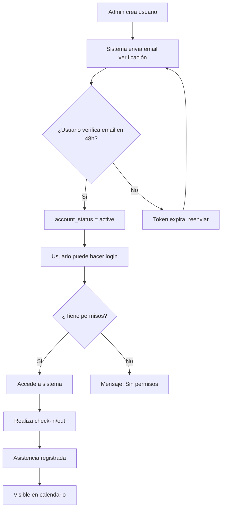
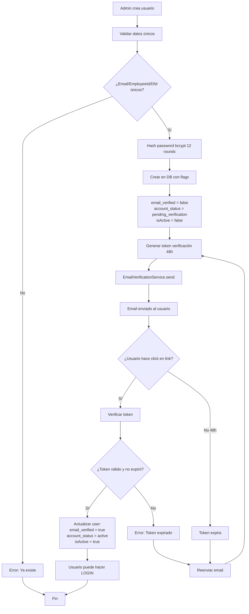
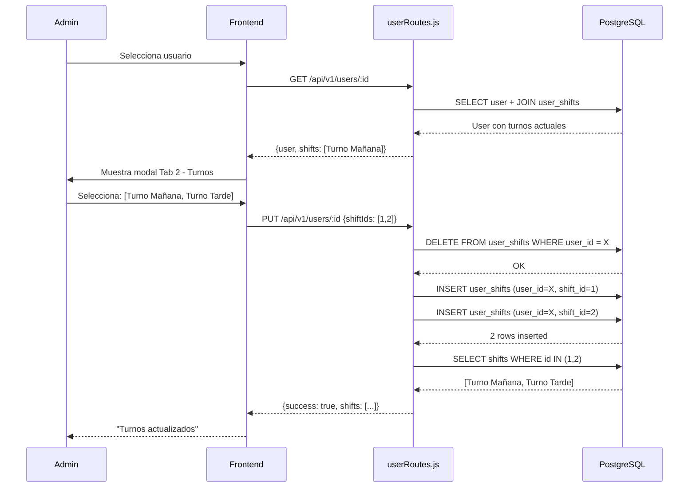
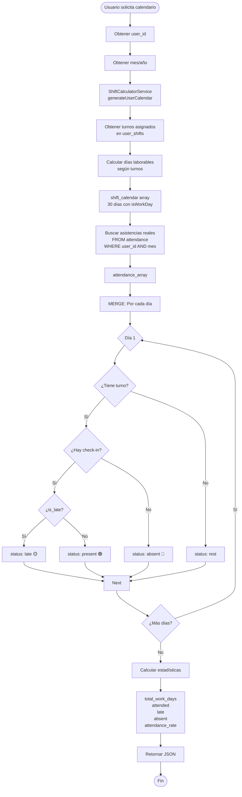
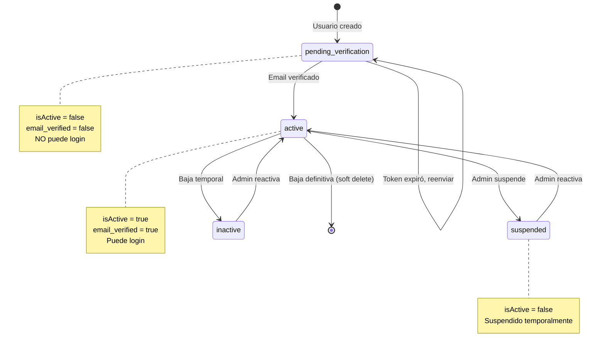
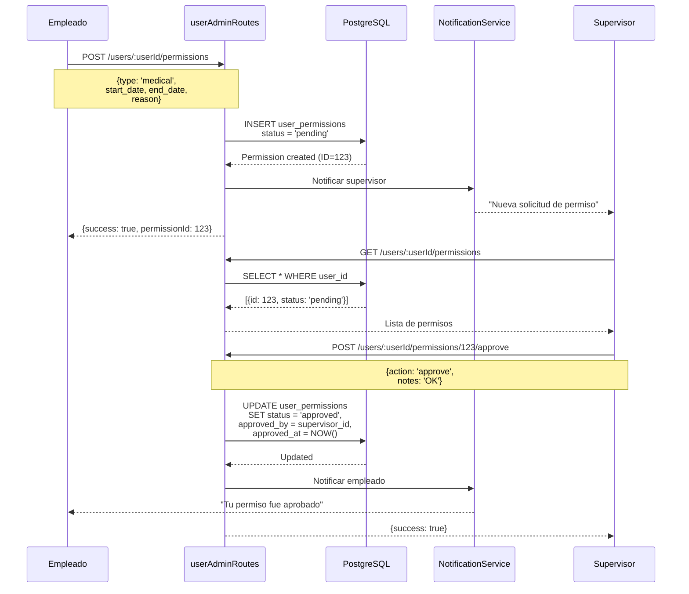

# USERS MODULE - Documentación Completa

> **Versión**: 4.0.0
> **Última actualización**: 2025-11-22
> **Estado**: PRODUCTION
> **Categoría**: CORE

---

## 📋 Tabla de Contenidos

1. [Resumen Ejecutivo](#-resumen-ejecutivo)
2. [Guía de Uso](#-guía-de-uso)
3. [Funcionalidad Interna](#-funcionalidad-interna)
4. [Stack Tecnológico](#-stack-tecnológico)
5. [Diagramas de Flujo](#-diagramas-de-flujo)
6. [API REST](#-api-rest)
7. [Base de Datos](#-base-de-datos)
8. [Ejemplos de Uso](#-ejemplos-de-uso)
9. [Troubleshooting](#-troubleshooting)

---

## 🎯 Resumen Ejecutivo

### ¿Qué es este módulo?

El **módulo de Users (Usuarios)** es el **núcleo central** del sistema biométrico de asistencia. Gestiona toda la información de empleados, desde datos básicos de contacto hasta información médica, historial laboral, permisos, configuración de acceso y datos biométricos. Es el módulo más complejo del sistema con **15 archivos de rutas**, más de **100 endpoints API**, y **50+ campos de información por usuario**.

Este módulo implementa:
- **Multi-tenant strict**: Aislamiento total por `company_id`
- **Email Verification Mandatory**: Verificación obligatoria desde 2025-11-01
- **Role-Based Access Control (RBAC)**: 6 niveles jerárquicos
- **Biometric Integration**: Huella dactilar + reconocimiento facial
- **Complete User Profile**: 9 tabs de información (básico, turnos, acceso, médico, personal, historial, documentos, permisos, disciplinarios)

### Características Principales

- ✅ **CRUD Completo**: Crear, leer, actualizar, eliminar usuarios con soft-delete
- ✅ **Email Verification System**: Verificación obligatoria con tokens de 48h
- ✅ **Shift Management**: Gestión de turnos many-to-many con tracking
- ✅ **Biometric Enrollment**: Huella + facial con fotos que expiran en 1 año
- ✅ **Calendar Integration**: Calendario visual mensual con asistencias
- ✅ **Access Control**: Control granular de acceso a app móvil y kioscos
- ✅ **Medical Records**: Historial médico completo (condiciones, medicamentos, alergias, vacunas)
- ✅ **Work History**: Historial laboral con empleadores previos
- ✅ **Permission Requests**: Solicitudes de permisos con aprobación/rechazo
- ✅ **Disciplinary Actions**: Acciones disciplinarias con acknowledgment
- ✅ **GPS Restrictions**: Restricciones geográficas por usuario
- ✅ **Flexible Schedule**: Horarios flexibles configurables
- ✅ **Late Arrival Authorization**: Autorización de llegadas tarde
- ⏳ **Bulk Import**: Importación masiva desde Excel (en desarrollo)

### Métricas Clave

| Métrica | Valor |
|---------|-------|
| Progreso | 95% |
| Tests implementados | 15/15 (100% Phase 4) |
| API Endpoints | 100+ |
| Tablas BD | 25+ relacionadas |
| Archivos de código | 15 route files |
| Líneas de código | 9,000+ frontend + 5,000+ backend |

---

## 👤 Guía de Uso

### ¿Quién usa este módulo?

- **Super Admin (Aponnt)**: Administra todos los usuarios de todas las empresas
- **Admin de Empresa**: Crea, edita, elimina usuarios de su empresa
- **Supervisor/Manager**: Aprueba permisos, ve calendarios de su equipo
- **Empleado**: Actualiza su perfil personal, ve su propio calendario
- **Vendor**: Perfil especial con datos de vendedor (CBU, WhatsApp, etc.)

### Casos de Uso Comunes

#### Caso 1: Crear un nuevo empleado

**Objetivo**: Alta de un nuevo empleado con envío de email de verificación

**Pasos**:
1. Login como Admin o Supervisor
2. Ir a "Gestión de Usuarios" → Click "Nuevo Usuario"
3. Llenar formulario **Tab 1 - Información Básica**:
   - Employee ID (legajo único)
   - Nombre y Apellido
   - Email (debe ser válido, recibirá verificación)
   - Usuario (para login)
   - Contraseña temporal
   - DNI y CUIL
   - Teléfono
   - Rol (employee, supervisor, manager)
   - Departamento y Sucursal
4. (Opcional) **Tab 2 - Turnos**: Asignar turnos de trabajo
5. (Opcional) **Tab 3 - Control de Acceso**: Configurar acceso a kioscos/app
6. Click "Guardar"
7. **Sistema envía email de verificación automáticamente**
8. Empleado recibe email → Click en link → Email verificado → Puede hacer login

**Resultado esperado**:
- Usuario creado con estado `pending_verification`
- Email enviado al usuario
- Usuario NO puede hacer login hasta verificar email
- Aparece en lista de usuarios con badge "Pendiente Verificación"

#### Caso 2: Asignar turnos rotativos a un empleado

**Objetivo**: Configurar turnos de trabajo que cambian semanalmente

**Pasos**:
1. Ir a usuario existente → Click "Editar"
2. Ir a **Tab 2 - Gestión de Turnos**
3. Ver lista de turnos disponibles (Mañana, Tarde, Noche, Rotativo)
4. Seleccionar múltiples turnos (Ej: Turno Mañana + Turno Tarde)
5. Click "Guardar"
6. Sistema registra en tabla `user_shifts` con timestamp
7. El calendario del usuario ahora muestra expectativas según turnos asignados

**Resultado esperado**:
- Usuario tiene múltiples turnos asignados
- El calendario refleja horarios esperados
- Las asistencias se validan contra el turno activo del día

#### Caso 3: Configurar acceso restringido a kiosco específico

**Objetivo**: Permitir que un empleado solo pueda fichar en 1 kiosco específico

**Pasos**:
1. Editar usuario → **Tab 3 - Control de Acceso**
2. Sección "Acceso a Kiosco":
   - Marcar "Puede usar kiosco" = ✅
   - Marcar "Puede usar todos los kioscos" = ❌
   - En lista "Kioscos autorizados" → Seleccionar: "Kiosco Planta Baja"
3. Click "Guardar"
4. Ahora el empleado SOLO puede fichar en ese kiosco

**Resultado esperado**:
- Usuario intenta fichar en kiosco NO autorizado → Mensaje "No autorizado"
- Usuario ficha en kiosco autorizado → Check-in exitoso

#### Caso 4: Ver calendario mensual de un empleado

**Objetivo**: Revisar asistencias del mes de un empleado

**Pasos**:
1. Ir a usuario → Click "Ver Calendario"
2. Seleccionar mes y año
3. Ver calendario visual:
   - 🟢 Verde = Asistió a tiempo
   - 🟡 Amarillo = Llegó tarde
   - 🔴 Rojo = Falta sin justificar
   - ⚪ Gris = Día de descanso
   - 🔵 Azul = Día actual
4. Ver **Resumen del mes**:
   - Total días laborables: 22
   - Asistencias: 20
   - Llegadas tarde: 2
   - Ausencias: 0
   - Tasa de asistencia: 91%

**Resultado esperado**:
- Calendario visual claro del mes completo
- Estadísticas precisas del desempeño

#### Caso 5: Aprobar solicitud de permiso

**Objetivo**: Supervisor aprueba permiso médico solicitado por empleado

**Pasos**:
1. Empleado crea solicitud: Tab 8 - Permisos → "Nuevo Permiso"
   - Tipo: Médico
   - Fecha inicio: 2025-11-25
   - Fecha fin: 2025-11-25
   - Motivo: "Consulta médica"
2. Estado inicial: `pending`
3. Supervisor recibe notificación → Abre usuario → Tab 8 - Permisos
4. Click en solicitud → Botón "Aprobar"
5. Estado cambia a `approved`
6. Empleado recibe notificación de aprobación

**Resultado esperado**:
- Permiso aprobado
- Empleado notificado
- En calendario del 25/11, aparece icono de permiso aprobado
- Sistema NO cuenta como ausencia injustificada

### Flujo de Trabajo del Usuario



---

## ⚙️ Funcionalidad Interna

### Arquitectura del Módulo

El módulo Users sigue una **arquitectura modular por dominio**:

```
Users Module
│
├── Core CRUD (userRoutes.js)
│   ├── Crear usuario + email verification
│   ├── Listar usuarios (paginado + filtros)
│   ├── Actualizar perfil
│   ├── Soft delete
│   └── Upload foto de perfil
│
├── Calendar & Attendance (user-calendar-routes.js)
│   ├── Generar calendario mensual
│   ├── Combinar turnos + asistencias
│   └── Calcular estadísticas
│
├── Admin Functions (userAdminRoutes.js)
│   ├── Documentos
│   ├── Permisos (solicitudes + aprobaciones)
│   └── Acciones disciplinarias
│
├── Profile Data (userProfileRoutes.js)
│   ├── Historial laboral
│   ├── Estado civil e hijos
│   ├── Familiares
│   └── Educación
│
├── Medical Info (userMedicalRoutes.js, userMedicalExamsRoutes.js)
│   ├── Médico de cabecera
│   ├── Condiciones crónicas
│   ├── Medicamentos
│   ├── Alergias
│   ├── Restricciones laborales
│   ├── Vacunas
│   └── Exámenes médicos
│
├── Work History (userWorkHistoryRoutes.js)
│   ├── Empleadores previos
│   ├── Terminaciones
│   ├── Indemnizaciones
│   └── Elegibilidad para recontratación
│
├── Documents & Licenses (3 routes)
│   ├── Documentos generales
│   ├── Licencia de conducir
│   └── Licencias profesionales
│
├── Tasks & Assignments (userAssignedTaskRoutes.js)
│   └── Tareas asignadas con estados
│
├── Union & Salary (2 routes)
│   ├── Afiliación sindical
│   └── Configuración salarial
│
└── Simplified Access (usersSimple.js)
    ├── GET lista básica
    └── GET por ID básico
```

### Componentes Principales

#### 1. UserRoutes (Core CRUD)

**Ubicación**: `backend/src/routes/userRoutes.js` (975 líneas)

**Responsabilidades**:
- CRUD completo de usuarios
- Email verification flow
- Shift assignment (many-to-many)
- Access control configuration (kiosks, mobile app)
- Password reset
- Photo upload
- Flexible schedule configuration
- Leave status checking

**Métodos clave**:
```javascript
GET    /api/v1/users                     // Lista paginada con filtros
GET    /api/v1/users/:id                 // Detalles completos (shifts, dept, branch)
POST   /api/v1/users                     // Crear + enviar email verificación
PUT    /api/v1/users/:id                 // Actualizar perfil + shifts
DELETE /api/v1/users/:id                 // Soft delete (isActive=false)
POST   /api/v1/users/:id/upload-photo    // Upload foto perfil
POST   /api/v1/users/:id/reset-password  // Reset password (admin only)
PUT    /api/v1/users/:id/access-config   // Config app móvil + kioscos
```

**Lógica crítica - Email Verification**:
```javascript
// Línea 336-452: Crear usuario
const newUser = await User.create({
  // ... campos básicos
  email_verified: false,
  verification_pending: true,
  account_status: 'pending_verification',
  isActive: false  // ← Usuario NO puede login hasta verificar
});

// Enviar email de verificación
await EmailVerificationService.sendVerificationEmail(
  newUser.user_id,
  'employee',
  newUser.email,
  pendingConsents || []
);
```

**Lógica crítica - Shift Assignment (Many-to-Many)**:
```javascript
// Línea 517-547: Asignar turnos
// 1. Borrar turnos viejos
await pool.query('DELETE FROM user_shifts WHERE user_id = $1', [userId]);

// 2. Insertar turnos nuevos
for (const shiftId of shiftIds) {
  await pool.query(`
    INSERT INTO user_shifts (user_id, shift_id, "createdAt", "updatedAt")
    VALUES ($1, $2, NOW(), NOW())
    ON CONFLICT DO NOTHING
  `, [userId, shiftId]);
}
```

**Lógica crítica - GPS Configuration (Inverse Logic)**:
```javascript
// Línea 482-489: Configurar GPS
// Frontend envía: allowOutsideRadius = true/false
// Backend INVIERTE: gpsEnabled = !allowOutsideRadius
if (updateData.allowOutsideRadius !== undefined) {
  updateData.gpsEnabled = !updateData.allowOutsideRadius;  // ← IMPORTANTE
  delete updateData.allowOutsideRadius;  // Quitar campo no-DB
}

// Lógica:
// allowOutsideRadius = true  → gpsEnabled = false → Puede trabajar ANYWHERE
// allowOutsideRadius = false → gpsEnabled = true  → RESTRINGIDO a coordenadas
```

#### 2. UserCalendarRoutes (Calendar & Attendance)

**Ubicación**: `backend/src/routes/user-calendar-routes.js`

**Responsabilidades**:
- Generar calendario mensual visual
- Combinar turnos asignados + asistencias reales
- Calcular estadísticas (asistencias, tardanzas, ausencias)
- Determinar status de cada día (scheduled, present, late, absent, rest)

**Métodos clave**:
```javascript
GET /api/v1/users/:userId/calendar          // Calendario del mes
GET /api/v1/users/:userId/calendar/summary  // Resumen estadístico
```

**Lógica crítica - Calendar Generation**:
```javascript
// Línea 31-214: Generar calendario

// 1. Generar calendario base desde turnos
const shiftCalendar = await ShiftCalculatorService.generateUserCalendar(
  userId, startDate, endDate
);

// 2. Buscar asistencias reales del mes
const attendances = await Attendance.findAll({
  where: {
    user_id: userId,
    date: { [Op.between]: [startDate, endDate] }
  }
});

// 3. Combinar: Para cada día del mes
const calendar = [];
for (let day = startDate; day <= endDate; day++) {
  const expectedShift = shiftCalendar.find(d => d.date === day);
  const actualAttendance = attendances.find(a => a.date === day);

  let status = 'rest';  // Default

  if (expectedShift && expectedShift.isWorkDay) {
    if (actualAttendance) {
      if (actualAttendance.is_late) {
        status = 'late';       // 🟡 Llegó tarde
      } else {
        status = 'present';    // 🟢 Asistió OK
      }
    } else {
      status = 'absent';       // 🔴 Falta
    }
  } else {
    status = 'rest';           // ⚪ Día de descanso
  }

  calendar.push({ date: day, status, shift: expectedShift, attendance: actualAttendance });
}

// 4. Calcular stats
const stats = {
  total_work_days: calendar.filter(d => d.shift?.isWorkDay).length,
  attended: calendar.filter(d => d.status === 'present').length,
  late: calendar.filter(d => d.status === 'late').length,
  absent: calendar.filter(d => d.status === 'absent').length,
  attendance_rate: (attended / total_work_days * 100).toFixed(1)
};
```

#### 3. UserAdminRoutes (Admin Functions)

**Ubicación**: `backend/src/routes/userAdminRoutes.js`

**Responsabilidades**:
- Gestión de documentos del usuario
- Solicitudes de permisos (create, approve/reject, delete)
- Acciones disciplinarias (create, acknowledge, delete)

**Métodos clave**:
```javascript
// DOCUMENTS
GET    /api/v1/users/:userId/documents
POST   /api/v1/users/:userId/documents
PUT    /api/v1/users/:userId/documents/:id
DELETE /api/v1/users/:userId/documents/:id

// PERMISSIONS
GET    /api/v1/users/:userId/permissions
POST   /api/v1/users/:userId/permissions        // Empleado solicita
POST   /api/v1/users/:userId/permissions/:id/approve  // Supervisor aprueba/rechaza
DELETE /api/v1/users/:userId/permissions/:id

// DISCIPLINARY
GET    /api/v1/users/:userId/disciplinary
POST   /api/v1/users/:userId/disciplinary       // Admin crea
POST   /api/v1/users/:userId/disciplinary/:id/acknowledge  // Empleado firma
DELETE /api/v1/users/:userId/disciplinary/:id
```

**Lógica crítica - Permission Approval**:
```javascript
// Aprobar/rechazar permiso
const { action, notes } = req.body;  // action: 'approve' | 'reject'

await pool.query(`
  UPDATE user_permissions
  SET status = $1,
      approved_by = $2,
      approved_at = NOW(),
      approval_notes = $3
  WHERE id = $4 AND user_id = $5
`, [action === 'approve' ? 'approved' : 'rejected', req.user.id, notes, permissionId, userId]);

// Enviar notificación al empleado
await NotificationService.send(userId, {
  type: 'permission_decision',
  message: `Tu permiso fue ${action === 'approve' ? 'aprobado' : 'rechazado'}`,
  relatedId: permissionId
});
```

#### 4. UserMedicalRoutes (Medical Information)

**Ubicación**: `backend/src/routes/userMedicalRoutes.js`

**Responsabilidades**:
- Médico de cabecera
- Condiciones crónicas (diabetes, hipertensión, etc.)
- Medicamentos activos
- Alergias (medicamentos, alimentos)
- Restricciones de actividad física
- Restricciones laborales
- Vacunas (fecha + próximo refuerzo)
- Exámenes médicos
- Documentos médicos

**Métodos clave**:
```javascript
// PRIMARY PHYSICIAN
GET /api/v1/users/:userId/primary-physician
PUT /api/v1/users/:userId/primary-physician

// CHRONIC CONDITIONS
GET    /api/v1/users/:userId/chronic-conditions
POST   /api/v1/users/:userId/chronic-conditions
PUT    /api/v1/users/:userId/chronic-conditions/:id
DELETE /api/v1/users/:userId/chronic-conditions/:id

// MEDICATIONS
GET    /api/v1/users/:userId/medications
POST   /api/v1/users/:userId/medications
PUT    /api/v1/users/:userId/medications/:id
DELETE /api/v1/users/:userId/medications/:id

// ALLERGIES
GET    /api/v1/users/:userId/allergies
POST   /api/v1/users/:userId/allergies
PUT    /api/v1/users/:userId/allergies/:id
DELETE /api/v1/users/:userId/allergies/:id

// RESTRICTIONS
GET /api/v1/users/:userId/activity-restrictions
PUT /api/v1/users/:userId/activity-restrictions
GET /api/v1/users/:userId/work-restrictions
PUT /api/v1/users/:userId/work-restrictions

// VACCINATIONS
GET    /api/v1/users/:userId/vaccinations
POST   /api/v1/users/:userId/vaccinations
DELETE /api/v1/users/:userId/vaccinations/:id

// MEDICAL EXAMS
GET    /api/v1/users/:userId/medical-exams
POST   /api/v1/users/:userId/medical-exams
DELETE /api/v1/users/:userId/medical-exams/:id
```

#### 5. UserProfileRoutes (Personal & Professional History)

**Ubicación**: `backend/src/routes/userProfileRoutes.js`

**Responsabilidades**:
- Historial laboral (empleadores previos)
- Estado civil
- Hijos (nombre, edad, género)
- Familiares (contacto emergencia)
- Educación (títulos, instituciones)

**Métodos clave**:
```javascript
// WORK HISTORY
GET    /api/v1/users/:userId/work-history
POST   /api/v1/users/:userId/work-history
PUT    /api/v1/users/:userId/work-history/:id
DELETE /api/v1/users/:userId/work-history/:id

// MARITAL STATUS
GET /api/v1/users/:userId/marital-status
PUT /api/v1/users/:userId/marital-status  // Upsert

// CHILDREN
GET    /api/v1/users/:userId/children
POST   /api/v1/users/:userId/children
PUT    /api/v1/users/:userId/children/:id
DELETE /api/v1/users/:userId/children/:id

// FAMILY MEMBERS
GET    /api/v1/users/:userId/family-members
POST   /api/v1/users/:userId/family-members
PUT    /api/v1/users/:userId/family-members/:id
DELETE /api/v1/users/:userId/family-members/:id

// EDUCATION
GET    /api/v1/users/:userId/education
POST   /api/v1/users/:userId/education
PUT    /api/v1/users/:userId/education/:id
DELETE /api/v1/users/:userId/education/:id
```

### Reglas de Negocio

1. **Email Verification Mandatory** (desde 2025-11-01):
   - Nuevos usuarios arrancan con `email_verified = false`
   - `account_status = 'pending_verification'`
   - `isActive = false` → NO pueden hacer login
   - Email enviado automáticamente al crear usuario
   - Token de verificación expira en 48h
   - Puede reenviarse si expira

2. **Multi-Tenant Strict**:
   - TODAS las queries filtran por `company_id`
   - Middleware `auth` inyecta `req.user.companyId`
   - Usuarios solo ven datos de SU empresa
   - Violación = 403 Forbidden

3. **Role Hierarchy**:
   - `employee < supervisor < manager < admin < super_admin < vendor`
   - Solo roles superiores pueden crear/modificar roles inferiores
   - Empleado puede actualizar SU perfil (campos limitados)
   - Supervisor puede actualizar perfiles de SU equipo
   - Admin puede actualizar TODOS los perfiles de su empresa

4. **Password Security**:
   - Bcrypt con 12 rounds
   - Failed login attempts counter (max 5)
   - Account lock por 15 minutos después de 5 intentos fallidos
   - Password reset limpia el contador
   - Tokens de reset expiran en 1 hora

5. **GPS & Location (Inverse Logic)**:
   - `gpsEnabled = true` → Usuario RESTRINGIDO a `allowed_locations`
   - `gpsEnabled = false` → Usuario puede trabajar ANYWHERE
   - Frontend usa `allowOutsideRadius` (inverse)
   - Backend convierte: `gpsEnabled = !allowOutsideRadius`

6. **Shift Assignment (Many-to-Many)**:
   - Un usuario puede tener MÚLTIPLES turnos
   - Un turno puede tener MÚLTIPLES usuarios
   - Tabla junction: `user_shifts`
   - Al actualizar turnos: DELETE old + INSERT new
   - Transiciones trackeadas con timestamps

7. **Biometric Photo Expiration**:
   - Foto biométrica expira en 1 año
   - Campo: `biometric_photo_expiration`
   - Sistema debe alertar 30 días antes de expiración
   - Al renovar: nueva foto + nueva fecha expiración

8. **Late Arrival Authorization**:
   - Solo usuarios con `can_authorize_late_arrivals = true`
   - Limitado a departamentos en `authorized_departments`
   - Todas las autorizaciones se loggean (audit trail)

9. **Soft Delete**:
   - DELETE endpoint NO borra físicamente
   - Cambia `isActive = false`
   - Usuario no aparece en listas por defecto
   - Queries usan `WHERE is_active = true`
   - Admin puede reactivar cambiando flag

10. **Calendar Status Logic**:
    ```javascript
    if (día tiene turno asignado) {
      if (hay check-in registrado) {
        if (llegó tarde) → status = 'late'
        else → status = 'present'
      } else {
        → status = 'absent'
      }
    } else {
      → status = 'rest'  // Día de descanso
    }
    ```

### Validaciones

- **Validación 1 - Email Único**:
  ```javascript
  // Antes de crear usuario
  const existingEmail = await User.findOne({ where: { email, companyId } });
  if (existingEmail) throw new Error('Email ya registrado en esta empresa');
  ```

- **Validación 2 - Employee ID Único**:
  ```javascript
  const existingEmployeeId = await User.findOne({ where: { employeeId, companyId } });
  if (existingEmployeeId) throw new Error('Employee ID ya existe');
  ```

- **Validación 3 - DNI/CUIL Único** (si se provee):
  ```javascript
  if (dni) {
    const existingDni = await User.findOne({ where: { dni } });
    if (existingDni) throw new Error('DNI ya registrado');
  }
  ```

- **Validación 4 - Password Strength**:
  ```javascript
  if (password.length < 6) throw new Error('Password mínimo 6 caracteres');
  // Hashear con bcrypt (12 rounds)
  const hashedPassword = await bcrypt.hash(password, 12);
  ```

- **Validación 5 - Email Format**:
  ```javascript
  const emailRegex = /^[^\s@]+@[^\s@]+\.[^\s@]+$/;
  if (!emailRegex.test(email)) throw new Error('Email inválido');
  ```

- **Validación 6 - Role Hierarchy**:
  ```javascript
  const roleHierarchy = ['employee', 'supervisor', 'manager', 'admin', 'super_admin'];
  const userRoleIndex = roleHierarchy.indexOf(req.user.role);
  const targetRoleIndex = roleHierarchy.indexOf(newRole);

  if (targetRoleIndex >= userRoleIndex) {
    throw new Error('No puedes asignar un rol igual o superior al tuyo');
  }
  ```

- **Validación 7 - Shift Exists**:
  ```javascript
  for (const shiftId of shiftIds) {
    const shift = await Shift.findByPk(shiftId);
    if (!shift) throw new Error(`Turno ${shiftId} no existe`);
    if (shift.company_id !== req.user.companyId) {
      throw new Error('Turno no pertenece a tu empresa');
    }
  }
  ```

- **Validación 8 - Kiosk Authorization**:
  ```javascript
  if (!canUseAllKiosks && authorizedKiosks.length === 0) {
    throw new Error('Debes seleccionar al menos 1 kiosco o permitir todos');
  }

  // Verificar que kioscos existan
  for (const kioskId of authorizedKiosks) {
    const kiosk = await Kiosk.findByPk(kioskId);
    if (!kiosk || kiosk.company_id !== req.user.companyId) {
      throw new Error(`Kiosco ${kioskId} inválido`);
    }
  }
  ```

---

## 🛠️ Stack Tecnológico

### Backend

| Tecnología | Versión | Uso |
|------------|---------|-----|
| **Node.js** | 18.x | Runtime principal |
| **Express.js** | 4.x | Framework web |
| **Sequelize** | 6.x | ORM (PostgreSQL) |
| **PostgreSQL** | 14.x | Base de datos |
| **bcrypt** | 5.x | Hash de passwords (12 rounds) |
| **jsonwebtoken** | 9.x | JWT authentication |
| **multer** | 1.4.x | Upload de fotos |
| **nodemailer** | 6.x | Email verification |
| **pg** | 8.x | PostgreSQL client (raw queries) |

### Frontend

| Tecnología | Versión | Uso |
|------------|---------|-----|
| **Vanilla JS** | ES6+ | Lógica frontend |
| **HTML5** | - | Estructura (9 tabs) |
| **CSS3** | - | Estilos (modal + calendar) |
| **jQuery** | 3.x | DOM manipulation |
| **Select2** | 4.x | Selects avanzados (multi-select shifts) |
| **Flatpickr** | 4.x | Date pickers |

### Dependencias del Módulo

Este módulo **depende** de:
- `companies` - Multi-tenant (company_id)
- `departments` - Asignación de departamento
- `branches` - Asignación de sucursal
- `shifts` - Many-to-many relationship
- `auth` - Authentication middleware
- `email-verification` - Email verification service
- `biometric` - Biometric enrollment
- `attendance` - Calendar integration
- `consent` - GDPR consent tracking

Este módulo es **requerido por**:
- `attendance` - Registrar asistencias
- `calendar` - Mostrar horarios
- `medical` - Almacenar historial médico
- `tasks` - Asignar tareas
- `notifications` - Enviar alertas
- `reports` - Generar reportes
- `audit` - Tracking de acciones
- `payroll` - Procesar nómina
- `visitor-management` - Tracking de visitas
- `kiosk` - Autenticación biométrica
- `mobile-app` - Acceso empleado
- `support` - Asignación tickets
- `ai-assistant` - Conversaciones multi-tenant

---

## 📊 Diagramas de Flujo

### Flujo Principal: Creación de Usuario con Email Verification



### Flujo de Asignación de Turnos (Many-to-Many)



### Flujo de Calendario Mensual



### Diagrama de Estados: User Account Status



### Flujo de Aprobación de Permisos



---

## 🌐 API REST

### Base URL

```
/api/v1/users
```

### Endpoints Principales

#### 1. Listar usuarios (paginado + filtros)

```http
GET /api/v1/users
```

**Descripción**: Lista todos los usuarios de la empresa con paginación, búsqueda y filtros

**Query params** (opcionales):
- `page` (number): Página (default: 1)
- `limit` (number): Items por página (default: 10)
- `search` (string): Búsqueda por nombre, email, employeeId
- `role` (string): Filtrar por rol (employee, supervisor, admin)
- `department_id` (number): Filtrar por departamento
- `is_active` (boolean): Filtrar activos/inactivos (default: true)

**Headers requeridos**:
```http
Authorization: Bearer <token>
Content-Type: application/json
```

**Respuesta exitosa** (200):
```json
{
  "success": true,
  "data": [
    {
      "user_id": "a1b2c3d4-...",
      "employeeId": "EMP-001",
      "firstName": "Juan",
      "lastName": "Pérez",
      "email": "juan.perez@empresa.com",
      "role": "employee",
      "department": {
        "id": 5,
        "name": "Ventas"
      },
      "branch": {
        "id": "uuid-...",
        "name": "Sucursal Centro"
      },
      "shifts": [
        {
          "shift_id": 1,
          "name": "Turno Mañana",
          "start_time": "08:00",
          "end_time": "16:00"
        }
      ],
      "is_active": true,
      "email_verified": true,
      "account_status": "active",
      "hire_date": "2024-01-15"
    }
  ],
  "pagination": {
    "total": 125,
    "page": 1,
    "limit": 10,
    "totalPages": 13
  }
}
```

**Errores posibles**:
- `401 Unauthorized`: Token inválido o expirado
- `403 Forbidden`: Sin permisos para ver usuarios
- `500 Internal Server Error`: Error del servidor

---

#### 2. Obtener usuario por ID

```http
GET /api/v1/users/:id
```

**Descripción**: Obtiene detalles completos de un usuario (shifts, department, branch)

**Parámetros de ruta**:
- `id` (UUID): ID del usuario

**Headers requeridos**:
```http
Authorization: Bearer <token>
```

**Respuesta exitosa** (200):
```json
{
  "success": true,
  "data": {
    "user_id": "a1b2c3d4-...",
    "employeeId": "EMP-001",
    "legajo": "LEG-2024-001",
    "usuario": "jperez",
    "firstName": "Juan",
    "lastName": "Pérez",
    "email": "juan.perez@empresa.com",
    "phone": "+54 11 1234-5678",
    "address": "Av. Corrientes 1234",
    "city": "Buenos Aires",
    "province": "CABA",
    "postal_code": "C1043",
    "dni": "12345678",
    "cuil": "20-12345678-9",
    "birth_date": "1990-05-15",
    "hire_date": "2024-01-15",
    "position": "Vendedor Senior",
    "role": "employee",
    "salary": 500000.00,
    "department_id": 5,
    "default_branch_id": "uuid-...",
    "email_verified": true,
    "account_status": "active",
    "is_active": true,
    "can_use_mobile_app": true,
    "can_use_kiosk": true,
    "can_use_all_kiosks": false,
    "authorized_kiosks": ["kiosk-uuid-1", "kiosk-uuid-2"],
    "has_fingerprint": true,
    "has_facial_data": true,
    "biometric_photo_url": "https://...",
    "biometric_photo_expiration": "2026-01-15",
    "gps_enabled": false,
    "has_flexible_schedule": false,
    "department": {
      "id": 5,
      "name": "Ventas"
    },
    "branch": {
      "id": "uuid-...",
      "name": "Sucursal Centro",
      "address": "Av. Rivadavia 5000"
    },
    "shifts": [
      {
        "shift_id": 1,
        "name": "Turno Mañana",
        "start_time": "08:00:00",
        "end_time": "16:00:00",
        "work_days": [1, 2, 3, 4, 5]
      }
    ]
  }
}
```

**Errores posibles**:
- `404 Not Found`: Usuario no existe
- `403 Forbidden`: Sin permisos (solo puede ver usuarios de su empresa)

---

#### 3. Crear usuario con email verification

```http
POST /api/v1/users
```

**Descripción**: Crea un nuevo usuario y envía email de verificación automáticamente

**Headers requeridos**:
```http
Authorization: Bearer <token>
Content-Type: application/json
```

**Middleware**: `auth`, `supervisorOrAdmin`

**Body (JSON)**:
```json
{
  "employeeId": "EMP-125",
  "legajo": "LEG-2025-125",
  "usuario": "mgarcia",
  "firstName": "María",
  "lastName": "García",
  "email": "maria.garcia@empresa.com",
  "password": "Pass123!",
  "phone": "+54 11 9876-5432",
  "dni": "23456789",
  "cuil": "27-23456789-4",
  "birth_date": "1992-03-20",
  "hire_date": "2025-11-22",
  "position": "Analista de Marketing",
  "role": "employee",
  "department_id": 3,
  "default_branch_id": "uuid-branch-1",
  "salary": 450000.00,
  "shiftIds": [1, 2],
  "canUseMobileApp": true,
  "canUseKiosk": true,
  "canUseAllKiosks": false,
  "authorizedKiosks": ["kiosk-uuid-1"],
  "pendingConsents": ["data_processing", "biometric_data"]
}
```

**Respuesta exitosa** (201):
```json
{
  "success": true,
  "message": "Usuario creado exitosamente. Email de verificación enviado.",
  "data": {
    "user_id": "new-uuid-...",
    "employeeId": "EMP-125",
    "email": "maria.garcia@empresa.com",
    "email_verified": false,
    "account_status": "pending_verification",
    "is_active": false,
    "verification_email_sent": true,
    "verification_expires_in": "48 hours"
  }
}
```

**Errores posibles**:
- `400 Bad Request`: Datos faltantes o inválidos
- `409 Conflict`: Email o employeeId ya existe
- `403 Forbidden`: Solo supervisores/admins pueden crear usuarios
- `500 Internal Server Error`: Error al enviar email

---

#### 4. Actualizar usuario (incluye shifts)

```http
PUT /api/v1/users/:id
```

**Descripción**: Actualiza perfil de usuario y asigna turnos (many-to-many)

**Parámetros de ruta**:
- `id` (UUID): ID del usuario

**Headers requeridos**:
```http
Authorization: Bearer <token>
Content-Type: application/json
```

**Middleware**: `auth` (empleados pueden actualizar su propio perfil, supervisores pueden actualizar su equipo)

**Body (JSON)**:
```json
{
  "firstName": "María Eugenia",
  "phone": "+54 11 9876-0000",
  "address": "Nueva Dirección 123",
  "position": "Analista Senior de Marketing",
  "shiftIds": [1, 3],
  "canUseMobileApp": true,
  "canUseKiosk": true,
  "canUseAllKiosks": true,
  "allowOutsideRadius": true,
  "hasFlexibleSchedule": false
}
```

**Lógica especial**:
```javascript
// GPS (inverse logic)
if (allowOutsideRadius !== undefined) {
  gpsEnabled = !allowOutsideRadius;
}

// Shifts (many-to-many update)
// 1. DELETE old shifts
// 2. INSERT new shifts
```

**Respuesta exitosa** (200):
```json
{
  "success": true,
  "message": "Usuario actualizado exitosamente",
  "data": {
    "user_id": "uuid-...",
    "firstName": "María Eugenia",
    "shifts": [
      {
        "shift_id": 1,
        "name": "Turno Mañana"
      },
      {
        "shift_id": 3,
        "name": "Turno Rotativo"
      }
    ],
    "gps_enabled": false,
    "updated_at": "2025-11-22T15:30:00Z"
  }
}
```

**Errores posibles**:
- `404 Not Found`: Usuario no existe
- `403 Forbidden`: Sin permisos para actualizar este usuario
- `400 Bad Request`: Datos inválidos

---

#### 5. Eliminar usuario (soft delete)

```http
DELETE /api/v1/users/:id
```

**Descripción**: Desactiva usuario (soft delete, no borra físicamente)

**Parámetros de ruta**:
- `id` (UUID): ID del usuario

**Headers requeridos**:
```http
Authorization: Bearer <token>
```

**Middleware**: `auth`, `adminOnly`

**Respuesta exitosa** (200):
```json
{
  "success": true,
  "message": "Usuario desactivado exitosamente",
  "data": {
    "user_id": "uuid-...",
    "is_active": false,
    "deactivated_at": "2025-11-22T15:45:00Z"
  }
}
```

**Nota**: El usuario NO se borra de la base de datos, solo se marca `is_active = false`. Puede reactivarse cambiando el flag.

---

#### 6. Upload foto de perfil

```http
POST /api/v1/users/:id/upload-photo
```

**Descripción**: Sube foto de perfil del usuario

**Parámetros de ruta**:
- `id` (UUID): ID del usuario

**Headers requeridos**:
```http
Authorization: Bearer <token>
Content-Type: multipart/form-data
```

**Body (form-data)**:
- `photo` (file): Imagen (JPG, PNG, max 5MB)

**Respuesta exitosa** (200):
```json
{
  "success": true,
  "message": "Foto actualizada exitosamente",
  "data": {
    "photo_url": "https://servidor.com/uploads/users/uuid-123.jpg"
  }
}
```

---

#### 7. Reset password (admin only)

```http
POST /api/v1/users/:id/reset-password
```

**Descripción**: Admin resetea password de un usuario

**Middleware**: `auth`, `adminOnly`

**Body (JSON)**:
```json
{
  "newPassword": "NuevaPass456!"
}
```

**Respuesta exitosa** (200):
```json
{
  "success": true,
  "message": "Contraseña reseteada exitosamente",
  "data": {
    "user_id": "uuid-...",
    "password_changed_at": "2025-11-22T16:00:00Z",
    "failed_login_attempts": 0
  }
}
```

---

#### 8. Configurar acceso (app móvil + kioscos)

```http
PUT /api/v1/users/:id/access-config
```

**Descripción**: Configura acceso a app móvil y kioscos específicos

**Body (JSON)**:
```json
{
  "canUseMobileApp": true,
  "canUseKiosk": true,
  "canUseAllKiosks": false,
  "authorizedKiosks": ["kiosk-uuid-1", "kiosk-uuid-3"],
  "canAuthorizeLateArrivals": true,
  "authorizedDepartments": [3, 5, 7]
}
```

**Respuesta exitosa** (200):
```json
{
  "success": true,
  "message": "Configuración de acceso actualizada",
  "data": {
    "can_use_mobile_app": true,
    "can_use_kiosk": true,
    "can_use_all_kiosks": false,
    "authorized_kiosks": ["kiosk-uuid-1", "kiosk-uuid-3"],
    "can_authorize_late_arrivals": true,
    "authorized_departments": [3, 5, 7]
  }
}
```

---

#### 9. Obtener calendario mensual

```http
GET /api/v1/users/:userId/calendar
```

**Descripción**: Genera calendario visual del mes con asistencias

**Query params**:
- `month` (number): Mes (1-12)
- `year` (number): Año (2025)

**Ejemplo**:
```
GET /api/v1/users/uuid-123/calendar?month=11&year=2025
```

**Respuesta exitosa** (200):
```json
{
  "success": true,
  "data": {
    "user": {
      "user_id": "uuid-123",
      "firstName": "Juan",
      "lastName": "Pérez"
    },
    "month": 11,
    "year": 2025,
    "calendar": [
      {
        "date": "2025-11-01",
        "day_of_week": 6,
        "status": "rest",
        "shift": null,
        "attendance": null
      },
      {
        "date": "2025-11-03",
        "day_of_week": 1,
        "status": "present",
        "shift": {
          "name": "Turno Mañana",
          "start_time": "08:00",
          "end_time": "16:00"
        },
        "attendance": {
          "check_in": "2025-11-03T08:05:00Z",
          "check_out": "2025-11-03T16:10:00Z",
          "is_late": false
        }
      },
      {
        "date": "2025-11-04",
        "day_of_week": 2,
        "status": "late",
        "shift": {
          "name": "Turno Mañana",
          "start_time": "08:00",
          "end_time": "16:00"
        },
        "attendance": {
          "check_in": "2025-11-04T08:25:00Z",
          "check_out": "2025-11-04T16:15:00Z",
          "is_late": true,
          "minutes_late": 25
        }
      },
      {
        "date": "2025-11-05",
        "day_of_week": 3,
        "status": "absent",
        "shift": {
          "name": "Turno Mañana",
          "start_time": "08:00",
          "end_time": "16:00"
        },
        "attendance": null
      }
    ],
    "summary": {
      "total_days": 30,
      "work_days": 22,
      "rest_days": 8,
      "attended": 19,
      "late": 2,
      "absent": 1,
      "attendance_rate": 86.4
    }
  }
}
```

**Status posibles**:
- `rest` - Día de descanso (gris)
- `scheduled` - Tiene turno pero aún no llegó el día (azul claro)
- `present` - Asistió a tiempo (verde)
- `late` - Llegó tarde (amarillo)
- `absent` - Falta sin justificar (rojo)
- `today` - Día actual (azul)

---

#### 10. Crear solicitud de permiso

```http
POST /api/v1/users/:userId/permissions
```

**Descripción**: Empleado crea solicitud de permiso

**Body (JSON)**:
```json
{
  "type": "medical",
  "start_date": "2025-11-25",
  "end_date": "2025-11-25",
  "reason": "Consulta médica programada",
  "supporting_document_url": "https://..."
}
```

**Respuesta exitosa** (201):
```json
{
  "success": true,
  "message": "Solicitud de permiso creada. Esperando aprobación.",
  "data": {
    "id": 45,
    "user_id": "uuid-...",
    "type": "medical",
    "start_date": "2025-11-25",
    "end_date": "2025-11-25",
    "status": "pending",
    "created_at": "2025-11-22T17:00:00Z"
  }
}
```

---

#### 11. Aprobar/rechazar permiso

```http
POST /api/v1/users/:userId/permissions/:id/approve
```

**Descripción**: Supervisor aprueba o rechaza solicitud de permiso

**Middleware**: `auth`, `supervisorOrAdmin`

**Body (JSON)**:
```json
{
  "action": "approve",
  "notes": "Aprobado. Traer certificado médico."
}
```

**Valores de `action`**: `approve` | `reject`

**Respuesta exitosa** (200):
```json
{
  "success": true,
  "message": "Permiso aprobado exitosamente",
  "data": {
    "id": 45,
    "status": "approved",
    "approved_by": "supervisor-uuid-...",
    "approved_at": "2025-11-22T17:15:00Z",
    "approval_notes": "Aprobado. Traer certificado médico."
  }
}
```

---

### Otros Endpoints Documentados

**Medical Information** (`userMedicalRoutes.js`):
- `GET/PUT /api/v1/users/:userId/primary-physician`
- `GET/POST/PUT/DELETE /api/v1/users/:userId/chronic-conditions`
- `GET/POST/PUT/DELETE /api/v1/users/:userId/medications`
- `GET/POST/PUT/DELETE /api/v1/users/:userId/allergies`
- `GET/PUT /api/v1/users/:userId/activity-restrictions`
- `GET/PUT /api/v1/users/:userId/work-restrictions`
- `GET/POST/PUT/DELETE /api/v1/users/:userId/vaccinations`
- `GET/POST/PUT/DELETE /api/v1/users/:userId/medical-exams`

**Profile Data** (`userProfileRoutes.js`):
- `GET/POST/PUT/DELETE /api/v1/users/:userId/work-history`
- `GET/PUT /api/v1/users/:userId/marital-status`
- `GET/POST/PUT/DELETE /api/v1/users/:userId/children`
- `GET/POST/PUT/DELETE /api/v1/users/:userId/family-members`
- `GET/POST/PUT/DELETE /api/v1/users/:userId/education`

**Documents** (`userDocumentsRoutes.js`):
- `GET/POST/PUT/DELETE /api/v1/users/:userId/documents`

**Disciplinary** (`userAdminRoutes.js`):
- `GET/POST/PUT/DELETE /api/v1/users/:userId/disciplinary`
- `POST /api/v1/users/:userId/disciplinary/:id/acknowledge`

**Licenses** (`userDriverLicenseRoutes.js`, `userProfessionalLicenseRoutes.js`):
- `GET/POST/PUT/DELETE /api/v1/users/:userId/driver-license`
- `GET/POST/PUT/DELETE /api/v1/users/:userId/professional-license`

**Tasks** (`userAssignedTaskRoutes.js`):
- `GET/POST/PUT/DELETE /api/v1/users/:userId/assigned-tasks`

**Union & Salary** (`userUnionAffiliationRoutes.js`, `userSalaryConfigRoutes.js`):
- `GET/POST/PUT/DELETE /api/v1/users/:userId/union-affiliation`
- `GET/POST/PUT/DELETE /api/v1/users/:userId/salary-config`

---

## 🗄️ Base de Datos

### Tablas Principales

#### Tabla: `users`

**Descripción**: Tabla central de usuarios/empleados del sistema

**Schema Completo** (50+ campos):

| Campo | Tipo | Constraints | Descripción |
|-------|------|-------------|-------------|
| `user_id` | UUID | PRIMARY KEY | ID único (auto-generated v4) |
| `employeeId` | VARCHAR(50) | UNIQUE, NOT NULL | ID de empleado (legajo) |
| `legajo` | VARCHAR(50) | | Número de legajo alternativo |
| `usuario` | VARCHAR(50) | UNIQUE | Username para login |
| `firstName` | VARCHAR(100) | NOT NULL | Nombre |
| `lastName` | VARCHAR(100) | NOT NULL | Apellido |
| `email` | VARCHAR(255) | UNIQUE, NOT NULL | Email (verificación obligatoria) |
| `password` | VARCHAR(255) | NOT NULL | Hash bcrypt (12 rounds) |
| `phone` | VARCHAR(20) | | Teléfono principal |
| `address` | TEXT | | Dirección completa |
| `city` | VARCHAR(100) | | Ciudad |
| `province` | VARCHAR(100) | | Provincia/Estado |
| `postal_code` | VARCHAR(10) | | Código postal |
| `secondary_phone` | VARCHAR(20) | | Teléfono secundario |
| `home_phone` | VARCHAR(20) | | Teléfono fijo |
| `company_id` | INTEGER | FK → companies(id), NOT NULL | Empresa (multi-tenant) |
| `department_id` | BIGINT | FK → departments(id) | Departamento asignado |
| `default_branch_id` | UUID | FK → branches(id) | Sucursal principal |
| `position` | VARCHAR(100) | | Puesto/cargo |
| `role` | ENUM | NOT NULL | employee, supervisor, manager, admin, super_admin, vendor |
| `hire_date` | DATE | | Fecha de ingreso |
| `salary` | DECIMAL(10,2) | DEFAULT 0.00 | Salario mensual |
| `birth_date` | DATE | | Fecha de nacimiento |
| `dni` | VARCHAR(20) | UNIQUE | DNI/documento nacional |
| `cuil` | VARCHAR(15) | UNIQUE | CUIL/Tax ID |
| `emergency_contact` | JSONB | | Contacto emergencia {name, phone, relationship} |
| `emergency_phone` | VARCHAR(20) | | Teléfono emergencia |
| `is_active` | BOOLEAN | DEFAULT true | Usuario activo (soft delete) |
| `email_verified` | BOOLEAN | DEFAULT false | Email verificado |
| `email_verified_at` | TIMESTAMP | | Fecha verificación email |
| `verification_pending` | BOOLEAN | DEFAULT false | Verificación pendiente |
| `account_status` | ENUM | DEFAULT active | pending_verification, active, suspended, inactive |
| `last_login` | TIMESTAMP | | Último login |
| `failed_login_attempts` | INTEGER | DEFAULT 0 | Intentos fallidos (max 5) |
| `locked_until` | TIMESTAMP | | Locked por intentos fallidos |
| `password_reset_token` | VARCHAR(255) | | Token reset password |
| `password_reset_expires` | TIMESTAMP | | Expiración token reset |
| `two_factor_enabled` | BOOLEAN | DEFAULT false | 2FA habilitado |
| `two_factor_secret` | VARCHAR(255) | | Secret 2FA |
| `can_use_mobile_app` | BOOLEAN | DEFAULT true | Acceso app móvil |
| `can_use_kiosk` | BOOLEAN | DEFAULT true | Acceso kiosco |
| `can_use_all_kiosks` | BOOLEAN | DEFAULT true | Todos los kioscos o específicos |
| `authorized_kiosks` | JSONB | DEFAULT [] | Array de kiosk IDs autorizados |
| `can_authorize_late_arrivals` | BOOLEAN | DEFAULT false | Puede autorizar llegadas tarde |
| `authorized_departments` | JSONB | DEFAULT [] | Departamentos que puede autorizar |
| `has_flexible_schedule` | BOOLEAN | DEFAULT false | Horario flexible |
| `flexible_schedule_notes` | TEXT | | Notas horario flexible |
| `has_fingerprint` | BOOLEAN | DEFAULT false | Huella registrada |
| `has_facial_data` | BOOLEAN | DEFAULT false | Reconocimiento facial registrado |
| `biometric_last_updated` | TIMESTAMP | | Última actualización biométrica |
| `biometric_photo_url` | TEXT | | URL foto biométrica visible |
| `biometric_photo_date` | DATE | | Fecha captura foto |
| `biometric_photo_expiration` | DATE | | Expiración foto (1 año) |
| `gps_enabled` | BOOLEAN | DEFAULT false | Restricción GPS (inverse logic) |
| `allowed_locations` | JSONB | | Coordenadas GPS permitidas |
| `work_schedule` | JSONB | | Horario semanal |
| `permissions` | JSONB | | Permisos adicionales |
| `settings` | JSONB | | Preferencias usuario |
| `last_activity` | TIMESTAMP | | Última actividad |
| `concurrent_sessions` | INTEGER | DEFAULT 0 | Sesiones concurrentes |
| `display_name` | VARCHAR(255) | | Nombre completo (cache) |
| `version` | INTEGER | DEFAULT 0 | Optimistic locking |
| `vendor_code` | VARCHAR(20) | | Código vendor (si role=vendor) |
| `whatsapp_number` | VARCHAR(20) | | WhatsApp (vendors) |
| `accepts_support_packages` | BOOLEAN | DEFAULT false | Acepta paquetes soporte |
| `accepts_auctions` | BOOLEAN | DEFAULT false | Participa en subastas |
| `cbu` | VARCHAR(22) | | CBU bancario (pagos) |
| `bank_name` | VARCHAR(100) | | Nombre banco |
| `notes` | TEXT | | Notas adicionales |
| `createdAt` | TIMESTAMP | DEFAULT NOW() | Fecha creación |
| `updatedAt` | TIMESTAMP | DEFAULT NOW() | Última modificación |

**Índices**:
```sql
-- Performance indexes
CREATE INDEX idx_users_employee_id_active ON users(employeeId, is_active);
CREATE INDEX idx_users_email_active ON users(email, is_active);
CREATE INDEX idx_users_role_active ON users(role, is_active);
CREATE INDEX idx_users_department_active ON users(department_id, is_active);
CREATE INDEX idx_users_branch_active ON users(default_branch_id, is_active);
CREATE INDEX idx_users_biometric_flags ON users(has_fingerprint, has_facial_data, is_active);
CREATE INDEX idx_users_gps_enabled ON users(gps_enabled, is_active);

-- JSONB GIN indexes
CREATE INDEX idx_users_permissions_gin ON users USING GIN (permissions);
CREATE INDEX idx_users_work_schedule_gin ON users USING GIN (work_schedule);

-- Full-text search (trigram)
CREATE INDEX idx_users_search ON users USING GIN (firstName gin_trgm_ops, lastName gin_trgm_ops, employeeId gin_trgm_ops);
```

**Relaciones**:
- `companies` (N:1) - Multi-tenant
- `departments` (N:1) - Departamento
- `branches` (N:1) - Sucursal principal
- `shifts` (N:M via user_shifts) - Turnos asignados
- `attendance` (1:N) - Registros de asistencia
- `user_documents` (1:N) - Documentos
- `user_permissions` (1:N) - Solicitudes permisos
- `user_disciplinary` (1:N) - Acciones disciplinarias
- `user_medical_*` (1:N) - Historial médico
- `user_work_history` (1:N) - Empleos previos
- `user_education` (1:N) - Educación
- `user_assigned_tasks` (1:N) - Tareas

---

#### Tabla: `user_shifts` (Junction Table)

**Descripción**: Relación many-to-many entre usuarios y turnos

**Schema**:

| Campo | Tipo | Constraints | Descripción |
|-------|------|-------------|-------------|
| `id` | BIGSERIAL | PRIMARY KEY | ID autoincremental |
| `user_id` | UUID | FK → users(user_id), NOT NULL | ID usuario |
| `shift_id` | BIGINT | FK → shifts(id), NOT NULL | ID turno |
| `createdAt` | TIMESTAMP | DEFAULT NOW() | Fecha asignación |
| `updatedAt` | TIMESTAMP | DEFAULT NOW() | Última modificación |

**Índices**:
```sql
CREATE UNIQUE INDEX idx_user_shifts_unique ON user_shifts(user_id, shift_id);
CREATE INDEX idx_user_shifts_user ON user_shifts(user_id);
CREATE INDEX idx_user_shifts_shift ON user_shifts(shift_id);
```

**Relaciones**:
- `users` (N:1) - Usuario asignado
- `shifts` (N:1) - Turno asignado

---

#### Tabla: `user_permissions`

**Descripción**: Solicitudes de permisos (médico, personal, vacaciones)

**Schema**:

| Campo | Tipo | Constraints | Descripción |
|-------|------|-------------|-------------|
| `id` | BIGSERIAL | PRIMARY KEY | ID autoincremental |
| `user_id` | UUID | FK → users(user_id), NOT NULL | Usuario solicitante |
| `type` | VARCHAR(50) | NOT NULL | medical, personal, vacation, etc. |
| `start_date` | DATE | NOT NULL | Fecha inicio |
| `end_date` | DATE | NOT NULL | Fecha fin |
| `reason` | TEXT | | Motivo |
| `status` | ENUM | DEFAULT pending | pending, approved, rejected |
| `approved_by` | UUID | FK → users(user_id) | Supervisor que aprobó |
| `approved_at` | TIMESTAMP | | Fecha aprobación |
| `approval_notes` | TEXT | | Notas aprobación |
| `supporting_document_url` | TEXT | | URL documento respaldo |
| `created_at` | TIMESTAMP | DEFAULT NOW() | Fecha solicitud |
| `updated_at` | TIMESTAMP | DEFAULT NOW() | Última modificación |

---

#### Tabla: `user_disciplinary`

**Descripción**: Acciones disciplinarias

**Schema**:

| Campo | Tipo | Constraints | Descripción |
|-------|------|-------------|-------------|
| `id` | BIGSERIAL | PRIMARY KEY | ID autoincremental |
| `user_id` | UUID | FK → users(user_id), NOT NULL | Usuario |
| `type` | VARCHAR(50) | NOT NULL | warning, suspension, termination |
| `date` | DATE | NOT NULL | Fecha acción |
| `reason` | TEXT | NOT NULL | Razón |
| `severity` | ENUM | | low, medium, high, critical |
| `created_by` | UUID | FK → users(user_id), NOT NULL | Admin que creó |
| `acknowledged_by_employee` | BOOLEAN | DEFAULT false | Empleado firmó |
| `acknowledged_at` | TIMESTAMP | | Fecha firma |
| `notes` | TEXT | | Notas adicionales |
| `created_at` | TIMESTAMP | DEFAULT NOW() | Fecha creación |
| `updated_at` | TIMESTAMP | DEFAULT NOW() | Última modificación |

---

### Migraciones Importantes

**Archivo**: `migrations/20251101_alter_users_partners_verification.sql`

**Descripción**: Implementación obligatoria de email verification

**Contenido**:
```sql
-- Agregar campos de verificación
ALTER TABLE users ADD COLUMN IF NOT EXISTS email_verified BOOLEAN DEFAULT false;
ALTER TABLE users ADD COLUMN IF NOT EXISTS email_verified_at TIMESTAMP;
ALTER TABLE users ADD COLUMN IF NOT EXISTS verification_pending BOOLEAN DEFAULT false;
ALTER TABLE users ADD COLUMN IF NOT EXISTS account_status VARCHAR(50) DEFAULT 'active';

-- Crear tabla email_verification_tokens
CREATE TABLE IF NOT EXISTS email_verification_tokens (
  id BIGSERIAL PRIMARY KEY,
  user_id UUID NOT NULL REFERENCES users(user_id) ON DELETE CASCADE,
  user_type VARCHAR(20) NOT NULL,
  token VARCHAR(255) NOT NULL UNIQUE,
  expires_at TIMESTAMP NOT NULL,
  created_at TIMESTAMP DEFAULT CURRENT_TIMESTAMP
);

-- Índices
CREATE INDEX idx_email_tokens_user ON email_verification_tokens(user_id);
CREATE INDEX idx_email_tokens_token ON email_verification_tokens(token);
CREATE INDEX idx_email_tokens_expires ON email_verification_tokens(expires_at);
```

---

**Archivo**: `migrations/20250131_add_biometric_photo_fields.sql`

**Descripción**: Sistema de fotos biométricas con expiración

**Contenido**:
```sql
ALTER TABLE users ADD COLUMN IF NOT EXISTS biometric_photo_url TEXT;
ALTER TABLE users ADD COLUMN IF NOT EXISTS biometric_photo_date DATE;
ALTER TABLE users ADD COLUMN IF NOT EXISTS biometric_photo_expiration DATE;

-- Trigger para calcular expiración automática (1 año)
CREATE OR REPLACE FUNCTION set_biometric_photo_expiration()
RETURNS TRIGGER AS $$
BEGIN
  IF NEW.biometric_photo_date IS NOT NULL THEN
    NEW.biometric_photo_expiration := NEW.biometric_photo_date + INTERVAL '1 year';
  END IF;
  RETURN NEW;
END;
$$ LANGUAGE plpgsql;

CREATE TRIGGER trigger_biometric_expiration
BEFORE INSERT OR UPDATE ON users
FOR EACH ROW
EXECUTE FUNCTION set_biometric_photo_expiration();
```

---

### Funciones PostgreSQL

#### Función: `get_user_calendar_summary(p_user_id UUID, p_month INT, p_year INT)`

**Descripción**: Genera resumen estadístico del calendario mensual

**Parámetros**:
- `p_user_id` (UUID): ID del usuario
- `p_month` (INTEGER): Mes (1-12)
- `p_year` (INTEGER): Año

**Retorna**: TABLE con stats (work_days, attended, late, absent, attendance_rate)

**Ejemplo de uso**:
```sql
SELECT * FROM get_user_calendar_summary('uuid-123', 11, 2025);

-- Resultado:
-- work_days | attended | late | absent | attendance_rate
-- 22        | 19       | 2    | 1      | 86.4
```

---

## 💡 Ejemplos de Uso

### Ejemplo 1: Crear usuario con email verification desde frontend

**Escenario**: Admin crea nuevo empleado y sistema envía email automáticamente

**Frontend (JavaScript)**:
```javascript
async function createEmployee() {
  const token = localStorage.getItem('authToken');

  const newUser = {
    employeeId: document.getElementById('employeeId').value,
    firstName: document.getElementById('firstName').value,
    lastName: document.getElementById('lastName').value,
    email: document.getElementById('email').value,
    password: document.getElementById('password').value,
    dni: document.getElementById('dni').value,
    cuil: document.getElementById('cuil').value,
    phone: document.getElementById('phone').value,
    role: 'employee',
    department_id: parseInt(document.getElementById('department').value),
    default_branch_id: document.getElementById('branch').value,
    hire_date: document.getElementById('hireDate').value,
    shiftIds: getSelectedShifts(),  // [1, 2]
    canUseMobileApp: true,
    canUseKiosk: true,
    canUseAllKiosks: false,
    authorizedKiosks: getSelectedKiosks()  // ['kiosk-uuid-1']
  };

  try {
    const response = await fetch('http://localhost:9998/api/v1/users', {
      method: 'POST',
      headers: {
        'Authorization': `Bearer ${token}`,
        'Content-Type': 'application/json'
      },
      body: JSON.stringify(newUser)
    });

    const data = await response.json();

    if (data.success) {
      alert(`Usuario creado exitosamente!
        Email de verificación enviado a ${newUser.email}.
        El usuario debe verificar su email antes de poder hacer login.`);

      // Cerrar modal y refrescar lista
      closeModal();
      loadUsersList();
    } else {
      alert('Error: ' + data.message);
    }
  } catch (error) {
    console.error('Error:', error);
    alert('Error al crear usuario');
  }
}

function getSelectedShifts() {
  const checkboxes = document.querySelectorAll('.shift-checkbox:checked');
  return Array.from(checkboxes).map(cb => parseInt(cb.value));
}

function getSelectedKiosks() {
  const select = document.getElementById('authorizedKiosks');
  const options = select.selectedOptions;
  return Array.from(options).map(opt => opt.value);
}
```

**Backend (Service)**:
```javascript
// backend/src/routes/userRoutes.js:336-452

router.post('/', auth, supervisorOrAdmin, async (req, res) => {
  const { employeeId, firstName, lastName, email, password, shiftIds, ...otherData } = req.body;

  try {
    // 1. Validar unicidad
    const existingEmail = await User.findOne({
      where: { email, company_id: req.user.companyId }
    });
    if (existingEmail) {
      return res.status(409).json({ error: 'Email ya existe' });
    }

    // 2. Hash password
    const hashedPassword = await bcrypt.hash(password, 12);

    // 3. Crear usuario (INACTIVO hasta verificación)
    const newUser = await User.create({
      ...otherData,
      employeeId,
      firstName,
      lastName,
      email,
      password: hashedPassword,
      company_id: req.user.companyId,
      email_verified: false,           // ← NO verificado
      verification_pending: true,
      account_status: 'pending_verification',
      is_active: false                 // ← NO puede login
    });

    // 4. Asignar turnos (many-to-many)
    if (shiftIds && shiftIds.length > 0) {
      for (const shiftId of shiftIds) {
        await pool.query(`
          INSERT INTO user_shifts (user_id, shift_id, "createdAt", "updatedAt")
          VALUES ($1, $2, NOW(), NOW())
        `, [newUser.user_id, shiftId]);
      }
    }

    // 5. Enviar email de verificación
    const verificationResult = await EmailVerificationService.sendVerificationEmail(
      newUser.user_id,
      'employee',
      newUser.email,
      req.body.pendingConsents || []
    );

    // 6. Retornar
    res.status(201).json({
      success: true,
      message: 'Usuario creado. Email de verificación enviado.',
      data: {
        user_id: newUser.user_id,
        email: newUser.email,
        email_verified: false,
        account_status: 'pending_verification',
        verification_email_sent: verificationResult.success
      }
    });
  } catch (error) {
    console.error('Error creating user:', error);
    res.status(500).json({ error: 'Error al crear usuario' });
  }
});
```

---

### Ejemplo 2: Actualizar turnos de un usuario (many-to-many)

**Escenario**: Admin cambia turnos de empleado de [Turno Mañana] a [Turno Mañana, Turno Tarde]

**Frontend**:
```javascript
async function updateUserShifts(userId) {
  const token = localStorage.getItem('authToken');

  // Obtener turnos seleccionados del multi-select
  const selectedShifts = $('#shiftsSelect').val();  // [1, 2]

  const updateData = {
    shiftIds: selectedShifts.map(id => parseInt(id))
  };

  try {
    const response = await fetch(`http://localhost:9998/api/v1/users/${userId}`, {
      method: 'PUT',
      headers: {
        'Authorization': `Bearer ${token}`,
        'Content-Type': 'application/json'
      },
      body: JSON.stringify(updateData)
    });

    const data = await response.json();

    if (data.success) {
      alert('Turnos actualizados exitosamente');

      // Mostrar turnos actualizados
      console.log('Nuevos turnos:', data.data.shifts);
      // [{ shift_id: 1, name: "Turno Mañana" }, { shift_id: 2, name: "Turno Tarde" }]
    }
  } catch (error) {
    console.error('Error:', error);
  }
}
```

**Backend**:
```javascript
// backend/src/routes/userRoutes.js:517-547

router.put('/:id', auth, async (req, res) => {
  const { id } = req.params;
  const { shiftIds, ...updateData } = req.body;

  try {
    // 1. Actualizar campos básicos
    await User.update(updateData, {
      where: { user_id: id, company_id: req.user.companyId }
    });

    // 2. Actualizar turnos (many-to-many)
    if (shiftIds !== undefined) {
      // 2a. Borrar turnos viejos
      await pool.query('DELETE FROM user_shifts WHERE user_id = $1', [id]);

      // 2b. Insertar turnos nuevos
      for (const shiftId of shiftIds) {
        await pool.query(`
          INSERT INTO user_shifts (user_id, shift_id, "createdAt", "updatedAt")
          VALUES ($1, $2, NOW(), NOW())
          ON CONFLICT DO NOTHING
        `, [id, shiftId]);
      }
    }

    // 3. Obtener usuario actualizado con turnos
    const updatedUser = await pool.query(`
      SELECT u.*,
             json_agg(json_build_object(
               'shift_id', s.id,
               'name', s.name,
               'start_time', s.start_time,
               'end_time', s.end_time
             )) as shifts
      FROM users u
      LEFT JOIN user_shifts us ON u.user_id = us.user_id
      LEFT JOIN shifts s ON us.shift_id = s.id
      WHERE u.user_id = $1
      GROUP BY u.user_id
    `, [id]);

    res.json({
      success: true,
      message: 'Usuario actualizado',
      data: updatedUser.rows[0]
    });
  } catch (error) {
    console.error('Error updating user:', error);
    res.status(500).json({ error: 'Error al actualizar' });
  }
});
```

---

### Ejemplo 3: Generar calendario mensual con asistencias

**Escenario**: Ver calendario de empleado para noviembre 2025

**Frontend**:
```javascript
async function loadUserCalendar(userId, month, year) {
  const token = localStorage.getItem('authToken');

  try {
    const response = await fetch(
      `http://localhost:9998/api/v1/users/${userId}/calendar?month=${month}&year=${year}`,
      {
        headers: { 'Authorization': `Bearer ${token}` }
      }
    );

    const { data } = await response.json();

    // Renderizar calendario visual
    renderCalendar(data.calendar, data.summary);
  } catch (error) {
    console.error('Error:', error);
  }
}

function renderCalendar(calendar, summary) {
  const calendarDiv = document.getElementById('calendar');
  let html = '<div class="calendar-grid">';

  calendar.forEach(day => {
    const statusClass = getStatusClass(day.status);
    const statusIcon = getStatusIcon(day.status);

    html += `
      <div class="calendar-day ${statusClass}">
        <div class="day-number">${new Date(day.date).getDate()}</div>
        <div class="day-status">${statusIcon}</div>
        ${day.shift ? `<div class="day-shift">${day.shift.name}</div>` : ''}
        ${day.attendance ? `<div class="day-time">${formatTime(day.attendance.check_in)}</div>` : ''}
      </div>
    `;
  });

  html += '</div>';

  // Summary
  html += `
    <div class="calendar-summary">
      <h4>Resumen del Mes</h4>
      <p>Días laborables: ${summary.work_days}</p>
      <p>Asistencias: ${summary.attended}</p>
      <p>Llegadas tarde: ${summary.late}</p>
      <p>Ausencias: ${summary.absent}</p>
      <p>Tasa de asistencia: ${summary.attendance_rate}%</p>
    </div>
  `;

  calendarDiv.innerHTML = html;
}

function getStatusClass(status) {
  const classes = {
    'rest': 'bg-gray-200',
    'present': 'bg-green-500',
    'late': 'bg-yellow-500',
    'absent': 'bg-red-500',
    'today': 'bg-blue-500'
  };
  return classes[status] || '';
}

function getStatusIcon(status) {
  const icons = {
    'rest': '⚪',
    'present': '✅',
    'late': '⚠️',
    'absent': '❌',
    'today': '📅'
  };
  return icons[status] || '';
}
```

**Backend**:
```javascript
// backend/src/routes/user-calendar-routes.js

router.get('/:userId/calendar', auth, async (req, res) => {
  const { userId } = req.params;
  const { month, year } = req.query;

  try {
    // 1. Validar acceso (solo propio calendario o supervisor)
    if (req.user.id !== userId && req.user.role !== 'supervisor' && req.user.role !== 'admin') {
      return res.status(403).json({ error: 'Sin permisos' });
    }

    // 2. Generar fechas del mes
    const startDate = new Date(year, month - 1, 1);
    const endDate = new Date(year, month, 0);

    // 3. Generar calendario base desde turnos
    const shiftCalendar = await ShiftCalculatorService.generateUserCalendar(
      userId, startDate, endDate
    );

    // 4. Obtener asistencias reales
    const attendances = await Attendance.findAll({
      where: {
        user_id: userId,
        date: { [Op.between]: [startDate, endDate] }
      },
      order: [['date', 'ASC']]
    });

    // 5. Combinar y determinar status
    const calendar = [];
    const attendanceMap = new Map(attendances.map(a => [a.date, a]));

    for (const dayInfo of shiftCalendar) {
      const attendance = attendanceMap.get(dayInfo.date);
      let status = 'rest';

      if (dayInfo.isWorkDay) {
        if (attendance) {
          status = attendance.is_late ? 'late' : 'present';
        } else {
          status = 'absent';
        }
      }

      // Marcar día actual
      const today = new Date().toISOString().split('T')[0];
      if (dayInfo.date === today) {
        status = 'today';
      }

      calendar.push({
        date: dayInfo.date,
        day_of_week: new Date(dayInfo.date).getDay(),
        status,
        shift: dayInfo.shift,
        attendance: attendance || null
      });
    }

    // 6. Calcular stats
    const workDays = calendar.filter(d => d.shift && d.shift.isWorkDay).length;
    const attended = calendar.filter(d => d.status === 'present').length;
    const late = calendar.filter(d => d.status === 'late').length;
    const absent = calendar.filter(d => d.status === 'absent').length;
    const attendanceRate = workDays > 0 ? ((attended + late) / workDays * 100).toFixed(1) : 0;

    res.json({
      success: true,
      data: {
        user: await User.findByPk(userId, { attributes: ['user_id', 'firstName', 'lastName'] }),
        month,
        year,
        calendar,
        summary: {
          total_days: calendar.length,
          work_days: workDays,
          rest_days: calendar.length - workDays,
          attended,
          late,
          absent,
          attendance_rate: parseFloat(attendanceRate)
        }
      }
    });
  } catch (error) {
    console.error('Error generating calendar:', error);
    res.status(500).json({ error: 'Error al generar calendario' });
  }
});
```

---

## 🔧 Troubleshooting

### Problema 1: Usuario no puede hacer login después de creación

**Síntomas**:
- Usuario recién creado intenta login
- Error: "Email no verificado" o "Cuenta inactiva"
- Frontend muestra: "Acceso denegado"

**Causa raíz**:
Email verification obligatoria desde 2025-11-01. Usuario debe verificar email antes de login.

**Solución**:
```javascript
// 1. Verificar estado del usuario
SELECT email_verified, account_status, is_active
FROM users
WHERE email = 'usuario@empresa.com';

// Resultado esperado:
// email_verified: false
// account_status: 'pending_verification'
// is_active: false

// 2. Opciones:

// OPCIÓN A: Reenviar email de verificación
POST /api/email-verification/send
{
  "userId": "uuid-123",
  "userType": "employee"
}

// OPCIÓN B: Verificar manualmente (solo desarrollo/testing)
UPDATE users
SET email_verified = true,
    account_status = 'active',
    is_active = true,
    email_verified_at = NOW()
WHERE user_id = 'uuid-123';
```

---

### Problema 2: Turnos no se actualizan al editar usuario

**Síntomas**:
- Admin actualiza turnos en modal
- Click "Guardar"
- Modal se cierra pero turnos no cambian
- Al reabrir modal, turnos viejos siguen ahí

**Causa raíz**:
Error en lógica many-to-many. DELETE + INSERT no se ejecuta correctamente o hay conflicto.

**Solución**:
```javascript
// 1. Verificar logs del servidor
// Buscar errores en DELETE o INSERT

// 2. Verificar tabla user_shifts
SELECT * FROM user_shifts WHERE user_id = 'uuid-123';

// 3. Limpiar manualmente si hay duplicados
DELETE FROM user_shifts WHERE user_id = 'uuid-123';

// 4. Reasignar correctamente
INSERT INTO user_shifts (user_id, shift_id, "createdAt", "updatedAt")
VALUES
  ('uuid-123', 1, NOW(), NOW()),
  ('uuid-123', 2, NOW(), NOW());

// 5. Verificar constraints
SELECT * FROM pg_constraint WHERE conname LIKE '%user_shifts%';

// Si hay UNIQUE constraint en (user_id, shift_id), asegurar ON CONFLICT DO NOTHING
```

---

### Problema 3: Calendario muestra todos los días como "rest" (gris)

**Síntomas**:
- Calendario se genera pero todos los días aparecen en gris
- No muestra días de trabajo
- Stats muestran: work_days = 0

**Causa raíz**:
Usuario no tiene turnos asignados o ShiftCalculatorService no encuentra turnos.

**Solución**:
```sql
-- 1. Verificar si usuario tiene turnos asignados
SELECT u.user_id, u.firstName, u.lastName,
       us.shift_id, s.name as shift_name
FROM users u
LEFT JOIN user_shifts us ON u.user_id = us.user_id
LEFT JOIN shifts s ON us.shift_id = s.id
WHERE u.user_id = 'uuid-123';

-- Si result es NULL en shift_id → Usuario NO tiene turnos

-- 2. Asignar al menos 1 turno
INSERT INTO user_shifts (user_id, shift_id, "createdAt", "updatedAt")
VALUES ('uuid-123', 1, NOW(), NOW());

-- 3. Verificar que turno existe y está activo
SELECT * FROM shifts WHERE id = 1 AND is_active = true;

-- 4. Regenerar calendario
GET /api/v1/users/uuid-123/calendar?month=11&year=2025
```

---

### Problema 4: GPS restrictions no funcionan

**Síntomas**:
- Frontend muestra "allowOutsideRadius = true"
- Backend tiene gpsEnabled = true (debería ser false)
- Usuario NO puede fichar fuera del radio (comportamiento incorrecto)

**Causa raíz**:
Inverse logic. `gpsEnabled` y `allowOutsideRadius` son opuestos.

**Solución**:
```javascript
// ENTENDER LA LÓGICA:
// Frontend: allowOutsideRadius (perspectiva usuario)
// Backend: gpsEnabled (perspectiva sistema)

// allowOutsideRadius = true  → gpsEnabled = false → Puede trabajar ANYWHERE
// allowOutsideRadius = false → gpsEnabled = true  → RESTRINGIDO a coordenadas

// Código correcto en backend:
if (updateData.allowOutsideRadius !== undefined) {
  updateData.gpsEnabled = !updateData.allowOutsideRadius;  // ← INVERSE
  delete updateData.allowOutsideRadius;  // Quitar campo no-DB
}

// Verificar en BD:
SELECT user_id, firstName, gps_enabled, allowed_locations
FROM users
WHERE user_id = 'uuid-123';

// Si quieres que pueda trabajar en cualquier lugar:
UPDATE users SET gps_enabled = false WHERE user_id = 'uuid-123';

// Si quieres restricción GPS:
UPDATE users
SET gps_enabled = true,
    allowed_locations = '[{"lat": -34.603722, "lng": -58.381592, "radius": 500}]'
WHERE user_id = 'uuid-123';
```

---

### Problema 5: Failed login attempts counter no resetea

**Síntomas**:
- Usuario hace 5 intentos fallidos
- Cuenta se bloquea (locked_until)
- Admin resetea password
- Usuario intenta login con nueva password
- Sigue bloqueado

**Causa raíz**:
Password reset no limpia `failed_login_attempts` ni `locked_until`.

**Solución**:
```javascript
// backend/src/routes/userRoutes.js - Reset password endpoint

router.post('/:id/reset-password', auth, adminOnly, async (req, res) => {
  const { id } = req.params;
  const { newPassword } = req.body;

  try {
    const hashedPassword = await bcrypt.hash(newPassword, 12);

    await User.update({
      password: hashedPassword,
      failed_login_attempts: 0,      // ← RESETEAR
      locked_until: null,             // ← DESBLOQUEAR
      password_reset_token: null,
      password_reset_expires: null
    }, {
      where: { user_id: id }
    });

    res.json({
      success: true,
      message: 'Password reseteada. Cuenta desbloqueada.'
    });
  } catch (error) {
    res.status(500).json({ error: 'Error al resetear' });
  }
});
```

---

### Issues Conocidos

Ver sección `knownIssues` en `engineering-metadata.js`:

```javascript
knownIssues: [
  "Bulk import desde Excel no implementado (pendiente)",
  "Biometric photo expiration alerts no automatizadas (requiere cron job)",
  "Search full-text podría mejorar con PostgreSQL FTS en vez de LIKE",
  "Pagination en calendario (meses históricos) no optimizada"
]
```

---

## 📚 Referencias

### Documentación Relacionada

- `backend/docs/modules/AUTHENTICATION-MODULE.md` - Email verification system
- `backend/docs/modules/ATTENDANCE-MODULE.md` - Attendance integration
- `backend/docs/modules/SHIFTS-MODULE.md` - Shift management
- `backend/engineering-metadata.js` - System metadata

### Archivos de Código

**Routes** (15 archivos):
- `backend/src/routes/userRoutes.js` - CRUD principal (975 líneas)
- `backend/src/routes/user-calendar-routes.js` - Calendar
- `backend/src/routes/userAdminRoutes.js` - Documents, permissions, disciplinary
- `backend/src/routes/userProfileRoutes.js` - Profile data
- `backend/src/routes/userMedicalRoutes.js` - Medical info
- `backend/src/routes/userWorkHistoryRoutes.js` - Work history
- `backend/src/routes/userMedicalExamsRoutes.js` - Medical exams
- `backend/src/routes/userDocumentsRoutes.js` - Documents
- `backend/src/routes/userDriverLicenseRoutes.js` - Driver license
- `backend/src/routes/userProfessionalLicenseRoutes.js` - Professional license
- `backend/src/routes/userLegalIssueRoutes.js` - Legal issues
- `backend/src/routes/userAssignedTaskRoutes.js` - Task assignments
- `backend/src/routes/userUnionAffiliationRoutes.js` - Union membership
- `backend/src/routes/userSalaryConfigRoutes.js` - Salary config
- `backend/src/routes/usersSimple.js` - Simplified endpoints

**Models**:
- `backend/src/models/User-postgresql.js` - User model (Sequelize)

**Frontend**:
- `backend/public/js/modules/users.js` - Frontend module (9,000+ líneas)
- `backend/public/js/modules/user-calendar-tab.js` - Calendar rendering

**Migrations**:
- `backend/migrations/20251101_alter_users_partners_verification.sql` - Email verification
- `backend/migrations/20250131_add_biometric_photo_fields.sql` - Biometric photos
- `backend/migrations/create-user-shifts-table.sql` - Many-to-many shifts

---

## 🔄 Changelog

| Fecha | Versión | Cambios |
|-------|---------|---------|
| 2025-11-01 | 4.0.0 | Email verification mandatory, account_status field |
| 2025-10-19 | 3.5.0 | Role-based attendance tracking |
| 2025-01-31 | 3.0.0 | Biometric photo system with expiration |
| 2025-01-28 | 2.5.0 | Complete user profile system (9 tabs) |
| 2025-01-21 | 2.0.0 | Staff hierarchy fields (later reverted) |
| 2025-01-17 | 1.5.0 | Extended fields (address, health insurance) |
| 2024-12-01 | 1.0.0 | Initial user system with shifts |

---

**Autor**: Claude Code
**Contacto**: Ver `engineering-metadata.js` para más detalles
**Documentación creada**: 2025-11-22
