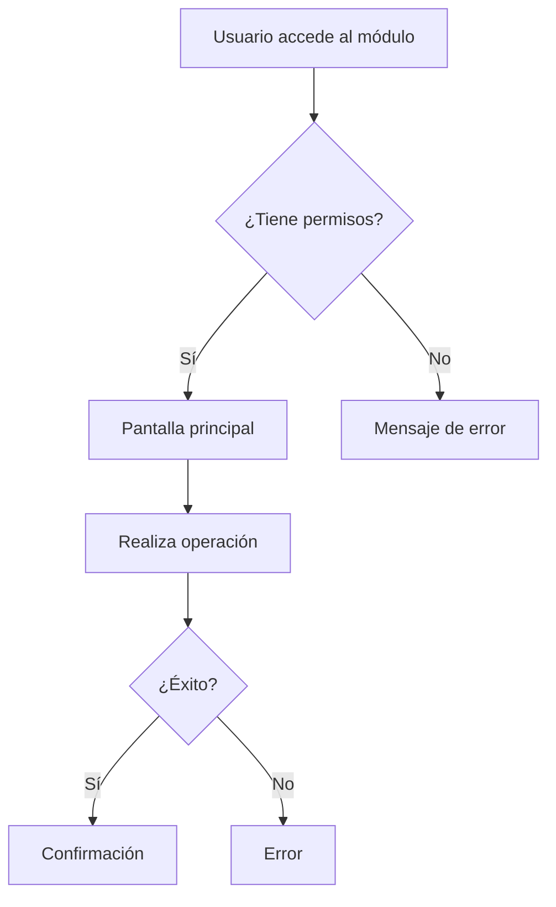
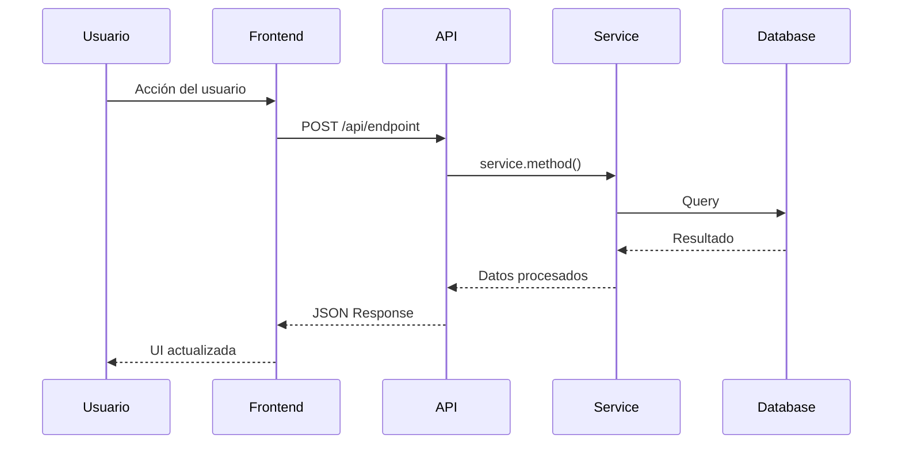
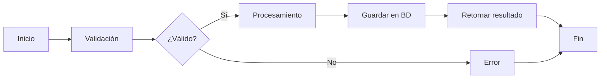
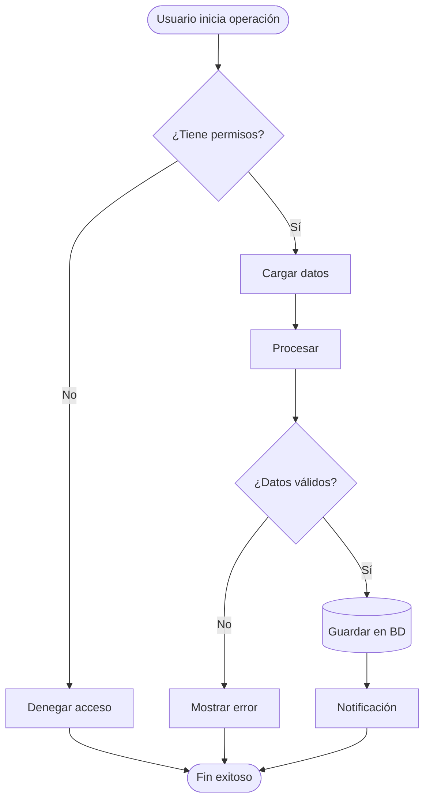
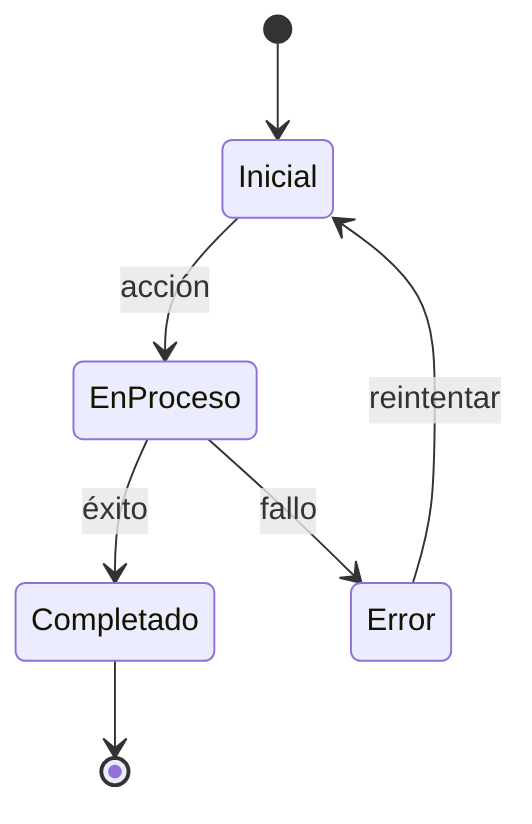

# [NOMBRE DEL MÓDULO] - Documentación Completa

> **Versión**: [VERSION]
> **Última actualización**: [FECHA]
> **Estado**: [PRODUCTION | DEVELOPMENT | IN_MIGRATION]
> **Categoría**: [CORE | ENTERPRISE | COMMERCIAL]

---

## 📋 Tabla de Contenidos

1. [Resumen Ejecutivo](#-resumen-ejecutivo)
2. [Guía de Uso](#-guía-de-uso)
3. [Funcionalidad Interna](#-funcionalidad-interna)
4. [Stack Tecnológico](#-stack-tecnológico)
5. [Diagramas de Flujo](#-diagramas-de-flujo)
6. [API REST](#-api-rest)
7. [Base de Datos](#-base-de-datos)
8. [Ejemplos de Uso](#-ejemplos-de-uso)
9. [Troubleshooting](#-troubleshooting)

---

## 🎯 Resumen Ejecutivo

### ¿Qué es este módulo?

[Descripción breve en 2-3 párrafos sobre qué es el módulo, para qué sirve y por qué existe]

### Características Principales

- ✅ **[Feature 1]**: [Descripción breve]
- ✅ **[Feature 2]**: [Descripción breve]
- ✅ **[Feature 3]**: [Descripción breve]
- ⏳ **[Feature en desarrollo]**: [Descripción breve]

### Métricas Clave

| Métrica | Valor |
|---------|-------|
| Progreso | [X]% |
| Tests implementados | [X]/[Y] |
| API Endpoints | [X] |
| Tablas BD | [X] |
| Archivos de código | [X] |

---

## 👤 Guía de Uso

### ¿Quién usa este módulo?

- **[Rol 1]**: [Descripción de cómo lo usa]
- **[Rol 2]**: [Descripción de cómo lo usa]
- **[Rol 3]**: [Descripción de cómo lo usa]

### Casos de Uso Comunes

#### Caso 1: [Nombre del caso de uso]

**Objetivo**: [Qué quiere lograr el usuario]

**Pasos**:
1. [Paso 1]
2. [Paso 2]
3. [Paso 3]

**Resultado esperado**: [Qué debería ocurrir]

#### Caso 2: [Nombre del caso de uso]

**Objetivo**: [Qué quiere lograr el usuario]

**Pasos**:
1. [Paso 1]
2. [Paso 2]
3. [Paso 3]

**Resultado esperado**: [Qué debería ocurrir]

### Flujo de Trabajo del Usuario



---

## ⚙️ Funcionalidad Interna

### Arquitectura del Módulo

[Descripción de la arquitectura del módulo: capas, responsabilidades, patrones utilizados]

### Componentes Principales

#### 1. [Nombre del Componente]

**Ubicación**: `[ruta/al/archivo.js]`

**Responsabilidades**:
- [Responsabilidad 1]
- [Responsabilidad 2]
- [Responsabilidad 3]

**Métodos clave**:
```javascript
// Firma de métodos principales
async metodo1(param1, param2) // Descripción
async metodo2(param1) // Descripción
```

#### 2. [Nombre del Componente]

**Ubicación**: `[ruta/al/archivo.js]`

**Responsabilidades**:
- [Responsabilidad 1]
- [Responsabilidad 2]

### Flujo de Datos



### Reglas de Negocio

1. **Regla 1**: [Descripción de la regla]
2. **Regla 2**: [Descripción de la regla]
3. **Regla 3**: [Descripción de la regla]

### Validaciones

- **Validación 1**: [Qué se valida y por qué]
- **Validación 2**: [Qué se valida y por qué]
- **Validación 3**: [Qué se valida y por qué]

---

## 🛠️ Stack Tecnológico

### Backend

| Tecnología | Versión | Uso |
|------------|---------|-----|
| **Node.js** | [X.X.X] | Runtime principal |
| **Express.js** | [X.X.X] | Framework web |
| **Sequelize** | [X.X.X] | ORM |
| **PostgreSQL** | [X.X] | Base de datos |
| **[Otra lib]** | [X.X.X] | [Descripción] |

### Frontend

| Tecnología | Versión | Uso |
|------------|---------|-----|
| **Vanilla JS** | ES6+ | Lógica frontend |
| **HTML5** | - | Estructura |
| **CSS3** | - | Estilos |
| **Chart.js** | [X.X.X] | Gráficos (si aplica) |

### Dependencias del Módulo

Este módulo **depende** de:
- `[modulo1]` - [Razón de la dependencia]
- `[modulo2]` - [Razón de la dependencia]

Este módulo es **requerido por**:
- `[modulo3]` - [Razón de la dependencia]
- `[modulo4]` - [Razón de la dependencia]

---

## 📊 Diagramas de Flujo

### Flujo Principal



### Flujo de [Operación Específica]



### Diagrama de Estados



---

## 🌐 API REST

### Base URL

```
/api/[ruta-base]
```

### Endpoints

#### 1. [Nombre del endpoint]

```http
GET /api/[ruta]/:id
```

**Descripción**: [Qué hace este endpoint]

**Parámetros de ruta**:
- `id` (UUID): [Descripción]

**Query params** (opcionales):
- `param1` (string): [Descripción]
- `param2` (number): [Descripción]

**Headers requeridos**:
```http
Authorization: Bearer <token>
Content-Type: application/json
```

**Respuesta exitosa** (200):
```json
{
  "success": true,
  "data": {
    "field1": "value1",
    "field2": 123
  }
}
```

**Errores posibles**:
- `400 Bad Request`: [Cuándo ocurre]
- `401 Unauthorized`: [Cuándo ocurre]
- `404 Not Found`: [Cuándo ocurre]
- `500 Internal Server Error`: [Cuándo ocurre]

#### 2. [Nombre del endpoint]

```http
POST /api/[ruta]
```

**Descripción**: [Qué hace este endpoint]

**Body (JSON)**:
```json
{
  "field1": "string (required)",
  "field2": "number (optional)",
  "field3": {
    "nested": "object"
  }
}
```

**Respuesta exitosa** (201):
```json
{
  "success": true,
  "data": {
    "id": "uuid-generado",
    "created_at": "2025-01-22T10:00:00Z"
  },
  "message": "Creado exitosamente"
}
```

---

## 🗄️ Base de Datos

### Tablas Principales

#### Tabla: `[nombre_tabla]`

**Descripción**: [Para qué sirve esta tabla]

**Schema**:

| Campo | Tipo | Constraints | Descripción |
|-------|------|-------------|-------------|
| `id` | BIGSERIAL | PRIMARY KEY | ID autoincremental |
| `campo1` | VARCHAR(255) | NOT NULL | [Descripción] |
| `campo2` | DECIMAL(10,2) | DEFAULT 0.00 | [Descripción] |
| `campo3` | UUID | FK → tabla2(id) | [Descripción] |
| `created_at` | TIMESTAMP | DEFAULT NOW() | Fecha de creación |
| `updated_at` | TIMESTAMP | DEFAULT NOW() | Última actualización |

**Índices**:
```sql
CREATE INDEX idx_tabla_campo1 ON tabla(campo1);
CREATE INDEX idx_tabla_compound ON tabla(campo2, campo3);
```

**Relaciones**:
- `tabla2` (1:N) - [Descripción de la relación]
- `tabla3` (N:M) - [Descripción de la relación]

### Migraciones

**Archivo**: `migrations/[fecha]_create_[tabla].sql`

**Ejemplo**:
```sql
CREATE TABLE IF NOT EXISTS tabla (
  id BIGSERIAL PRIMARY KEY,
  campo1 VARCHAR(255) NOT NULL,
  created_at TIMESTAMP DEFAULT CURRENT_TIMESTAMP
);
```

### Funciones PostgreSQL

#### Función: `[nombre_funcion]()`

**Descripción**: [Qué hace]

**Parámetros**:
- `param1` (UUID): [Descripción]
- `param2` (INTEGER): [Descripción]

**Retorna**: [Tipo de retorno]

**Ejemplo de uso**:
```sql
SELECT * FROM nombre_funcion('uuid-aqui', 30);
```

### Vistas Materializadas

#### Vista: `v_[nombre_vista]`

**Descripción**: [Para qué sirve]

**Query**:
```sql
CREATE MATERIALIZED VIEW v_nombre_vista AS
SELECT
  t1.campo1,
  t2.campo2,
  COUNT(*) as total
FROM tabla1 t1
INNER JOIN tabla2 t2 ON t1.id = t2.tabla1_id
GROUP BY t1.campo1, t2.campo2;
```

---

## 💡 Ejemplos de Uso

### Ejemplo 1: [Caso de uso básico]

**Escenario**: [Descripción del escenario]

**Frontend (JavaScript)**:
```javascript
// Código de ejemplo
async function ejemplo1() {
  try {
    const response = await fetch('/api/endpoint', {
      method: 'POST',
      headers: {
        'Authorization': `Bearer ${token}`,
        'Content-Type': 'application/json'
      },
      body: JSON.stringify({
        campo1: 'valor1',
        campo2: 123
      })
    });

    const data = await response.json();
    console.log('Resultado:', data);
  } catch (error) {
    console.error('Error:', error);
  }
}
```

**Backend (Service)**:
```javascript
// backend/src/services/MiServicio.js
class MiServicio {
  async metodoEjemplo(params) {
    // Lógica del servicio
    const resultado = await this.procesarDatos(params);
    return resultado;
  }
}
```

### Ejemplo 2: [Caso de uso avanzado]

**Escenario**: [Descripción del escenario]

**Código completo**:
```javascript
// Ejemplo más complejo
// ...
```

---

## 🔧 Troubleshooting

### Problema 1: [Descripción del problema]

**Síntomas**:
- [Síntoma 1]
- [Síntoma 2]

**Causa raíz**: [Explicación de la causa]

**Solución**:
```bash
# Comandos o pasos para resolver
```

### Problema 2: [Descripción del problema]

**Síntomas**:
- [Síntoma 1]

**Causa raíz**: [Explicación de la causa]

**Solución**:
```javascript
// Código de solución si aplica
```

### Issues Conocidos

Ver sección `knownIssues` en `engineering-metadata.js`:

```javascript
knownIssues: [
  "Issue 1: Descripción del issue",
  "Issue 2: Descripción del issue"
]
```

---

## 📚 Referencias

### Documentación Relacionada

- [Archivo relacionado 1]
- [Archivo relacionado 2]

### Links Externos

- [Documentación oficial de librería X]
- [Tutorial relevante]

---

## 🔄 Changelog

| Fecha | Versión | Cambios |
|-------|---------|---------|
| 2025-01-XX | 1.0.0 | Versión inicial |
| 2025-01-XX | 1.1.0 | [Cambios] |

---

**Autor**: Claude Code
**Contacto**: Ver `engineering-metadata.js` para más detalles
